### **Контрольное задание №1**

​	Файл MainActivity.java был изменен, были добавлены переопределяющие методы и отслеживание поведения поля EditText:

```java
public class MainActivity extends AppCompatActivity {
    private static final String TAG = "MainActivity";
    private EditText editText;
    @Override
    protected void onCreate(Bundle savedInstanceState) {
        super.onCreate(savedInstanceState);
        EdgeToEdge.enable(this);
        setContentView(R.layout.activity_main);
        editText = findViewById(R.id.editText);

        ViewCompat.setOnApplyWindowInsetsListener(findViewById(R.id.main), (v, insets) -> {
            Insets systemBars = insets.getInsets(WindowInsetsCompat.Type.systemBars());
            v.setPadding(systemBars.left, systemBars.top, systemBars.right, systemBars.bottom);
            return insets;
        });
        if (savedInstanceState != null) {
            String savedText = savedInstanceState.getString("edit_text");
            editText.setText(savedText);
        }
        Log.i(TAG, "onCreate()");
    }

    @Override
    protected void onStart() {
        super.onStart();
        Log.i(TAG, "onStart()");
    }

    @Override
    protected void onRestoreInstanceState(Bundle savedInstanceState) {
        super.onRestoreInstanceState(savedInstanceState);
        String savedText = savedInstanceState.getString("edit_text");
        editText.setText(savedText);
        Log.i(TAG, "onRestoreInstanceState()");
    }

    @Override
    protected void onRestart() {
        super.onRestart();
        Log.i(TAG, "onRestart()");
    }

    @Override
    protected void onResume() {
        super.onResume();
        Log.i(TAG, "onResume()");
    }

    @Override
    protected void onPause() {
        super.onPause();
        Log.i(TAG, "onPause()");
    }

    @Override
    protected void onSaveInstanceState(Bundle outState) {
        super.onSaveInstanceState(outState);
        outState.putString("edit_text", editText.getText().toString());
        Log.i(TAG, "onSaveInstanceState()");
    }

    @Override
    protected void onStop() {
        super.onStop();
        Log.i(TAG, "onStop()");
    }

    @Override
    protected void onDestroy() {
        super.onDestroy();
        Log.i(TAG, "onDestroy()");
    }

    @Override
    protected void onPostCreate(Bundle savedInstanceState) {
        super.onPostCreate(savedInstanceState);
        Log.i(TAG, "onPostCreate()");
    }

    @Override
    protected void onPostResume() {
        super.onPostResume();
        Log.i(TAG, "onPostResume()");
    }

    @Override
    public void onAttachedToWindow() {
        super.onAttachedToWindow();
        Log.i(TAG, "onAttachedToWindow()");
    }

    @Override
    public void onDetachedFromWindow() {
        super.onDetachedFromWindow();
        Log.i(TAG, "onDetachedFromWindow()");
    }
}

```

​	При запуске модуля ActivityLifecycle появился такой экран:

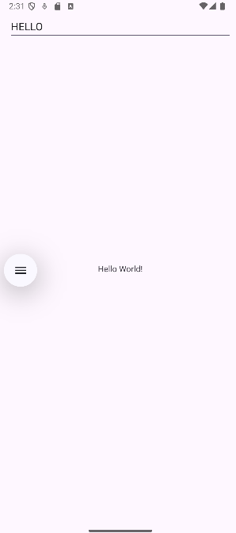

​	При повороте введенный новый текст остался прежним:

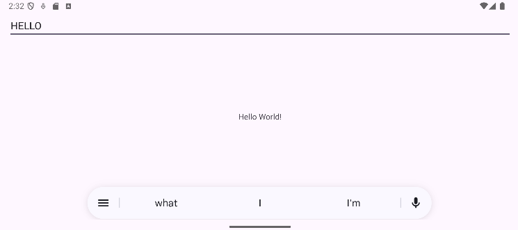

​	Был выполнен переход на домашнюю страницу, поворот телефона, а затем повторное открытие приложения. 

 	В logcat были выведены соответствующие логи:

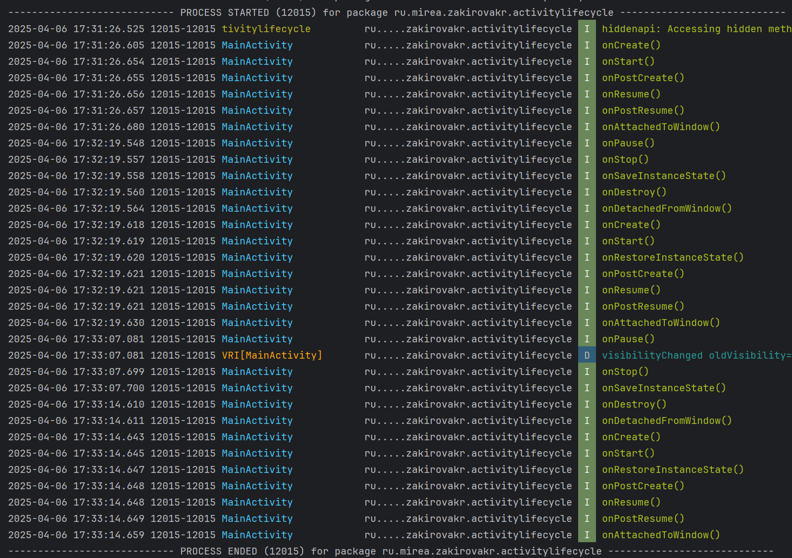

#### **Вопросы:**

1. Будет ли вызван метод onCreate после нажатия на кнопку «Home» и возврата в приложение?
   Ответ: Нет. При нажатии «Home» вызываются методы onPause(), onStop(), а при возврате — onRestart(), onStart(), onResume(). Метод onCreate() не вызывается, так как активность не уничтожается.
2. Изменится ли значение поля EditText после нажатия на кнопку «Home» и возврата в приложение?
    Ответ: Нет. Активность не уничтожается, поэтому EditText сохраняет своё состояние автоматически. onCreate() и onRestoreInstanceState() не вызываются, и содержимое поля остаётся без изменений.
3. Изменится ли значение поля EditText после нажатия на кнопку «Back» и возврата в приложение?
   Ответ: Нет, если реализовано сохранение состояния. При нажатии «Back» активность уничтожается, но здесь реализован onSaveInstanceState() и восстановление в onCreate() и onRestoreInstanceState(). Поэтому значение EditText сохраняется и восстанавливается при новом запуске.

------

### **Контрольное задание №2. Вызов активности**

#### **Часть 1**

​	Был создан новый модуль MultiActivity и новая активность SecondActivity. 

​	В первую «activity»  было добавлено поле ввода и кнопка «Отправить». На второй «activity» отображается значение поля первой активности в «TextView».

​	Код первой «activity»:

```java
public class MainActivity extends AppCompatActivity {
    private EditText editText;
    private Button buttonSend;
    @Override
    protected void onCreate(Bundle savedInstanceState) {
        super.onCreate(savedInstanceState);
        EdgeToEdge.enable(this);
        setContentView(R.layout.activity_main);
        ViewCompat.setOnApplyWindowInsetsListener(findViewById(R.id.main), (v, insets) -> {
            Insets systemBars = insets.getInsets(WindowInsetsCompat.Type.systemBars());
            v.setPadding(systemBars.left, systemBars.top, systemBars.right, systemBars.bottom);
            return insets;
        });

        editText = findViewById(R.id.editText);
        buttonSend = findViewById(R.id.buttonSend);

        buttonSend.setOnClickListener(v -> {
            String text = editText.getText().toString();
            Intent intent = new Intent(MainActivity.this, SecondActivity.class);
            intent.putExtra("key", text);
            startActivity(intent);
        });

        Log.i("TestMainActivity", "onCreate()");

    }

    @Override
    protected void onStart() {
        super.onStart();
        Log.i("TestMainActivity", "onStart()");
    }

    @Override
    protected void onResume() {
        super.onResume();
        Log.i("TestMainActivity", "onResume()");
    }

    @Override
    protected void onPause() {
        super.onPause();
        Log.i("TestMainActivity", "onPause()");
    }

    @Override
    protected void onStop() {
        super.onStop();
        Log.i("TestMainActivity", "onStop()");
    }

    @Override
    protected void onRestart() {
        super.onRestart();
        Log.i("TestMainActivity", "onRestart()");
    }

    @Override
    protected void onDestroy() {
        super.onDestroy();
        Log.i("TestMainActivity", "onDestroy()");
    }


}
```

​	Код второй «activity»:

```java
public class SecondActivity extends AppCompatActivity {
    private TextView textView;

    @Override
    protected void onCreate(Bundle savedInstanceState) {
        super.onCreate(savedInstanceState);
        setContentView(R.layout.activity_second);

        textView = findViewById(R.id.textView2);
        String text = getIntent().getStringExtra("key");
        textView.setText(text);

        Log.i("TestSecondActivity", "onCreate()");
    }

    @Override
    protected void onStart() {
        super.onStart();
        Log.i("TestSecondActivity", "onStart()");
    }

    @Override
    protected void onResume() {
        super.onResume();
        Log.i("TestSecondActivity", "onResume()");
    }

    @Override
    protected void onPause() {
        super.onPause();
        Log.i("TestSecondActivity", "onPause()");
    }

    @Override
    protected void onStop() {
        super.onStop();
        Log.i("TestSecondActivity", "onStop()");
    }

    @Override
    protected void onRestart() {
        super.onRestart();
        Log.i("TestSecondActivity", "onRestart()");
    }

    @Override
    protected void onDestroy() {
        super.onDestroy();
        Log.i("TestSecondActivity", "onDestroy()");
    }
}
```

​	При запуске приложения открывается первая «activity»:

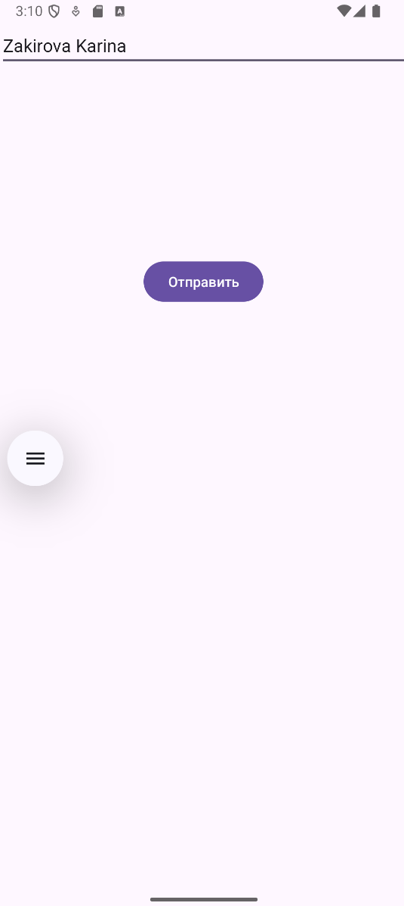

​	При нажатии на кнопку "Отправить" открывается вторая «activity» и отображается веденный текст из первой «activity»:

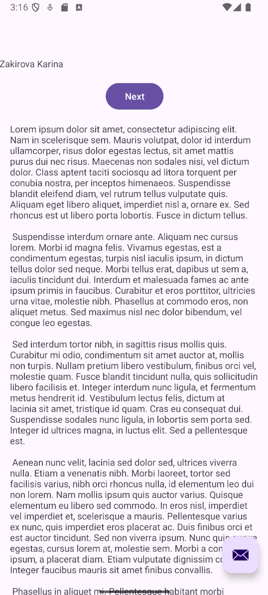

​	В соответствии с задание были выполнены последовательно следующие действия:

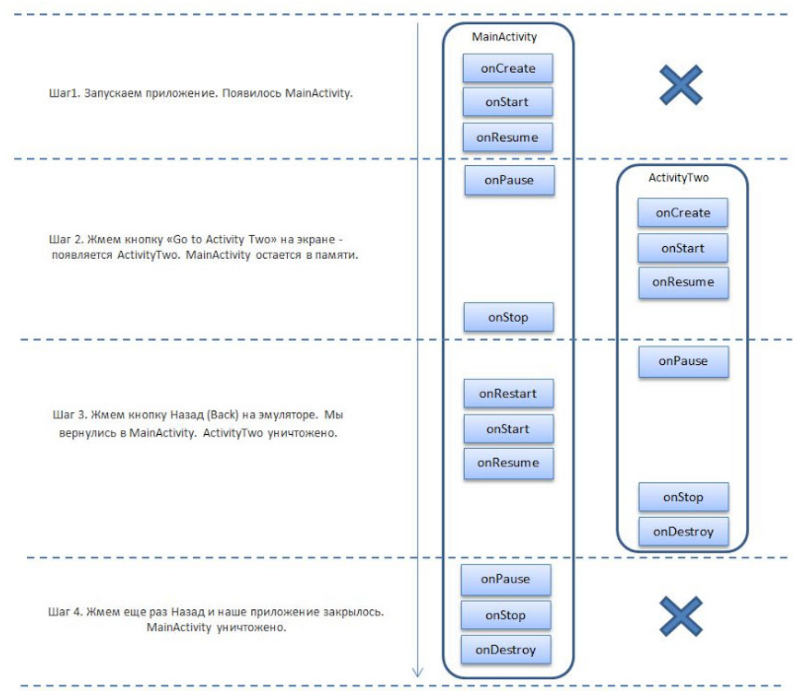

 	В logcat были выведены соответствующие логи:

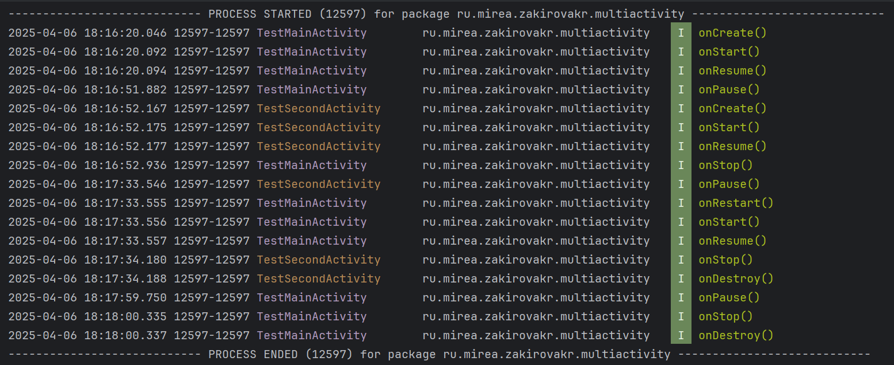

------


#### **Часть 2**

​	Был создан модуль IntentFilter. 

​	Были добавлены две кнопки, одна для вызова веб-браузера, а вторая для передачи ФИО студента и университета в другое приложение.

```java
public class MainActivity extends AppCompatActivity {

    private Button buttonOpenWeb;
    private Button buttonShare;


    @Override
    protected void onCreate(Bundle savedInstanceState) {
        super.onCreate(savedInstanceState);
        EdgeToEdge.enable(this);
        setContentView(R.layout.activity_main);

        ViewCompat.setOnApplyWindowInsetsListener(findViewById(R.id.main), (v, insets) -> {
            Insets systemBars = insets.getInsets(WindowInsetsCompat.Type.systemBars());
            v.setPadding(systemBars.left, systemBars.top, systemBars.right, systemBars.bottom);
            return insets;
        });

        buttonOpenWeb = findViewById(R.id.buttonOpenWeb);
        buttonShare = findViewById(R.id.buttonShare);

        buttonOpenWeb.setOnClickListener(new View.OnClickListener() {
            @Override
            public void onClick(View v) {
                Uri address = Uri.parse("https://www.mirea.ru/");
                Intent openLinkIntent = new Intent(Intent.ACTION_VIEW, address);
                startActivity(openLinkIntent);
            }
        });

        buttonShare.setOnClickListener(new View.OnClickListener() {
            @Override
            public void onClick(View v) {
                Intent shareIntent = new Intent(Intent.ACTION_SEND);
                shareIntent.setType("text/plain");
                shareIntent.putExtra(Intent.EXTRA_SUBJECT, "MIREA");
                shareIntent.putExtra(Intent.EXTRA_TEXT, "Закирова Карина Рамилевна");
                startActivity(Intent.createChooser(shareIntent, "МОИ ФИО"));
            }
        });
    }
}
```

​	При запуске приложения открывается страница с двумя кнопками:

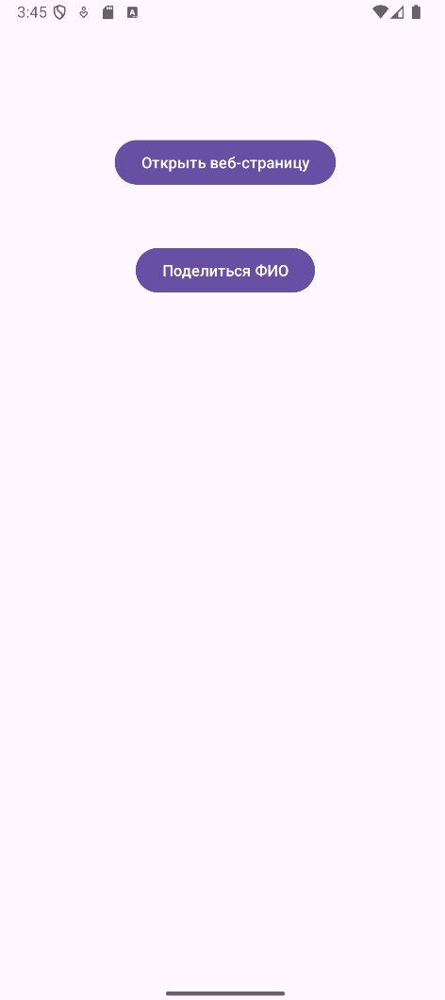

​	При нажатии на кнопку "Открыть веб-страницу" открывается сайт университета:


​	При нажатии на кнопку "Отправить" появляется окно с ФИО и приложениями для отправки:

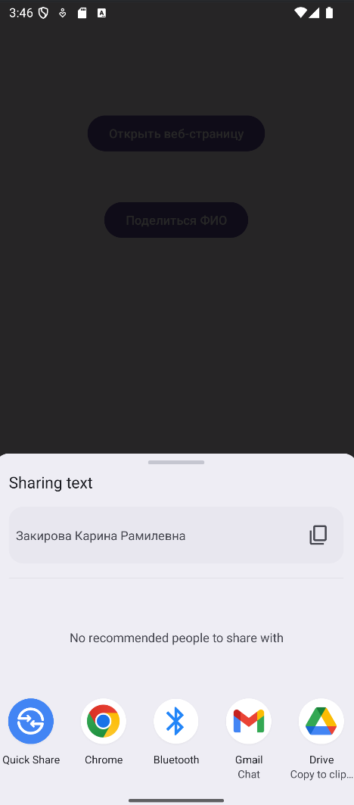

------

### **Контрольное задание №3**

#### 	Часть 1. Всплывающие уведомления

​	Был создан новый модуль ToastApp. Затем было добавлено поле ввода и кнопка.

​	Затем в файле MainActivity.java была добавлена обработка нажатия на кнопку для реализации всплывающего уведомления.

```java
public class MainActivity extends AppCompatActivity {

    private EditText inputField;
    private Button countButton;


    @Override
    protected void onCreate(Bundle savedInstanceState) {
        super.onCreate(savedInstanceState);
        EdgeToEdge.enable(this);
        setContentView(R.layout.activity_main);
        ViewCompat.setOnApplyWindowInsetsListener(findViewById(R.id.main), (v, insets) -> {
            Insets systemBars = insets.getInsets(WindowInsetsCompat.Type.systemBars());
            v.setPadding(systemBars.left, systemBars.top, systemBars.right, systemBars.bottom);
            return insets;
        });

        inputField = findViewById(R.id.inputField);
        countButton = findViewById(R.id.countButton);

        countButton.setOnClickListener(new View.OnClickListener() {
            @Override
            public void onClick(View v) {

                String inputText = inputField.getText().toString();
                int charCount = inputText.length();

                String message = "СТУДЕНТ № 10 ГРУППА БСБО-09-22 Количество символов - " + charCount;

                Toast.makeText(MainActivity.this, message, Toast.LENGTH_LONG).show();
            }
        });
    }
}
```

​	При запуске приложения, после ввода текста и нажатия на кнопку появляется уведомление:

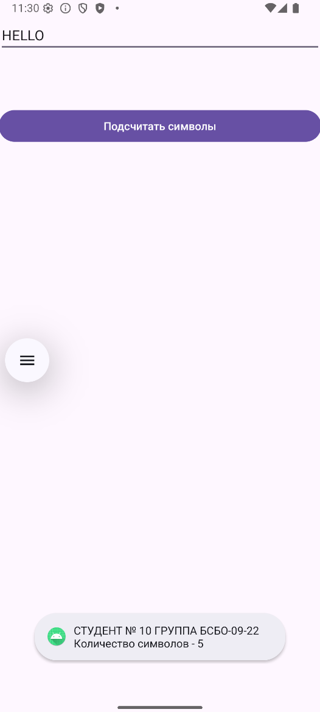

​	

------

#### 	Часть 2. Уведомления

​	Был создан новый модуль NotificationApp. Была добавлена кнопка "Send Notification". Для выполнения задания был написан следующий код:

```java
package ru.mirea.zakirovakr.notificationapp;

import android.Manifest;
import android.app.NotificationChannel;
import android.app.NotificationManager;
import android.content.pm.PackageManager;
import android.os.Build;
import android.os.Bundle;
import android.util.Log;
import android.view.View;
import android.widget.Toast;

import androidx.annotation.NonNull;
import androidx.appcompat.app.AppCompatActivity;
import androidx.core.app.ActivityCompat;
import androidx.core.app.NotificationCompat;
import androidx.core.app.NotificationManagerCompat;
import androidx.core.content.ContextCompat;

public class MainActivity extends AppCompatActivity {

    private static final String CHANNEL_ID = "com.mirea.zakirovakr.notificationapp.CHANNEL";
    private static final int PERMISSION_CODE = 200;

    @Override
    protected void onCreate(Bundle savedInstanceState) {
        super.onCreate(savedInstanceState);
        setContentView(R.layout.activity_main);

        // Запрос разрешения на уведомления (только для Android 13+)
        if (Build.VERSION.SDK_INT >= Build.VERSION_CODES.TIRAMISU) {
            if (ContextCompat.checkSelfPermission(this, Manifest.permission.POST_NOTIFICATIONS)
                    != PackageManager.PERMISSION_GRANTED) {
                Log.d("PERMISSION", "Нет разрешений на уведомления");
                ActivityCompat.requestPermissions(this,
                        new String[]{Manifest.permission.POST_NOTIFICATIONS},
                        PERMISSION_CODE);
            } else {
                Log.d("PERMISSION", "Разрешения получены");
            }
        }

        // Создание канала уведомлений (Android 8+)
        if (Build.VERSION.SDK_INT >= Build.VERSION_CODES.O) {
            CharSequence name = "Zakirova Karina ";
            String description = "MIREA Channel";
            int importance = NotificationManager.IMPORTANCE_HIGH;
            NotificationChannel channel = new NotificationChannel(CHANNEL_ID, name, importance);
            channel.setDescription(description);

            NotificationManager notificationManager = getSystemService(NotificationManager.class);
            if (notificationManager != null) {
                notificationManager.createNotificationChannel(channel);
            }
        }
    }

    public void onClickSendNotification(View view) {
        Log.d("DEBUG", "Кнопка нажата");
        Toast.makeText(this, "Кнопка нажата", Toast.LENGTH_SHORT).show();

        // Проверка разрешения (Android 13+)
        if (Build.VERSION.SDK_INT >= Build.VERSION_CODES.TIRAMISU &&
                ContextCompat.checkSelfPermission(this, Manifest.permission.POST_NOTIFICATIONS)
                        != PackageManager.PERMISSION_GRANTED) {
            Log.d("DEBUG", "Нет разрешения POST_NOTIFICATIONS");
            Toast.makeText(this, "Нет разрешения на уведомления", Toast.LENGTH_SHORT).show();
            return;
        }

        // Создание уведомления
        NotificationCompat.Builder builder = new NotificationCompat.Builder(this, CHANNEL_ID)
                .setSmallIcon(R.drawable.ic_launcher_foreground) // или твоя иконка
                .setContentTitle("Mirea")
                .setContentText("Congratulation!")
                .setPriority(NotificationCompat.PRIORITY_HIGH)
                .setStyle(new NotificationCompat.BigTextStyle()
                        .bigText("Much longer text that cannot fit one line..."));

        NotificationManagerCompat notificationManager = NotificationManagerCompat.from(this);
        notificationManager.notify(1, builder.build());
        Log.d("DEBUG", "Уведомление отправлено");
    }

    // Обработка результата запроса разрешений
    @Override
    public void onRequestPermissionsResult(int requestCode,
                                           @NonNull String[] permissions,
                                           @NonNull int[] grantResults) {
        super.onRequestPermissionsResult(requestCode, permissions, grantResults);
        if (requestCode == PERMISSION_CODE) {
            if (grantResults.length > 0 &&
                    grantResults[0] == PackageManager.PERMISSION_GRANTED) {
                Log.d("PERMISSION", "Разрешение ПОЛУЧЕНО");
            } else {
                Log.d("PERMISSION", "Разрешение ОТКЛОНЕНО");
                Toast.makeText(this, "Разрешение на уведомления отклонено", Toast.LENGTH_SHORT).show();
            }
        }
    }
}
```

​	При запуске приложения появляется экран с кнопкой:

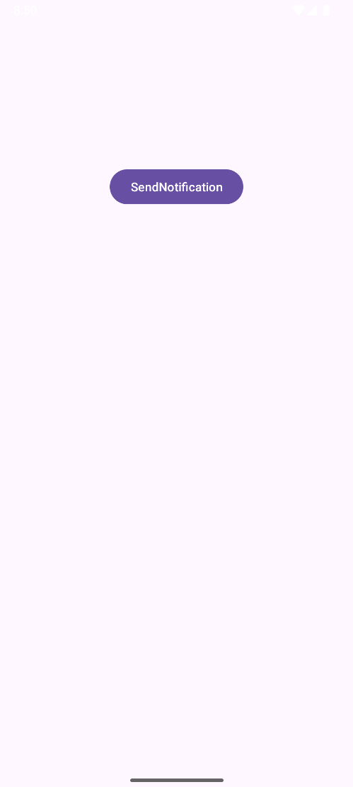

​	При нажатии на кнопку приходит уведомление:

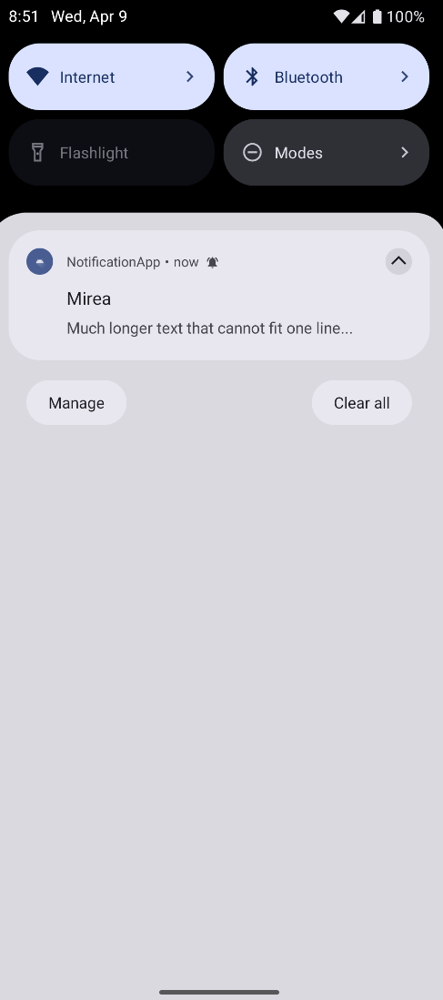

------

#### 	Часть 3. Диалоговые окна 

​	Был создан новый Java класс MyDialog, который наследуется от DialogFragment. Была добавлена обработка нажатий на кнопки.

```java
public class MyDialog extends DialogFragment {
    @NonNull
    @Override
    public Dialog onCreateDialog(Bundle savedInstanceState) {
        AlertDialog.Builder builder = new AlertDialog.Builder(getActivity());
        builder.setTitle("Здравствуй МИРЭА!")
                .setMessage("Успех близок?")
                .setIcon(R.mipmap.ic_launcher_round)
                .setPositiveButton("Иду дальше", new DialogInterface.OnClickListener() {
                    public void onClick(DialogInterface dialog, int id) {
                        // Закрываем окно
                        ((MainActivity)getActivity()).onOkClicked();
                        dialog.cancel();
                    }
                })
                .setNeutralButton("На паузе",
                        new DialogInterface.OnClickListener() {
                            public void onClick(DialogInterface dialog,
                                                int id) {
                                ((MainActivity)getActivity()).onNeutralClicked();
                                dialog.cancel();
                            }
                        })
                .setNegativeButton("Нет",
                        new DialogInterface.OnClickListener() {
                            public void onClick(DialogInterface dialog,
                                                int id) {
                                ((MainActivity)getActivity()).onCancelClicked();
                                dialog.cancel();
                            }
                        });
        return builder.create();
    }
}
```

​	В MainActivity были добавлены методы вызывающие всплывающие уведомления соответствующие кнопкам:

```java
public void onClickShowDialog(View view) {
    MyDialog dialogFragment = new MyDialog();
    dialogFragment.show(getSupportFragmentManager(), "mirea");
}

public void onOkClicked() {
    Toast.makeText(getApplicationContext(), "Вы выбрали кнопку \"Иду дальше\"!",
            Toast.LENGTH_LONG).show();
}
public void onCancelClicked() {
    Toast.makeText(getApplicationContext(), "Вы выбрали кнопку \"Нет\"!",
            Toast.LENGTH_LONG).show();
}
public void onNeutralClicked() {
    Toast.makeText(getApplicationContext(), "Вы выбрали кнопку \"На паузе\"!",
            Toast.LENGTH_LONG).show();
}
```

​	При запуске приложения открывается окно

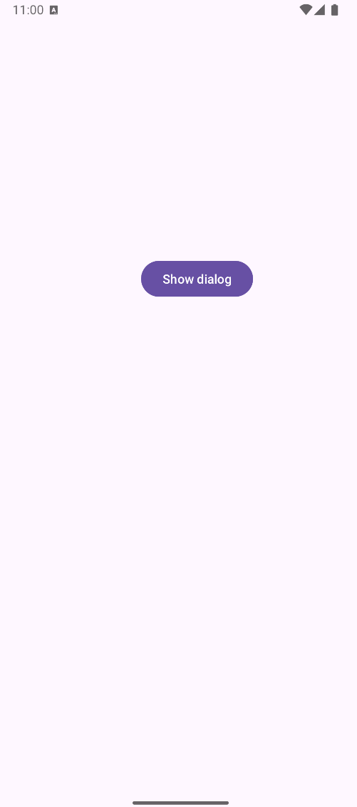

​	При нажатии на кнопку появляется диалоговое окно:

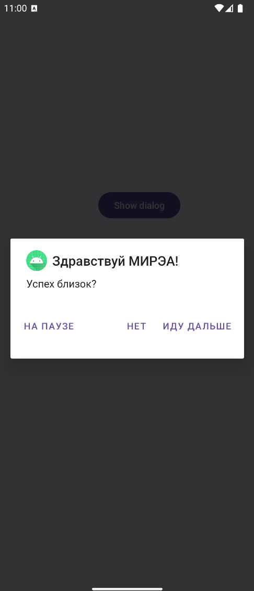

​	При нажатии на кнопку "Иду дальше" появляется уведомление:

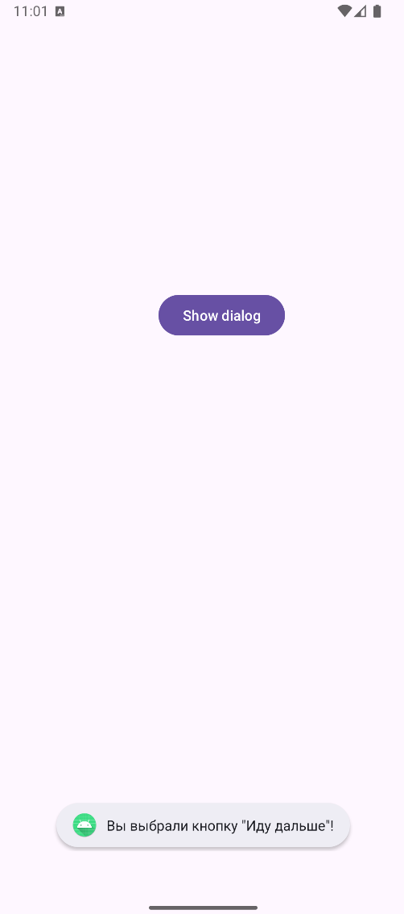

​	Далее для выполнения задания были созданы Java классы:

- MyTimeDialogFragment:

  ```java
  package ru.mirea.zakirovakr.dialog;
  
  import android.app.Dialog;
  import android.app.TimePickerDialog;
  import android.os.Bundle;
  import android.widget.Toast;
  import android.text.format.DateFormat;
  import android.widget.TimePicker;
  
  import androidx.annotation.NonNull;
  import androidx.fragment.app.DialogFragment;
  
  import java.util.Calendar;
  
  public class MyTimeDialogFragment extends DialogFragment {
      @NonNull
      @Override
      public Dialog onCreateDialog(Bundle savedInstanceState) {
          final Calendar c = Calendar.getInstance();
          int hour = c.get(Calendar.HOUR_OF_DAY);
          int minute = c.get(Calendar.MINUTE);
  
          return new TimePickerDialog(getActivity(), (view, hourOfDay, minute1) -> {
              Toast.makeText(getActivity(),
                      "Вы выбрали: " + hourOfDay + ":" + String.format("%02d", minute1),
                      Toast.LENGTH_LONG).show();
          }, hour, minute, DateFormat.is24HourFormat(getActivity()));
      }
  }
  ```

- MyDateDialogFragment:

  ```java
  package ru.mirea.zakirovakr.dialog;
  
  import android.app.DatePickerDialog;
  import android.app.Dialog;
  import android.os.Bundle;
  import android.widget.DatePicker;
  import android.widget.Toast;
  
  import androidx.annotation.NonNull;
  import androidx.fragment.app.DialogFragment;
  
  import java.util.Calendar;
  
  public class MyDateDialogFragment extends DialogFragment {
      @NonNull
      @Override
      public Dialog onCreateDialog(Bundle savedInstanceState) {
          final Calendar c = Calendar.getInstance();
          int year = c.get(Calendar.YEAR);
          int month = c.get(Calendar.MONTH);
          int day = c.get(Calendar.DAY_OF_MONTH);
  
          return new DatePickerDialog(getActivity(), (view, year1, month1, dayOfMonth) -> {
              Toast.makeText(getActivity(),
                      "Вы выбрали: " + dayOfMonth + "." + (month1 + 1) + "." + year1,
                      Toast.LENGTH_LONG).show();
          }, year, month, day);
      }
  }
  ```

- MyProgressDialogFragment:

  ```java
  package ru.mirea.zakirovakr.dialog;
  
  import android.app.Dialog;
  import android.app.ProgressDialog;
  import android.os.Bundle;
  
  import androidx.annotation.NonNull;
  import androidx.fragment.app.DialogFragment;
  
  public class MyProgressDialogFragment extends DialogFragment {
      @NonNull
      @Override
      public Dialog onCreateDialog(Bundle savedInstanceState) {
          ProgressDialog progressDialog = new ProgressDialog(getActivity());
          progressDialog.setMessage("Загрузка...");
          progressDialog.setIndeterminate(true);
          progressDialog.setCancelable(true);
          return progressDialog;
      }
  }
  ```

​	В Main Activity были добавлены методы:

```java
public void onClickShowDateDialog(View view) {
    MyDateDialogFragment dateDialog = new MyDateDialogFragment();
    dateDialog.show(getSupportFragmentManager(), "datePicker");
}

public void onClickShowTimeDialog(View view) {
    MyTimeDialogFragment timeDialog = new MyTimeDialogFragment();
    timeDialog.show(getSupportFragmentManager(), "timePicker");
}

public void onClickShowProgressDialog(View view) {
    MyProgressDialogFragment progressDialog = new MyProgressDialogFragment();
    progressDialog.show(getSupportFragmentManager(), "progressDialog");
}
```

​	При запуске приложения открывается экран. Далее демонстрация работы кнопок и соответствующих окон:

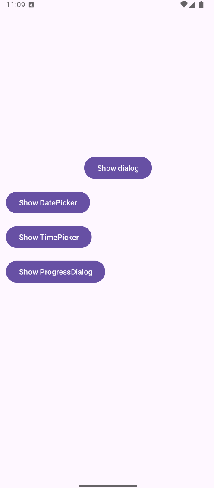

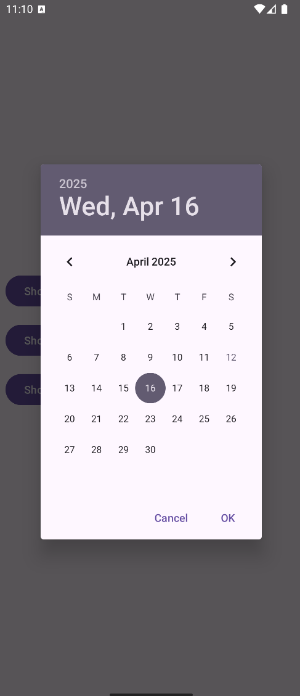

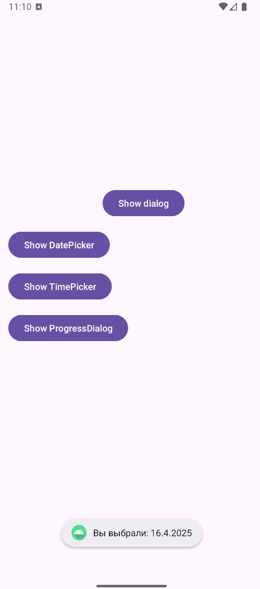

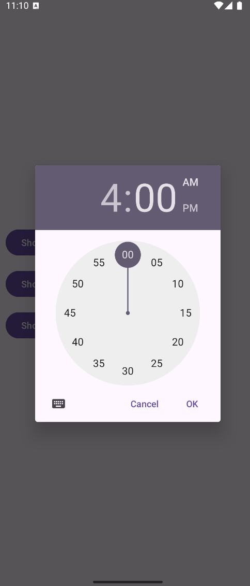

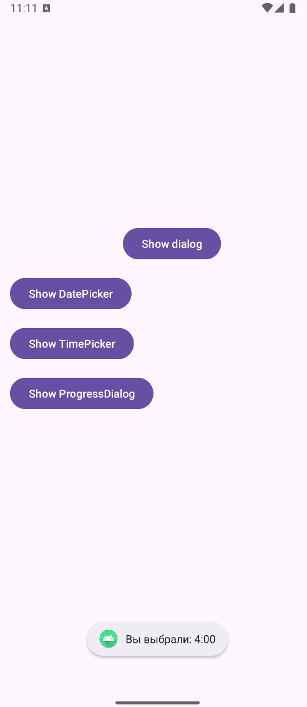

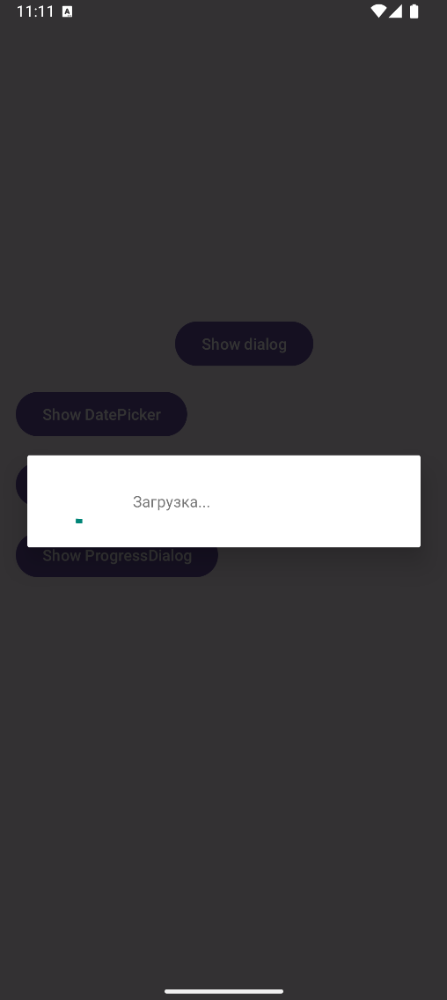

