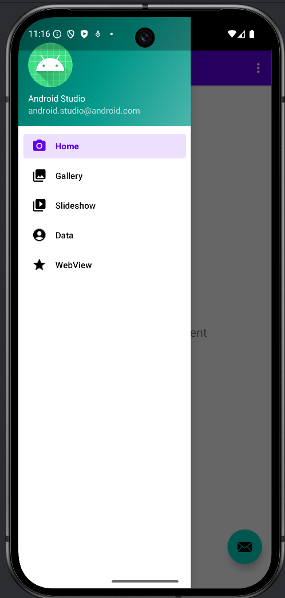
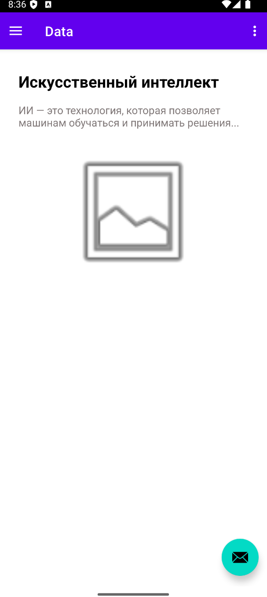

**Задание №1**

​	Был создан модуль IntentApp. В нем были созданы две активности:

MainActivity:

```java
public class MainActivity extends AppCompatActivity {
    Button button;

    @Override
    protected void onCreate(Bundle savedInstanceState) {
        super.onCreate(savedInstanceState);
        EdgeToEdge.enable(this);
        setContentView(R.layout.activity_main);
        ViewCompat.setOnApplyWindowInsetsListener(findViewById(R.id.main), (v, insets) -> {
            Insets systemBars = insets.getInsets(WindowInsetsCompat.Type.systemBars());
            v.setPadding(systemBars.left, systemBars.top, systemBars.right, systemBars.bottom);
            return insets;
        });
        button = findViewById(R.id.button);

        button.setOnClickListener(v -> {
            long dateInMillis = System.currentTimeMillis();
            String format = "yyyy-MM-dd HH:mm:ss";
            final SimpleDateFormat sdf = new SimpleDateFormat(format);
            String dateString = sdf.format(new Date(dateInMillis));

            Intent intent = new Intent(MainActivity.this, SecondActivity.class);
            intent.putExtra("time", dateString);
            startActivity(intent);
        });
    }
}
```

SecondActivity:

```java
public class SecondActivity extends AppCompatActivity {

    @Override
    protected void onCreate(Bundle savedInstanceState) {
        super.onCreate(savedInstanceState);
        EdgeToEdge.enable(this);
        setContentView(R.layout.activity_second);
        ViewCompat.setOnApplyWindowInsetsListener(findViewById(R.id.main), (v, insets) -> {
            Insets systemBars = insets.getInsets(WindowInsetsCompat.Type.systemBars());
            v.setPadding(systemBars.left, systemBars.top, systemBars.right, systemBars.bottom);
            return insets;
        });

        TextView textView = findViewById(R.id.textView);

        String time = getIntent().getStringExtra("time");

        int myNumber = 10;
        int square = myNumber * myNumber;

        String result = "КВАДРАТ ЗНАЧЕНИЯ МОЕГО НОМЕРА ПО СПИСКУ В ГРУППЕ СОСТАВЛЯЕТ ЧИСЛО " + square +
                ", а текущее время " + time;

        textView.setText(result);
    }
}
```


**Задание №2**

​	Был создан новый модуль Dialog

```java
public class MainActivity extends AppCompatActivity {

    @Override
    protected void onCreate(Bundle savedInstanceState) {
        super.onCreate(savedInstanceState);
        EdgeToEdge.enable(this);
        setContentView(R.layout.activity_main);
        ViewCompat.setOnApplyWindowInsetsListener(findViewById(R.id.main), (v, insets) -> {
            Insets systemBars = insets.getInsets(WindowInsetsCompat.Type.systemBars());
            v.setPadding(systemBars.left, systemBars.top, systemBars.right, systemBars.bottom);
            return insets;
        });

        Intent intent = new Intent(android.content.Intent.ACTION_SEND);
        intent.setType("*/*");
        intent.putExtra(Intent.EXTRA_TEXT, "Mirea");
        startActivity(Intent.createChooser(intent, "Выбор за вами!"));
    }
}
```


**Задание №3**

​	Был создан новый модуль FavoriteBook с двумя активностями:
MainActivity:

```java
public class MainActivity extends AppCompatActivity {

    private ActivityResultLauncher<Intent> activityResultLauncher;
    static final String BOOK_NAME_KEY = "book_name";
    static final String QUOTES_KEY = "quotes_name";
    static final String USER_MESSAGE = "MESSAGE";

    private TextView textViewUserBook;

    @Override
    protected void onCreate(Bundle savedInstanceState) {
        super.onCreate(savedInstanceState);
        setContentView(R.layout.activity_main);

        textViewUserBook = findViewById(R.id.textViewBook);

        ActivityResultCallback<ActivityResult> callback = new ActivityResultCallback<ActivityResult>() {
            @Override
            public void onActivityResult(ActivityResult result) {
                if (result.getResultCode() == Activity.RESULT_OK) {
                    Intent data = result.getData();
                    String userBook = data.getStringExtra(USER_MESSAGE);
                    textViewUserBook.setText(userBook);
                }
            }
        };

        activityResultLauncher = registerForActivityResult(
                new ActivityResultContracts.StartActivityForResult(),
                callback
        );
    }

    public void getInfoAboutBook(View view) {
        Intent intent = new Intent(this, ShareActivity.class);
        intent.putExtra(BOOK_NAME_KEY, "Преступление и наказание");
        intent.putExtra(QUOTES_KEY, "Человек есть тайна...");
        activityResultLauncher.launch(intent);
    }
}
```

ShareActivity:

```java
public class ShareActivity extends AppCompatActivity {

    private EditText editTextBook;
    private EditText editTextQuote;
    private TextView textViewDevBook;
    private TextView textViewDevQuote;

    @Override
    protected void onCreate(Bundle savedInstanceState) {
        super.onCreate(savedInstanceState);
        setContentView(R.layout.activity_share);

        textViewDevBook = findViewById(R.id.textViewDevBook);
        textViewDevQuote = findViewById(R.id.textViewDevQuote);
        editTextBook = findViewById(R.id.editTextUserBook);
        editTextQuote = findViewById(R.id.editTextUserQuote);

        Bundle extras = getIntent().getExtras();
        if (extras != null) {
            String bookName = extras.getString(MainActivity.BOOK_NAME_KEY);
            String quote = extras.getString(MainActivity.QUOTES_KEY);

            textViewDevBook.setText("Любимая книга разработчика: " + bookName);
            textViewDevQuote.setText("Цитата из книги: " + quote);
        }
    }

    public void sendUserData(View view) {
        String userBook = editTextBook.getText().toString();
        String userQuote = editTextQuote.getText().toString();

        String resultText = "Название Вашей любимой книги: " + userBook + ". Цитата: " + userQuote;

        Intent data = new Intent();
        data.putExtra(MainActivity.USER_MESSAGE, resultText);
        setResult(Activity.RESULT_OK, data);
        finish();
    }
}
```


**Задание №4**

​	Был создан новый модуль SystemintentsApp.

```java
public class MainActivity extends AppCompatActivity {

    @Override
    protected void onCreate(Bundle savedInstanceState) {
        super.onCreate(savedInstanceState);
        setContentView(R.layout.activity_main);

        Button btnCall = findViewById(R.id.btnCall);
        Button btnBrowser = findViewById(R.id.btnBrowser);
        Button btnMap = findViewById(R.id.btnMap);

        btnCall.setOnClickListener(new View.OnClickListener() {
            @Override
            public void onClick(View v) {
                onClickCall(v);
            }
        });

        btnBrowser.setOnClickListener(new View.OnClickListener() {
            @Override
            public void onClick(View v) {
                onClickOpenBrowser(v);
            }
        });

        btnMap.setOnClickListener(new View.OnClickListener() {
            @Override
            public void onClick(View v) {
                onClickOpenMaps(v);
            }
        });
    }


    public void onClickCall(View view) {
        Intent intent = new Intent(Intent.ACTION_DIAL);
        intent.setData(Uri.parse("tel:89811112233"));
        startActivity(intent);
    }

    public void onClickOpenBrowser(View view) {
        Intent intent = new Intent(Intent.ACTION_VIEW);
        intent.setData(Uri.parse("http://developer.android.com"));
        startActivity(intent);
    }

    public void onClickOpenMaps(View view) {
        Intent intent = new Intent(Intent.ACTION_VIEW);
        intent.setData(Uri.parse("geo:55.749479,37.613944"));
        startActivity(intent);
    }
}
```


**Задание №5**

​	Был создан модуль SimpleFragmentApp с двумя фрагментами FirstFragment и SecondFragment.

MainActivity:

```java
public class MainActivity extends AppCompatActivity {
    private static final String CURRENT_FRAGMENT = "current_fragment";
    private boolean isLandscape;
    private Fragment currentFragment;

    @Override
    protected void onCreate(Bundle savedInstanceState) {
        super.onCreate(savedInstanceState);

        // Определяем ориентацию
        isLandscape = getResources().getConfiguration().orientation == Configuration.ORIENTATION_LANDSCAPE;
        setContentView(R.layout.activity_main);

        // Восстанавливаем фрагмент если есть сохраненное состояние
        if (savedInstanceState != null) {
            currentFragment = getSupportFragmentManager().getFragment(savedInstanceState, CURRENT_FRAGMENT);
        }

        // Инициализация только при первом создании
        if (savedInstanceState == null) {
            if (isLandscape) {
                // В ландшафте оба фрагмента уже в XML
                return;
            } else {
                // В портрете устанавливаем первый фрагмент
                currentFragment = new FirstFragment();
                getSupportFragmentManager().beginTransaction()
                        .replace(R.id.fragmentContainerView, currentFragment)
                        .commit();
            }
        }

        // Настройка кнопок только для портретной ориентации
        if (!isLandscape) {
            Button btnFirst = findViewById(R.id.btnFirstFragment);
            Button btnSecond = findViewById(R.id.btnSecondFragment);

            btnFirst.setOnClickListener(v -> switchFragment(new FirstFragment()));
            btnSecond.setOnClickListener(v -> switchFragment(new SecondFragment()));
        }
    }

    @Override
    protected void onSaveInstanceState(@NonNull Bundle outState) {
        super.onSaveInstanceState(outState);
        // Сохраняем текущий фрагмент
        if (currentFragment != null && currentFragment.isAdded()) {
            getSupportFragmentManager().putFragment(outState, CURRENT_FRAGMENT, currentFragment);
        }
    }

    private void switchFragment(Fragment fragment) {
        currentFragment = fragment;
        getSupportFragmentManager().beginTransaction()
                .replace(R.id.fragmentContainerView, fragment)
                .addToBackStack(null)
                .commit();
    }
}
```

FirstFragment

```java
public class FirstFragment extends Fragment {
    private static final String ARG_TEXT = "text";
    private String text = "Hello blank fragment";

    @Override
    public void onCreate(@Nullable Bundle savedInstanceState) {
        super.onCreate(savedInstanceState);
        if (savedInstanceState != null) {
            text = savedInstanceState.getString(ARG_TEXT, text);
        }
    }

    @Override
    public View onCreateView(LayoutInflater inflater, ViewGroup container,
                             Bundle savedInstanceState) {
        View view = inflater.inflate(R.layout.fragment_first, container, false);
        TextView textView = view.findViewById(R.id.textView);
        textView.setText(text);
        return view;
    }

    @Override
    public void onSaveInstanceState(@NonNull Bundle outState) {
        super.onSaveInstanceState(outState);
        outState.putString(ARG_TEXT, text);
    }
}
```

SecondFragment

```java
public class SecondFragment extends Fragment {
    private static final String ARG_TEXT = "text";
    private String text = "Second Fragment";

    @Override
    public void onCreate(@Nullable Bundle savedInstanceState) {
        super.onCreate(savedInstanceState);
        if (savedInstanceState != null) {
            text = savedInstanceState.getString(ARG_TEXT, text);
        }
    }

    @Override
    public View onCreateView(LayoutInflater inflater, ViewGroup container,
                             Bundle savedInstanceState) {
        View view = inflater.inflate(R.layout.fragment_second, container, false);
        TextView textView = view.findViewById(R.id.textView);
        textView.setText(text);
        return view;
    }

    @Override
    public void onSaveInstanceState(@NonNull Bundle outState) {
        super.onSaveInstanceState(outState);
        outState.putString(ARG_TEXT, text);
    }
}
```


**Задание №6**

​	Был создан новый проект MireaProject типа с двумя дополнительными фрагментами DataFragment WebViewFragment.

MainActivity 

```java
public class MainActivity extends AppCompatActivity {

    private AppBarConfiguration mAppBarConfiguration;
    private ActivityMainBinding binding;

    @Override
    protected void onCreate(Bundle savedInstanceState) {
        super.onCreate(savedInstanceState);

        binding = ActivityMainBinding.inflate(getLayoutInflater());
        setContentView(binding.getRoot());

        setSupportActionBar(binding.appBarMain.toolbar);
        binding.appBarMain.fab.setOnClickListener(new View.OnClickListener() {
            @Override
            public void onClick(View view) {
                Snackbar.make(view, "Replace with your own action", Snackbar.LENGTH_LONG)
                        .setAction("Action", null)
                        .setAnchorView(R.id.fab).show();
            }
        });
        DrawerLayout drawer = binding.drawerLayout;
        NavigationView navigationView = binding.navView;
        mAppBarConfiguration = new AppBarConfiguration.Builder(
                R.id.nav_home,
                R.id.nav_gallery,
                R.id.nav_slideshow,
                R.id.nav_data,
                R.id.nav_webview
        ).setOpenableLayout(drawer).build();
        NavController navController = Navigation.findNavController(this, R.id.nav_host_fragment_content_main);
        NavigationUI.setupActionBarWithNavController(this, navController, mAppBarConfiguration);
        NavigationUI.setupWithNavController(navigationView, navController);
    }

    @Override
    public boolean onCreateOptionsMenu(Menu menu) {
        getMenuInflater().inflate(R.menu.main, menu);
        return true;
    }

    @Override
    public boolean onSupportNavigateUp() {
        NavController navController = Navigation.findNavController(this, R.id.nav_host_fragment_content_main);
        return NavigationUI.navigateUp(navController, mAppBarConfiguration)
                || super.onSupportNavigateUp();
    }
}
```



DataFragment

```java
public class DataFragment extends Fragment {
    @Override
    public View onCreateView(LayoutInflater inflater, ViewGroup container, Bundle savedInstanceState) {
        View view = inflater.inflate(R.layout.fragment_data, container, false);
        return view;
    }
}
```



WebViewFragment

```java
public class WebViewFragment extends Fragment {
    private WebView webView;

    @Override
    public View onCreateView(LayoutInflater inflater, ViewGroup container, Bundle savedInstanceState) {
        View view = inflater.inflate(R.layout.fragment_web_view, container, false);
        webView = view.findViewById(R.id.webView);
        webView.getSettings().setJavaScriptEnabled(true);
        webView.setWebViewClient(new WebViewClient());
        webView.loadUrl("https://google.com");
        return view;
    }
}
```

