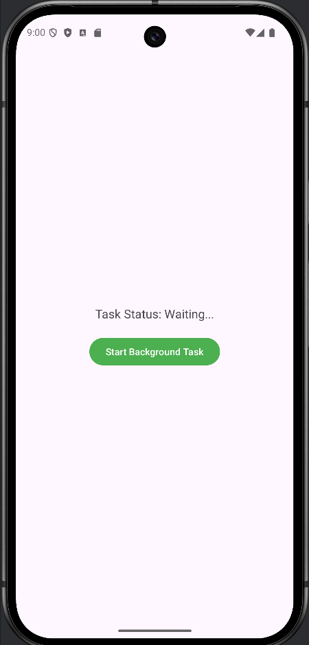
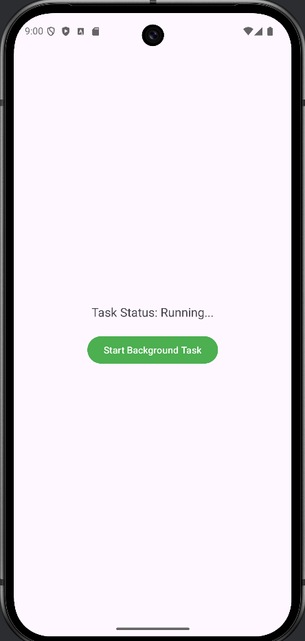

**Задание №1**

​	Был создан проект Lesson4.

​	В файл build.gradle.kts был добавлен следующий код:

```java
buildFeatures{
    viewBinding = true
}
```

​	Далее были созданы ресурс файлы для портретной и горизонтальной ориентации.

​	MainActivity:

```java
public class MainActivity extends AppCompatActivity {
    private ActivityMainBinding binding;

    @Override
    protected void onCreate(Bundle savedInstanceState) {
        super.onCreate(savedInstanceState);
        EdgeToEdge.enable(this);

        binding = ActivityMainBinding.inflate(getLayoutInflater());
        setContentView(binding.getRoot());

        ViewCompat.setOnApplyWindowInsetsListener(binding.getRoot(), (v, insets) -> {
            Insets systemBars = insets.getInsets(WindowInsetsCompat.Type.systemBars());
            v.setPadding(systemBars.left, systemBars.top, systemBars.right, systemBars.bottom);
            return insets;
        });
    }
}
```

​	При запуске приложения открылся экран:


​	При повороте экрана корректно отобразилась соответствующая активность:


------


**Задание №2**

​	Был создан новый модуль thread.

​	В файл build.gradle.kts был добавлен следующий код:

```java
buildFeatures{
    viewBinding = true
}
```

​	В файле MainActivity была прописана логика работы приложения с потоками 

```java
public class MainActivity extends AppCompatActivity {
    private ActivityMainBinding binding;
    private int counter = 0;

    @Override
    protected void onCreate(Bundle savedInstanceState) {
        super.onCreate(savedInstanceState);
        EdgeToEdge.enable(this);

        binding = ActivityMainBinding.inflate(getLayoutInflater());
        setContentView(binding.getRoot());

        ViewCompat.setOnApplyWindowInsetsListener(binding.getRoot(), (v, insets) -> {
            Insets systemBars = insets.getInsets(WindowInsetsCompat.Type.systemBars());
            v.setPadding(systemBars.left, systemBars.top, systemBars.right, systemBars.bottom);
            return insets;
        });

        Thread mainThread = Thread.currentThread();
        binding.textViewResult.setText("Имя текущего потока: " + mainThread.getName());
        mainThread.setName("МОЙ НОМЕР ГРУППЫ: БСБО-09-22, НОМЕР ПО СПИСКУ: 10");
        binding.textViewResult.append("\nНовое имя потока: " + mainThread.getName());
        Log.d(MainActivity.class.getSimpleName(), "Stack: " + java.util.Arrays.toString(mainThread.getStackTrace()));

        binding.buttonCalculate.setOnClickListener(new View.OnClickListener() {
            @Override
            public void onClick(View v) {
                new Thread(new Runnable() {
                    @Override
                    public void run() {
                        int threadNumber = counter++;
                        Log.d("ThreadProject", String.format("Запущен поток № %d студентом группы № %s номер по списку № %d",
                                threadNumber, "БСБО-09-22", 10));

                        String totalClassesStr = binding.editTextTotalClasses.getText().toString();
                        String studyDaysStr = binding.editTextStudyDays.getText().toString();

                        try {
                            int totalClasses = Integer.parseInt(totalClassesStr);
                            int studyDays = Integer.parseInt(studyDaysStr);

                            float averageClassesPerDay = (float) totalClasses / studyDays;

                            runOnUiThread(() -> {
                                binding.textViewResult.setText("Среднее количество пар в день: " + averageClassesPerDay);
                            });

                            long endTime = System.currentTimeMillis() + 20 * 1000;
                            while (System.currentTimeMillis() < endTime) {
                                synchronized (this) {
                                    try {
                                        wait(endTime - System.currentTimeMillis());
                                        Log.d(MainActivity.class.getSimpleName(), "Endtime: " + endTime);
                                    } catch (Exception e) {
                                        throw new RuntimeException(e);
                                    }
                                }
                            }
                            Log.d("ThreadProject", "Выполнен поток № " + threadNumber);
                        } catch (NumberFormatException e) {
                            runOnUiThread(() -> {
                                binding.textViewResult.setText("Ошибка: введите корректные числа");
                            });
                        } catch (ArithmeticException e) {
                            runOnUiThread(() -> {
                                binding.textViewResult.setText("Ошибка: количество дней не может быть 0");
                            });
                        }
                    }
                }).start();
            }
        });
    }
}
```

​	Благодаря переносу замедляющего функционала в отдельный поток, приложение остаётся отзывчивым даже при многократном нажатии на кнопку. Каждый клик создаёт новый поток, и логи в Logcat подтверждают это:


------


**Задание №3.1**

​	Был создан новый модуль data_thread.

​	В файл build.gradle.kts был добавлен следующий код:

```java
buildFeatures{
    viewBinding = true
}
```

​	MainActivity:

```java
public class MainActivity extends AppCompatActivity {
    private ActivityMainBinding binding;

    @Override
    protected void onCreate(Bundle savedInstanceState) {
        super.onCreate(savedInstanceState);
        EdgeToEdge.enable(this);

        // Инициализация ViewBinding
        binding = ActivityMainBinding.inflate(getLayoutInflater());
        setContentView(binding.getRoot());

        // Настройка WindowInsets
        ViewCompat.setOnApplyWindowInsetsListener(binding.getRoot(), (v, insets) -> {
            Insets systemBars = insets.getInsets(WindowInsetsCompat.Type.systemBars());
            v.setPadding(systemBars.left, systemBars.top, systemBars.right, systemBars.bottom);
            return insets;
        });

        // Определение Runnable
        final Runnable runn1 = new Runnable() {
            public void run() {
                binding.tvInfo.setText("runn1\n" + binding.tvInfo.getText());
            }
        };

        final Runnable runn2 = new Runnable() {
            public void run() {
                binding.tvInfo.setText("runn2\n" + binding.tvInfo.getText());
            }
        };

        final Runnable runn3 = new Runnable() {
            public void run() {
                binding.tvInfo.setText("runn3\n" + binding.tvInfo.getText());
                // После выполнения всех Runnable добавляем описание методов
                binding.tvInfo.append("\nРазличия и последовательность:\n" +
                        "1. runOnUiThread: Выполняет задачу в UI-потоке немедленно.\n" +
                        "2. post: Также выполняет задачу в UI-потоке немедленно, но через View.\n" +
                        "3. postDelayed: Выполняет задачу с задержкой (в данном случае 2000 мс).\n" +
                        "Последовательность: runn1 -> runn2 -> runn3 (с задержкой).");
            }
        };

        // Запуск фонового потока
        Thread t = new Thread(new Runnable() {
            public void run() {
                try {
                    // Задержка 2 секунды
                    TimeUnit.SECONDS.sleep(2);
                    runOnUiThread(runn1); // Выполняется сразу после 2 сек

                    // Задержка 1 секунда
                    TimeUnit.SECONDS.sleep(1);
                    binding.tvInfo.postDelayed(runn3, 2000); // Выполнится через 2 сек после вызова
                    binding.tvInfo.post(runn2); // Выполняется сразу после предыдущей задержки
                } catch (InterruptedException e) {
                    e.printStackTrace();
                }
            }
        });
        t.start();
    }
}
```


​	Итоговая последовательность:

- На 2-й секунде: runn1 (через runOnUiThread).
- На 3-й секунде: runn2 (через post).
- На 5-й секунде: runn3 (через postDelayed с задержкой 2000 мс) и вывод описания.


**Задание №3.2**

​	Был создан новый модуль looper. Затем был создан новый java класс MyLooper.

​	В файл build.gradle.kts был добавлен следующий код:

```java
buildFeatures{
    viewBinding = true
}
```

​	MainActivity:

```java
public class MainActivity extends AppCompatActivity {
    private ActivityMainBinding binding;
    private MyLooper myLooper;

    @Override
    protected void onCreate(Bundle savedInstanceState) {
        super.onCreate(savedInstanceState);
        EdgeToEdge.enable(this);

        // Инициализация ViewBinding
        binding = ActivityMainBinding.inflate(getLayoutInflater());
        setContentView(binding.getRoot());

        // Настройка WindowInsets
        ViewCompat.setOnApplyWindowInsetsListener(binding.getRoot(), (v, insets) -> {
            Insets systemBars = insets.getInsets(WindowInsetsCompat.Type.systemBars());
            v.setPadding(systemBars.left, systemBars.top, systemBars.right, systemBars.bottom);
            return insets;
        });

        // Создание Handler для главного потока
        Handler mainThreadHandler = new Handler(Looper.getMainLooper()) {
            @Override
            public void handleMessage(Message msg) {
                String result = msg.getData().getString("result");
                // Форматирование времени получения результата
                String time = new SimpleDateFormat("HH:mm:ss", Locale.getDefault()).format(new Date());
                Log.d(MainActivity.class.getSimpleName(), "Task executed at " + time + ". Result: " + result);
            }
        };

        // Запуск MyLooper
        myLooper = new MyLooper(mainThreadHandler);
        myLooper.start();

        // Установка начальных значений
        binding.editTextAge.setText("25");
        binding.editTextProfession.setText("Программист");

        // Обработчик нажатия на кнопку
        binding.buttonSend.setOnClickListener(new View.OnClickListener() {
            @Override
            public void onClick(View v) {
                // Логирование времени клика
                String clickTime = new SimpleDateFormat("HH:mm:ss", Locale.getDefault()).format(new Date());
                Log.d(MainActivity.class.getSimpleName(), "Button clicked at " + clickTime);

                // Проверка, что Handler в MyLooper инициализирован
                if (myLooper.mHandler != null) {
                    Message msg = Message.obtain();
                    Bundle bundle = new Bundle();
                    bundle.putString("AGE", binding.editTextAge.getText().toString());
                    bundle.putString("PROFESSION", binding.editTextProfession.getText().toString());
                    msg.setData(bundle);
                    myLooper.mHandler.sendMessage(msg);
                } else {
                    Log.e(MainActivity.class.getSimpleName(), "Handler в MyLooper ещё не инициализирован");
                }
            }
        });
    }
}
```

​	MyLooper:

```java
public class MyLooper extends Thread {
    public Handler mHandler;
    private Handler mainHandler;

    public MyLooper(Handler mainThreadHandler) {
        mainHandler = mainThreadHandler;
    }

    public void run() {
        Log.d("MyLooper", "run");
        Looper.prepare();

        mHandler = new Handler(Looper.myLooper()) {
            public void handleMessage(Message msg) {
                String ageStr = msg.getData().getString("AGE");
                String profession = msg.getData().getString("PROFESSION");

                try {
                    int age = Integer.parseInt(ageStr);
                    // Задержка на количество лет (в секундах)
                    Thread.sleep(age * 1000);

                    // Формирование результата
                    String result = String.format("Возраст: %d, Профессия: %s", age, profession);
                    // Логирование времени обработки
                    String time = new SimpleDateFormat("HH:mm:ss", Locale.getDefault()).format(new Date());
                    Log.d("MyLooper", "Processed at " + time + ". Результат: " + result);

                    // Отправка результата обратно в главный поток
                    Message message = new Message();
                    Bundle bundle = new Bundle();
                    bundle.putString("result", result);
                    message.setData(bundle);
                    mainHandler.sendMessage(message);
                } catch (InterruptedException e) {
                    e.printStackTrace();
                } catch (NumberFormatException e) {
                    Log.e("MyLooper", "Ошибка: возраст должен быть числом");
                }
            }
        };

        Looper.loop();
    }
}
```

​	При запуске приложения открывается такой экран:


​	Обработка нажатия и задержка равная указанному возрасту продемонстрирована ниже в логах Logcat:


------


**Задание №3.3**

​	Был создан новый модуль cryptoloader и в нем новый java класс MyLoader.

​	В MainActivity пользователь вводит фразу в EditText, которая затем шифруется с помощью алгоритма AES и передаётся вместе с ключом в Loader через restartLoader при нажатии на кнопку. После завершения работы Loader расшифрованная фраза возвращается в метод onLoadFinished, где отображается через Toast. MainActivity:

```java
public class MainActivity extends AppCompatActivity implements LoaderManager.LoaderCallbacks<String> {
    private ActivityMainBinding binding;
    private final String TAG = this.getClass().getSimpleName();
    private final int LoaderID = 1234;

    @Override
    protected void onCreate(Bundle savedInstanceState) {
        super.onCreate(savedInstanceState);
        EdgeToEdge.enable(this);

        // Инициализация ViewBinding
        binding = ActivityMainBinding.inflate(getLayoutInflater());
        setContentView(binding.getRoot());

        // Настройка WindowInsets
        ViewCompat.setOnApplyWindowInsetsListener(binding.getRoot(), (v, insets) -> {
            Insets systemBars = insets.getInsets(WindowInsetsCompat.Type.systemBars());
            v.setPadding(systemBars.left, systemBars.top, systemBars.right, systemBars.bottom);
            return insets;
        });

        // Обработчик нажатия на кнопку
        binding.buttonEncrypt.setOnClickListener(new View.OnClickListener() {
            @Override
            public void onClick(View v) {
                onClickButton(v);
            }
        });
    }

    // Метод для шифрования и запуска Loader
    public void onClickButton(View view) {
        String phrase = binding.editTextPhrase.getText().toString();
        if (phrase.isEmpty()) {
            Toast.makeText(this, "Введите фразу для шифрования", Toast.LENGTH_SHORT).show();
            return;
        }

        try {
            // Генерация ключа
            SecretKey key = generateKey();
            // Шифрование фразы
            byte[] encryptedPhrase = encryptMsg(phrase, key);

            // Передача данных в Loader с использованием restartLoader
            Bundle bundle = new Bundle();
            bundle.putByteArray(MyLoader.ARG_WORD, encryptedPhrase);
            bundle.putByteArray("key", key.getEncoded());
            LoaderManager.getInstance(this).restartLoader(LoaderID, bundle, this);
        } catch (Exception e) {
            Toast.makeText(this, "Ошибка шифрования: " + e.getMessage(), Toast.LENGTH_SHORT).show();
        }
    }

    @Override
    public Loader<String> onCreateLoader(int id, @Nullable Bundle args) {
        if (id == LoaderID) {
            Toast.makeText(this, "onCreateLoader: " + id, Toast.LENGTH_SHORT).show();
            return new MyLoader(this, args);
        }
        throw new IllegalArgumentException("Invalid loader id");
    }

    @Override
    public void onLoadFinished(Loader<String> loader, String data) {
        if (loader.getId() == LoaderID) {
            Log.d(TAG, "onLoadFinished: " + data);
            Toast.makeText(this, "onLoadFinished: " + data, Toast.LENGTH_LONG).show();
        }
    }

    @Override
    public void onLoaderReset(Loader<String> loader) {
        Log.d(TAG, "onLoaderReset");
    }

    // Метод генерации ключа
    public static SecretKey generateKey() {
        try {
            SecureRandom sr = SecureRandom.getInstance("SHA1PRNG");
            sr.setSeed("any data used as random seed".getBytes());
            KeyGenerator kg = KeyGenerator.getInstance("AES");
            kg.init(256, sr);
            return new SecretKeySpec((kg.generateKey()).getEncoded(), "AES");
        } catch (NoSuchAlgorithmException e) {
            throw new RuntimeException(e);
        }
    }

    // Метод шифрования
    public static byte[] encryptMsg(String message, SecretKey secret) {
        try {
            Cipher cipher = Cipher.getInstance("AES");
            cipher.init(Cipher.ENCRYPT_MODE, secret);
            return cipher.doFinal(message.getBytes());
        } catch (NoSuchAlgorithmException | NoSuchPaddingException | InvalidKeyException |
                 BadPaddingException | IllegalBlockSizeException e) {
            throw new RuntimeException(e);
        }
    }
}
```

​	MyLoader принимает зашифрованную фразу и ключ через Bundle, переданные из MainActivity, и выполняет их расшифровку в фоновом потоке в методе loadInBackground. После расшифровки результат возвращается в MainActivity для отображения, а сам процесс происходит асинхронно, чтобы не блокировать UI. MyLoader:

```java
public class MyLoader extends AsyncTaskLoader<String> {
    public static final String ARG_WORD = "word";
    private byte[] encryptedText;
    private byte[] key;

    public MyLoader(@NonNull Context context, Bundle args) {
        super(context);
        if (args != null) {
            encryptedText = args.getByteArray(ARG_WORD);
            key = args.getByteArray("key");
        }
    }

    @Override
    protected void onStartLoading() {
        super.onStartLoading();
        forceLoad(); // Запускает загрузку
    }

    @Override
    public String loadInBackground() {
        if (encryptedText == null || key == null) {
            return "Ошибка: данные или ключ отсутствуют";
        }

        try {
            // Восстановление ключа
            SecretKey originalKey = new SecretKeySpec(key, 0, key.length, "AES");
            // Дешифрование текста
            return decryptMsg(encryptedText, originalKey);
        } catch (Exception e) {
            return "Ошибка дешифрования: " + e.getMessage();
        }
    }

    // Метод дешифрования
    private String decryptMsg(byte[] cipherText, SecretKey secret) {
        try {
            Cipher cipher = Cipher.getInstance("AES");
            cipher.init(Cipher.DECRYPT_MODE, secret);
            return new String(cipher.doFinal(cipherText));
        } catch (NoSuchAlgorithmException | NoSuchPaddingException | IllegalBlockSizeException
                 | BadPaddingException | InvalidKeyException e) {
            throw new RuntimeException(e);
        }
    }
}
```

​	При запуске приложения можно ввести фразу:


​	После нажатия на кнопку всплывает уведомление с расшифрованной фразой:


------


**Задание №4**

​	Был создан новый модуль ServiceApp и Service PlayerService.

​	MainActivity:

```java
public class MainActivity extends AppCompatActivity {
    private static final int NOTIFICATION_PERMISSION_CODE = 100;
    private static final String TAG = "MainActivity";

    @Override
    protected void onCreate(Bundle savedInstanceState) {
        super.onCreate(savedInstanceState);
        EdgeToEdge.enable(this);
        setContentView(R.layout.activity_main);

        // Проверка разрешения на уведомления
        checkNotificationPermission();

        // Инициализация кнопок
        Button buttonPlay = findViewById(R.id.buttonPlay);
        Button buttonStop = findViewById(R.id.buttonStop);

        // Обработчик для кнопки Play
        buttonPlay.setOnClickListener(new View.OnClickListener() {
            @Override
            public void onClick(View v) {
                Log.d(TAG, "Play button clicked");
                Intent serviceIntent = new Intent(MainActivity.this, PlayerService.class);
                try {
                    startForegroundService(serviceIntent);
                    Toast.makeText(MainActivity.this, "Starting music playback", Toast.LENGTH_SHORT).show();
                } catch (Exception e) {
                    Log.e(TAG, "Error starting service", e);
                    Toast.makeText(MainActivity.this, "Failed to start playback: " + e.getMessage(), Toast.LENGTH_LONG).show();
                }
            }
        });

        // Обработчик для кнопки Stop
        buttonStop.setOnClickListener(new View.OnClickListener() {
            @Override
            public void onClick(View v) {
                Log.d(TAG, "Stop button clicked");
                Intent serviceIntent = new Intent(MainActivity.this, PlayerService.class);
                try {
                    stopService(serviceIntent);
                    Toast.makeText(MainActivity.this, "Stopping music playback", Toast.LENGTH_SHORT).show();
                } catch (Exception e) {
                    Log.e(TAG, "Error stopping service", e);
                    Toast.makeText(MainActivity.this, "Failed to stop playback: " + e.getMessage(), Toast.LENGTH_LONG).show();
                }
            }
        });
    }

    // Метод для проверки разрешения на уведомления
    private void checkNotificationPermission() {
        if (ContextCompat.checkSelfPermission(this, android.Manifest.permission.POST_NOTIFICATIONS)
                != PackageManager.PERMISSION_GRANTED) {
            ActivityCompat.requestPermissions(this,
                    new String[]{android.Manifest.permission.POST_NOTIFICATIONS},
                    NOTIFICATION_PERMISSION_CODE);
        }
    }

    @Override
    public void onRequestPermissionsResult(int requestCode, String[] permissions, int[] grantResults) {
        super.onRequestPermissionsResult(requestCode, permissions, grantResults);
        if (requestCode == NOTIFICATION_PERMISSION_CODE) {
            if (grantResults.length > 0 && grantResults[0] == PackageManager.PERMISSION_GRANTED) {
                Toast.makeText(this, "Notification permission granted", Toast.LENGTH_SHORT).show();
            } else {
                Toast.makeText(this, "Notification permission denied", Toast.LENGTH_SHORT).show();
            }
        }
    }
}
```

​	PlayerService:

```java
public class PlayerService extends Service {
    private MediaPlayer mediaPlayer;
    public static final String CHANNEL_ID = "ForegroundServiceChannel";
    private static final String TAG = "PlayerService";

    @Override
    public IBinder onBind(Intent intent) {
        throw new UnsupportedOperationException("Not yet implemented");
    }

    @Override
    public void onCreate() {
        super.onCreate();
        Log.d(TAG, "onCreate: Initializing PlayerService");

        // Создание уведомления
        NotificationCompat.Builder builder = new NotificationCompat.Builder(this, CHANNEL_ID)
                .setContentText("Playing 'Sunset Dreams' by Alex Rivers")
                .setSmallIcon(R.mipmap.ic_launcher)
                .setPriority(NotificationCompat.PRIORITY_HIGH)
                .setStyle(new NotificationCompat.BigTextStyle()
                        .bigText("Music Player Service - Enjoy your music!"))
                .setContentTitle("Music Player");

        // Создание канала уведомлений
        NotificationChannel channel = new NotificationChannel(CHANNEL_ID, "Student FIO Notification", NotificationManager.IMPORTANCE_DEFAULT);
        channel.setDescription("MIREA Channel");
        NotificationManagerCompat notificationManager = NotificationManagerCompat.from(this);
        notificationManager.createNotificationChannel(channel);

        // Запуск сервиса в foreground режиме
        try {
            startForeground(1, builder.build());
            Log.d(TAG, "onCreate: Foreground service started successfully");
        } catch (Exception e) {
            Log.e(TAG, "onCreate: Failed to start foreground service", e);
            stopSelf();
            return;
        }

        // Инициализация MediaPlayer
        try {
            mediaPlayer = MediaPlayer.create(this, R.raw.song);
            if (mediaPlayer == null) {
                Log.e(TAG, "onCreate: Failed to create MediaPlayer - resource not found or invalid");
                stopSelf();
                return;
            }
            mediaPlayer.setLooping(false);
            Log.d(TAG, "onCreate: MediaPlayer initialized successfully");
        } catch (Exception e) {
            Log.e(TAG, "onCreate: Error initializing MediaPlayer", e);
            stopSelf();
        }
    }

    @Override
    public int onStartCommand(Intent intent, int flags, int startId) {
        Log.d(TAG, "onStartCommand: Starting playback");

        if (mediaPlayer == null) {
            Log.e(TAG, "onStartCommand: MediaPlayer is null, cannot start playback");
            stopSelf();
            return START_NOT_STICKY;
        }

        try {
            mediaPlayer.start();
            Log.d(TAG, "onStartCommand: Playback started successfully");

            mediaPlayer.setOnCompletionListener(new MediaPlayer.OnCompletionListener() {
                public void onCompletion(MediaPlayer mp) {
                    Log.d(TAG, "onCompletion: Playback completed");
                    stopForeground(true);
                    stopSelf();
                }
            });
        } catch (Exception e) {
            Log.e(TAG, "onStartCommand: Error starting playback", e);
            stopSelf();
        }

        return START_NOT_STICKY;
    }

    @Override
    public void onDestroy() {
        Log.d(TAG, "onDestroy: Stopping PlayerService");

        try {
            if (mediaPlayer != null) {
                if (mediaPlayer.isPlaying()) {
                    mediaPlayer.stop();
                }
                mediaPlayer.release();
                mediaPlayer = null;
                Log.d(TAG, "onDestroy: MediaPlayer released");
            }
        } catch (Exception e) {
            Log.e(TAG, "onDestroy: Error releasing MediaPlayer", e);
        }

        stopForeground(true);
        super.onDestroy();
    }
}
```

​	AndroidManifest.xml:

```xml
<?xml version="1.0" encoding="utf-8"?>
<manifest xmlns:android="http://schemas.android.com/apk/res/android">
    <uses-permission android:name="android.permission.FOREGROUND_SERVICE" />
    <uses-permission android:name="android.permission.POST_NOTIFICATIONS" />
    <uses-permission android:name="android.permission.FOREGROUND_SERVICE_MEDIA_PLAYBACK" />
    <application
        android:allowBackup="true"
        android:icon="@mipmap/ic_launcher"
        android:label="@string/app_name"
        android:roundIcon="@mipmap/ic_launcher_round"
        android:supportsRtl="true"
        android:theme="@style/Theme.Lesson4">
        <service
            android:name=".PlayerService"
            android:enabled="true"
            android:exported="false"
            android:foregroundServiceType="mediaPlayback" />

        <activity
            android:name=".MainActivity"
            android:exported="true">
            <intent-filter>
                <action android:name="android.intent.action.MAIN" />

                <category android:name="android.intent.category.LAUNCHER" />
            </intent-filter>
        </activity>
    </application>

</manifest>
```

​	При запуске приложения открывается проигрыватель. При нажатии на "Play" воспроизводится композиция из папки raw, при нажатии на кнопку "Stop" останавливается. Дизайн приложения представлен ниже.


------


**Задание №5**

​	Был создан новый модуль WorkManager.

​	MainActivity:

```java
public class MainActivity extends AppCompatActivity {

    private TextView statusTextView;

    @Override
    protected void onCreate(Bundle savedInstanceState) {
        super.onCreate(savedInstanceState);
        EdgeToEdge.enable(this);
        setContentView(R.layout.activity_main);

        ViewCompat.setOnApplyWindowInsetsListener(findViewById(R.id.main), (v, insets) -> {
            Insets systemBars = insets.getInsets(WindowInsetsCompat.Type.systemBars());
            v.setPadding(systemBars.left, systemBars.top, systemBars.right, systemBars.bottom);
            return insets;
        });

        statusTextView = findViewById(R.id.statusTextView);

        Constraints constraints = new Constraints.Builder()
                .setRequiredNetworkType(NetworkType.UNMETERED)
                .setRequiresCharging(true)
                .build();

        WorkRequest uploadWorkRequest = new OneTimeWorkRequest.Builder(UploadWorker.class)
                .setConstraints(constraints)
                .build();


        WorkManager workManager = WorkManager.getInstance(this);
        workManager.enqueue(uploadWorkRequest);


        workManager.getWorkInfoByIdLiveData(uploadWorkRequest.getId()).observe(this, workInfo -> {
            if (workInfo != null) {
                WorkInfo.State state = workInfo.getState();
                switch (state) {
                    case ENQUEUED:
                        statusTextView.setText("Task Enqueued: Waiting for conditions...");
                        break;
                    case RUNNING:
                        statusTextView.setText("Task Running: Work in progress...");
                        break;
                    case SUCCEEDED:
                        statusTextView.setText("Task Succeeded: Work completed!");
                        break;
                    case FAILED:
                        statusTextView.setText("Task Failed: Something went wrong.");
                        break;
                    case BLOCKED:
                        statusTextView.setText("Task Blocked: Waiting for dependencies...");
                        break;
                    case CANCELLED:
                        statusTextView.setText("Task Cancelled.");
                        break;
                }
            }
        });
    }
}
```

​	UploadWorker:

```java
public class UploadWorker extends Worker {
    static final String TAG = "UploadWorker";

    public UploadWorker(@NonNull Context context, @NonNull WorkerParameters params) {
        super(context, params);
    }

    @Override
    public Result doWork() {
        Log.d(TAG, "doWork: start");
        try {
            TimeUnit.SECONDS.sleep(10);
        } catch (InterruptedException e) {
            e.printStackTrace();
            return Result.failure();
        }
        Log.d(TAG, "doWork: end");
        return Result.success();
    }
}
```

​	При запуске модуля в Logcat были выведены следующие логи:


------


**Задание №6**

​	В проекте MireaProject создан новый модуль pr4 и фрагмент BackgroundTaskFragment, который использует WorkManager для выполнения фоновой задачи с классом TaskWorker, имитирующим работу с задержкой 5 секунд и требующим наличия интернета. Фрагмент отображает статус задачи ("Running", "Succeeded" и т.д.) в TextView и запускает задачу по нажатию на кнопку, а MainActivity настроена для отображения этого фрагмента через FragmentContainerView. Добавлены необходимые зависимости в build.gradle, разрешение на интернет в AndroidManifest.xml, а также проведено тестирование, подтвердившее корректное выполнение задачи с логированием в Logcat.

​	MainActivity:

```java
public class MainActivity extends AppCompatActivity {

    @Override
    protected void onCreate(Bundle savedInstanceState) {
        super.onCreate(savedInstanceState);
        EdgeToEdge.enable(this);
        setContentView(R.layout.activity_main);

        ViewCompat.setOnApplyWindowInsetsListener(findViewById(R.id.fragment_container), (v, insets) -> {
            Insets systemBars = insets.getInsets(WindowInsetsCompat.Type.systemBars());
            v.setPadding(systemBars.left, systemBars.top, systemBars.right, systemBars.bottom);
            return insets;
        });

        if (savedInstanceState == null) {
            getSupportFragmentManager().beginTransaction()
                    .replace(R.id.fragment_container, new BackgroundTaskFragment())
                    .commit();
        }
    }
}
```

​	BackgroundTaskFragment:

```java
public class BackgroundTaskFragment extends Fragment {

    private TextView statusTextView;
    private Button startTaskButton;

    @Override
    public View onCreateView(LayoutInflater inflater, ViewGroup container, Bundle savedInstanceState) {
        View view = inflater.inflate(R.layout.fragment_background_task, container, false);

        statusTextView = view.findViewById(R.id.statusTextView);
        startTaskButton = view.findViewById(R.id.startTaskButton);

        startTaskButton.setOnClickListener(v -> startBackgroundTask());

        return view;
    }

    private void startBackgroundTask() {
        Constraints constraints = new Constraints.Builder()
                .setRequiredNetworkType(NetworkType.CONNECTED) 
                .build();

        WorkRequest taskRequest = new OneTimeWorkRequest.Builder(TaskWorker.class)
                .setConstraints(constraints)
                .build();

        WorkManager workManager = WorkManager.getInstance(requireContext());
        workManager.enqueue(taskRequest);

        workManager.getWorkInfoByIdLiveData(taskRequest.getId()).observe(getViewLifecycleOwner(), workInfo -> {
            if (workInfo != null) {
                WorkInfo.State state = workInfo.getState();
                switch (state) {
                    case ENQUEUED:
                        statusTextView.setText("Task Status: Enqueued...");
                        break;
                    case RUNNING:
                        statusTextView.setText("Task Status: Running...");
                        break;
                    case SUCCEEDED:
                        statusTextView.setText("Task Status: Succeeded!");
                        break;
                    case FAILED:
                        statusTextView.setText("Task Status: Failed.");
                        break;
                    case BLOCKED:
                        statusTextView.setText("Task Status: Blocked...");
                        break;
                    case CANCELLED:
                        statusTextView.setText("Task Status: Cancelled.");
                        break;
                }
            }
        });
    }
}
```

​	TaskWorker:

```java
public class TaskWorker extends Worker {
    private static final String TAG = "TaskWorker";

    public TaskWorker(@NonNull Context context, @NonNull WorkerParameters params) {
        super(context, params);
    }

    @Override
    public Result doWork() {
        Log.d(TAG, "doWork: Starting background task");
        try {
            TimeUnit.SECONDS.sleep(5);
        } catch (InterruptedException e) {
            e.printStackTrace();
            Log.e(TAG, "doWork: Task failed", e);
            return Result.failure();
        }
        Log.d(TAG, "doWork: Task completed successfully");
        return Result.success();
    }
}
```

​	При запуске приложения открывается экран:



​	После нажатия на кнопку начинается выполнение задачи, запускается задержка:




​	В Logcat были выведены следующие логи с разницей 5 секунд: 


