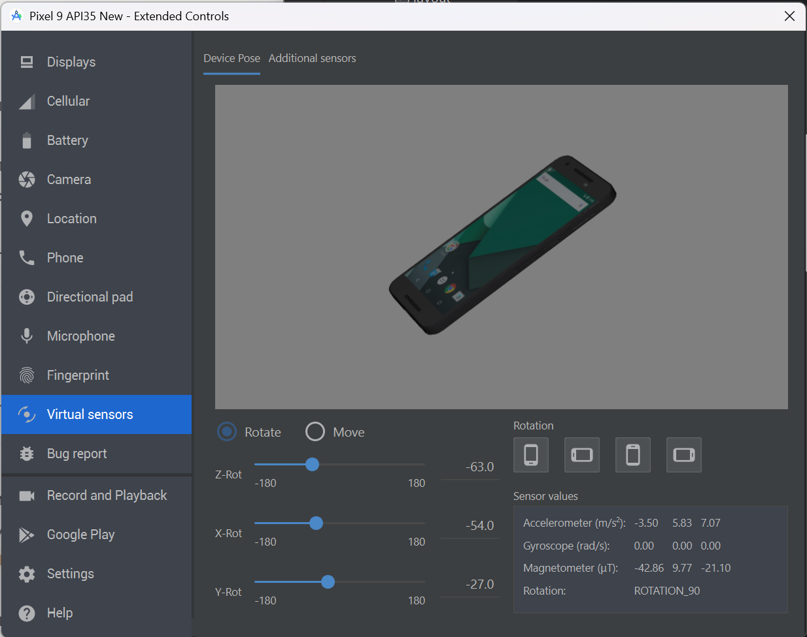
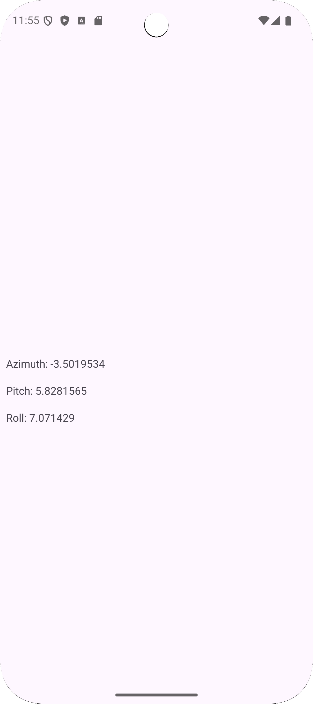
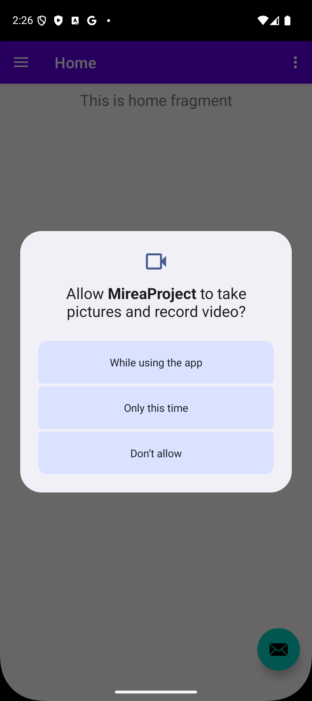
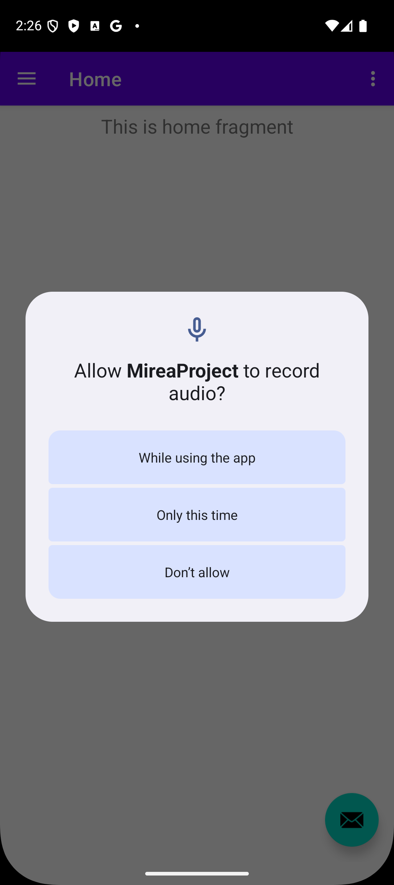
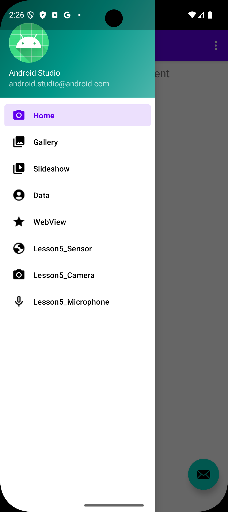
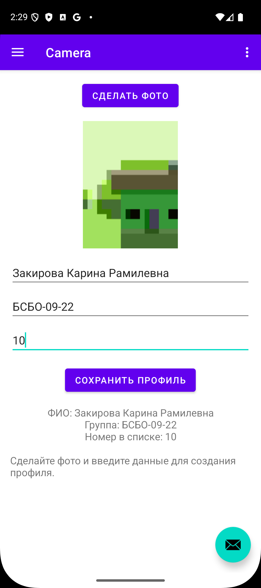
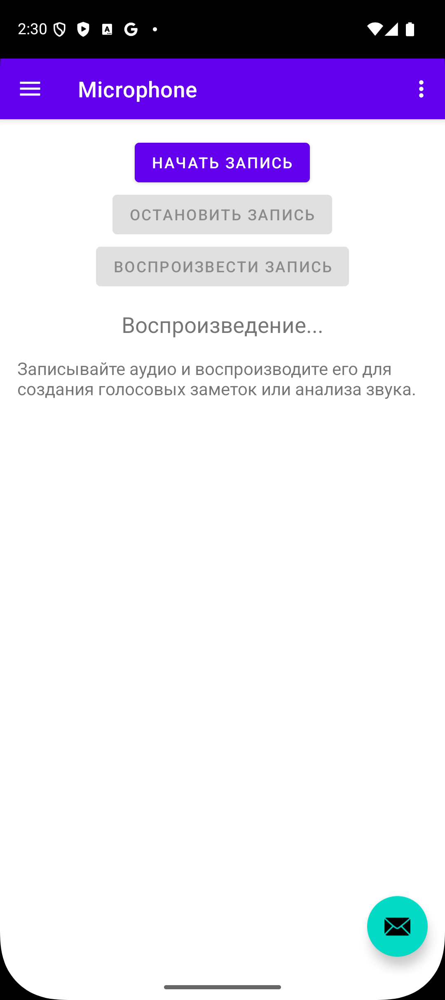
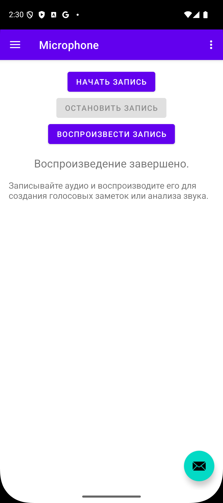

**Задание №1**

​	Был создан новый проект Lesson5. Был отображен список оборудования на устройстве. 

​	Была добавлена привязка к представлению:

```
buildFeatures {
    viewBinding = true
}
```

​	activity_main.xml:

```java
<?xml version="1.0" encoding="utf-8"?>
<androidx.constraintlayout.widget.ConstraintLayout xmlns:android="http://schemas.android.com/apk/res/android"
    xmlns:app="http://schemas.android.com/apk/res-auto"
    xmlns:tools="http://schemas.android.com/tools"
    android:layout_width="match_parent"
    android:layout_height="match_parent"
    tools:context=".MainActivity">
    <ListView
        android:id="@+id/list_view"
        android:layout_width="wrap_content"
        android:layout_height="wrap_content"
        android:layout_marginStart="8dp"
        android:layout_marginTop="8dp"
        android:layout_marginEnd="8dp"
        android:layout_marginBottom="8dp"
        app:layout_constraintBottom_toBottomOf="parent"
        app:layout_constraintEnd_toEndOf="parent"
        app:layout_constraintStart_toStartOf="parent"
        app:layout_constraintTop_toTopOf="parent" />
</androidx.constraintlayout.widget.ConstraintLayout>
```

​	MainActivity:

```java
public class MainActivity extends AppCompatActivity {
    private ActivityMainBinding binding;

    @Override
    protected void onCreate(Bundle savedInstanceState) {
        super.onCreate(savedInstanceState);
        binding = ActivityMainBinding.inflate(getLayoutInflater());
        setContentView(binding.getRoot());

        SensorManager sensorManager = (SensorManager) getSystemService(Context.SENSOR_SERVICE);
        List<Sensor> sensors = sensorManager.getSensorList(Sensor.TYPE_ALL);
        ListView listSensor = binding.listView;

        ArrayList<HashMap<String, Object>> arrayList = new ArrayList<>();
        for (int i = 0; i < sensors.size(); i++) {
            HashMap<String, Object> sensorTypeList = new HashMap<>();
            sensorTypeList.put("Name", sensors.get(i).getName());
            sensorTypeList.put("Value", sensors.get(i).getMaximumRange());
            arrayList.add(sensorTypeList);
        }

        SimpleAdapter mHistory = new SimpleAdapter(
                this,
                arrayList,
                android.R.layout.simple_list_item_2,
                new String[]{"Name", "Value"},
                new int[]{android.R.id.text1, android.R.id.text2}
        );

        listSensor.setAdapter(mHistory);
    }
}
```


------


**Задание №2**

​	Был создан новый модуль Accelerometer. Создано приложение, отображающее значения акселерометра на главном экране. При вращении устройства значения изменяются на главном экране.

​	activity_main.xml:

```xml
<?xml version="1.0" encoding="utf-8"?>
<androidx.constraintlayout.widget.ConstraintLayout xmlns:android="http://schemas.android.com/apk/res/android"
    xmlns:app="http://schemas.android.com/apk/res-auto"
    xmlns:tools="http://schemas.android.com/tools"
    android:id="@+id/main"
    android:layout_width="match_parent"
    android:layout_height="match_parent"
    tools:context=".MainActivity">
    <TextView
        android:id="@+id/textViewAzimuth"
        android:layout_width="match_parent"
        android:layout_height="wrap_content"
        android:layout_marginStart="8dp"
        android:layout_marginLeft="8dp"
        android:layout_marginEnd="8dp"
        android:layout_marginRight="8dp"
        app:layout_constraintBottom_toBottomOf="parent"
        app:layout_constraintEnd_toEndOf="parent"
        app:layout_constraintStart_toStartOf="parent"
        app:layout_constraintTop_toTopOf="parent" />
    <TextView
        android:id="@+id/textViewPitch"
        android:layout_width="match_parent"
        android:layout_height="wrap_content"
        android:layout_marginStart="8dp"
        android:layout_marginLeft="8dp"
        android:layout_marginTop="16dp"
        android:layout_marginEnd="8dp"
        android:layout_marginRight="8dp"
        app:layout_constraintEnd_toEndOf="parent"
        app:layout_constraintStart_toStartOf="parent"
        app:layout_constraintTop_toBottomOf="@+id/textViewAzimuth" />
    <TextView
        android:id="@+id/textViewRoll"
        android:layout_width="match_parent"
        android:layout_height="wrap_content"
        android:layout_marginStart="8dp"
        android:layout_marginLeft="8dp"
        android:layout_marginTop="16dp"
        android:layout_marginEnd="8dp"
        android:layout_marginRight="8dp"
        app:layout_constraintEnd_toEndOf="parent"
        app:layout_constraintStart_toStartOf="parent"
        app:layout_constraintTop_toBottomOf="@+id/textViewPitch" />
</androidx.constraintlayout.widget.ConstraintLayout>
```

​	MainActivity:

```java
public class MainActivity extends AppCompatActivity implements SensorEventListener {
    private SensorManager sensorManager;
    private Sensor accelerometer;
    private TextView azimuthTextView;
    private TextView pitchTextView;
    private TextView rollTextView;

    @Override
    protected void onCreate(Bundle savedInstanceState) {
        super.onCreate(savedInstanceState);
        EdgeToEdge.enable(this);
        setContentView(R.layout.activity_main);
        ViewCompat.setOnApplyWindowInsetsListener(findViewById(R.id.main), (v, insets) -> {
            WindowInsetsCompat Insets = insets;
            v.setPadding(Insets.getSystemWindowInsetLeft(), Insets.getSystemWindowInsetTop(),
                    Insets.getSystemWindowInsetRight(), Insets.getSystemWindowInsetBottom());
            return insets;
        });

        sensorManager = (SensorManager) getSystemService(SENSOR_SERVICE);
        accelerometer = sensorManager.getDefaultSensor(Sensor.TYPE_ACCELEROMETER);
        azimuthTextView = findViewById(R.id.textViewAzimuth);
        pitchTextView = findViewById(R.id.textViewPitch);
        rollTextView = findViewById(R.id.textViewRoll);
    }

    @Override
    protected void onPause() {
        super.onPause();
        sensorManager.unregisterListener(this);
    }

    @Override
    protected void onResume() {
        super.onResume();
        sensorManager.registerListener(this, accelerometer, SensorManager.SENSOR_DELAY_NORMAL);
    }

    @Override
    public void onSensorChanged(SensorEvent event) {
        if (event.sensor.getType() == Sensor.TYPE_ACCELEROMETER) {
            float x = event.values[0];
            float y = event.values[1];
            float z = event.values[2];
            azimuthTextView.setText(String.format("Azimuth: %s", x));
            pitchTextView.setText(String.format("Pitch: %s", y));
            rollTextView.setText(String.format("Roll: %s", z));
        }
    }

    @Override
    public void onAccuracyChanged(Sensor sensor, int accuracy) {
        }
}
```

​	При запуске приложения открывается экран:


​	При повороте экрана:


​	Далее был выполнен поворот телефона в настройках:



​	С такими настройками на экране отображаются следующие значения:



------


**Задание. Камера**

​	Был создан новый модуль Camera. 

​	Включена привязка:

```java
buildFeatures {
    viewBinding = true
}
```

​	Был обновлен файл AndroidManifest.xml:

```java
<?xml version="1.0" encoding="utf-8"?>
<manifest xmlns:android="http://schemas.android.com/apk/res/android">

    <uses-permission android:name="android.permission.CAMERA" />
    <uses-permission android:name="android.permission.WRITE_EXTERNAL_STORAGE" />

    <application
        android:allowBackup="true"
        android:icon="@mipmap/ic_launcher"
        android:label="@string/app_name"
        android:roundIcon="@mipmap/ic_launcher_round"
        android:supportsRtl="true"
        android:theme="@style/Theme.Lesson5">
        <activity
            android:name=".MainActivity"
            android:exported="true">
            <intent-filter>
                <action android:name="android.intent.action.MAIN" />

                <category android:name="android.intent.category.LAUNCHER" />
            </intent-filter>
        </activity>

        <provider
            android:name="androidx.core.content.FileProvider"
            android:authorities="ru.mirea.zakirovakr.camera.fileprovider"
            android:exported="false"
            android:grantUriPermissions="true">
            <meta-data
                android:name="android.support.FILE_PROVIDER_PATHS"
                android:resource="@xml/paths" />
        </provider>


    </application>

</manifest>
```

​	Был создан res/xml/. В этом файле указаны каталоги, которыми FileProvider может делиться. Буден использован external-files-path для обмена каталогом Pictures во внешнем хранилище приложения.

​	paths.xml

```xml
<?xml version="1.0" encoding="utf-8"?>
<paths>
    <external-files-path name="images" path="Pictures" />
</paths>
```

​	Макет включает ImageView для отображения сделанной фотографии. Был использован ViewBinding для обработки события нажатия на ImageView. 

​	activity_main.xml:

```xml
<?xml version="1.0" encoding="utf-8"?>
<androidx.constraintlayout.widget.ConstraintLayout xmlns:android="http://schemas.android.com/apk/res/android"
    xmlns:app="http://schemas.android.com/apk/res-auto"
    xmlns:tools="http://schemas.android.com/tools"
    android:layout_width="match_parent"
    android:layout_height="match_parent"
    tools:context=".MainActivity">

    <ImageView
        android:id="@+id/imageView"
        android:layout_width="0dp"
        android:layout_height="0dp"
        android:layout_margin="16dp"
        android:contentDescription="Captured Image"
        app:layout_constraintBottom_toBottomOf="parent"
        app:layout_constraintEnd_toEndOf="parent"
        app:layout_constraintStart_toStartOf="parent"
        app:layout_constraintTop_toTopOf="parent" />

</androidx.constraintlayout.widget.ConstraintLayout>
```

​	В MainActivity:

- Запрашиваются разрешения для КАМЕРЫ и WRITE_EXTERNAL_STORAGE.
- Используется FileProvider, чтобы сгенерировать URI для файла фотографии.
- Запускается приложение «Камера» с помощью направления MediaStore.ACTION_IMAGE_CAPTURE.
- Отображается сделанная фотография в режиме просмотра изображений.

​	MainActivity.java:

```java
public class MainActivity extends AppCompatActivity {
    private static final int REQUEST_CODE_PERMISSION = 100;
    private boolean isWork = false;
    private Uri imageUri;
    private ActivityMainBinding binding;

    @Override
    protected void onCreate(Bundle savedInstanceState) {
        super.onCreate(savedInstanceState);
        binding = ActivityMainBinding.inflate(getLayoutInflater());
        setContentView(binding.getRoot());

        int cameraPermissionStatus = ContextCompat.checkSelfPermission(this, android.Manifest.permission.CAMERA);
        int storagePermissionStatus = ContextCompat.checkSelfPermission(this, android.Manifest.permission.WRITE_EXTERNAL_STORAGE);

        if (cameraPermissionStatus == PackageManager.PERMISSION_GRANTED && storagePermissionStatus == PackageManager.PERMISSION_GRANTED) {
            isWork = true;
        } else {
            ActivityCompat.requestPermissions(this, new String[] {
                    android.Manifest.permission.CAMERA,
                    android.Manifest.permission.WRITE_EXTERNAL_STORAGE
            }, REQUEST_CODE_PERMISSION);
        }

        ActivityResultCallback<ActivityResult> callback = new ActivityResultCallback<ActivityResult>() {
            @Override
            public void onActivityResult(ActivityResult result) {
                if (result.getResultCode() == Activity.RESULT_OK) {
                    binding.imageView.setImageURI(imageUri);
                }
            }
        };

        ActivityResultLauncher<Intent> cameraActivityResultLauncher = registerForActivityResult(
                new ActivityResultContracts.StartActivityForResult(),
                callback
        );

        binding.imageView.setOnClickListener(new View.OnClickListener() {
            @Override
            public void onClick(View v) {
                if (isWork) {
                    try {
                        File photoFile = createImageFile();
                        String authorities = getApplicationContext().getPackageName() + ".fileprovider";
                        imageUri = FileProvider.getUriForFile(MainActivity.this, authorities, photoFile);
                        Intent cameraIntent = new Intent(android.provider.MediaStore.ACTION_IMAGE_CAPTURE);
                        cameraIntent.putExtra(android.provider.MediaStore.EXTRA_OUTPUT, imageUri);
                        cameraActivityResultLauncher.launch(cameraIntent);
                    } catch (IOException e) {
                        e.printStackTrace();
                    }
                }
            }
        });
    }

    @Override
    public void onRequestPermissionsResult(int requestCode, String[] permissions, int[] grantResults) {
        super.onRequestPermissionsResult(requestCode, permissions, grantResults);
        if (requestCode == REQUEST_CODE_PERMISSION) {
            if (grantResults.length > 0 && grantResults[0] == PackageManager.PERMISSION_GRANTED) {
                isWork = true;
            } else {
                // Permission denied - functionality will be disabled
                isWork = false;
            }
        }
    }

    private File createImageFile() throws IOException {
        String timeStamp = new SimpleDateFormat("yyyyMMdd_HHmmss", Locale.ENGLISH).format(new Date());
        String imageFileName = "IMAGE_" + timeStamp + "_";
        File storageDirectory = getExternalFilesDir(Environment.DIRECTORY_PICTURES);
        return File.createTempFile(imageFileName, ".jpg", storageDirectory);
    }
}
```

​	При запуске приложения запрашивается разрешение:


​		Открывается камера:


​	Просмотр изображения:


​	Изображение сохранено:


------


**Задание. Микрофон**

​	Был создан новый модуль AudioRecord. 

​	Включена привязка:

```java
buildFeatures {
    viewBinding = true
}
```

​	Были объявлены необходимые разрешения (RECORD_AUDIO и WRITE_EXTERNAL_STORAGE) для записи звука и сохранения файла.

​	AndroidManifest.xml:

```xml
<?xml version="1.0" encoding="utf-8"?>
<manifest xmlns:android="http://schemas.android.com/apk/res/android"
    xmlns:tools="http://schemas.android.com/tools"
    package="ru.mirea.zakirovakr.audiorecord">

    <uses-permission android:name="android.permission.RECORD_AUDIO" />
    <uses-permission android:name="android.permission.WRITE_EXTERNAL_STORAGE"
        tools:ignore="ScopedStorage" />

    <application
        android:allowBackup="true"
        android:icon="@mipmap/ic_launcher"
        android:label="@string/app_name"
        android:roundIcon="@mipmap/ic_launcher_round"
        android:supportsRtl="true"
        android:theme="@style/Theme.Lesson5">
        <activity
            android:name=".MainActivity"
            android:exported="true">
            <intent-filter>
                <action android:name="android.intent.action.MAIN" />
                <category android:name="android.intent.category.LAUNCHER" />
            </intent-filter>
        </activity>
    </application>

</manifest>
```

​	activity_main.xml:

```xml
<?xml version="1.0" encoding="utf-8"?>
<androidx.constraintlayout.widget.ConstraintLayout xmlns:android="http://schemas.android.com/apk/res/android"
    xmlns:app="http://schemas.android.com/apk/res-auto"
    xmlns:tools="http://schemas.android.com/tools"
    android:layout_width="match_parent"
    android:layout_height="match_parent"
    tools:context=".MainActivity">

    <Button
        android:id="@+id/recordButton"
        android:layout_width="wrap_content"
        android:layout_height="0dp"
        android:layout_marginTop="244dp"
        android:text="Начать запись. 10, БСБО-09-22"
        app:layout_constraintEnd_toEndOf="parent"
        app:layout_constraintStart_toStartOf="parent"
        app:layout_constraintTop_toTopOf="parent" />

    <Button
        android:id="@+id/playButton"
        android:layout_width="wrap_content"
        android:layout_height="wrap_content"
        android:layout_marginTop="16dp"
        android:text="Воспроизвести"
        app:layout_constraintEnd_toEndOf="parent"
        app:layout_constraintStart_toStartOf="parent"
        app:layout_constraintTop_toBottomOf="@+id/recordButton" />

</androidx.constraintlayout.widget.ConstraintLayout>
```

​	В MainActivity:

- Обработаны разрешения для RECORD_AUDIO и WRITE_EXTERNAL_STORAGE.
- Используется MediaRecorder для записи звука и сохранения его в файл.
- Используется MediaPlayer для воспроизведения записанного звука.
- Осуществляется управление состояниями кнопок, чтобы предотвратить одновременную запись и воспроизведение.

​	MainActivity.java:

```java
public class MainActivity extends AppCompatActivity {
    private static final int REQUEST_CODE_PERMISSION = 200;
    private final String TAG = MainActivity.class.getSimpleName();
    private boolean isWork;
    private String recordFilePath = null;
    private ActivityMainBinding binding;
    private Button recordButton = null;
    private Button playButton = null;
    private MediaRecorder recorder = null;
    private MediaPlayer player = null;
    private boolean isStartRecording = true;
    private boolean isStartPlaying = true;

    @Override
    protected void onCreate(Bundle savedInstanceState) {
        super.onCreate(savedInstanceState);
        binding = ActivityMainBinding.inflate(getLayoutInflater());
        setContentView(binding.getRoot());

        recordButton = binding.recordButton;
        playButton = binding.playButton;
        playButton.setEnabled(false);

        recordFilePath = (new File(getExternalFilesDir(Environment.DIRECTORY_MUSIC), "/audiorecordtest.3gp")).getAbsolutePath();

        int audioRecordPermissionStatus = ContextCompat.checkSelfPermission(this, android.Manifest.permission.RECORD_AUDIO);
        int storagePermissionStatus = ContextCompat.checkSelfPermission(this, android.Manifest.permission.WRITE_EXTERNAL_STORAGE);

        if (audioRecordPermissionStatus == PackageManager.PERMISSION_GRANTED && storagePermissionStatus == PackageManager.PERMISSION_GRANTED) {
            isWork = true;
        } else {
            ActivityCompat.requestPermissions(this, new String[] {
                    android.Manifest.permission.RECORD_AUDIO,
                    android.Manifest.permission.WRITE_EXTERNAL_STORAGE
            }, REQUEST_CODE_PERMISSION);
        }

        recordButton.setOnClickListener(new View.OnClickListener() {
            @Override
            public void onClick(View v) {
                if (isStartRecording) {
                    recordButton.setText("Stop recording");
                    playButton.setEnabled(false);
                    startRecording();
                } else {
                    recordButton.setText("Start recording");
                    playButton.setEnabled(true);
                    stopRecording();
                }
                isStartRecording = !isStartRecording;
            }
        });

        playButton.setOnClickListener(new View.OnClickListener() {
            @Override
            public void onClick(View v) {
                if (isStartPlaying) {
                    playButton.setText("Stop playing");
                    recordButton.setEnabled(false);
                    startPlaying();
                } else {
                    playButton.setText("Start playing");
                    recordButton.setEnabled(true);
                    stopPlaying();
                }
                isStartPlaying = !isStartPlaying;
            }
        });
    }

    @Override
    public void onRequestPermissionsResult(int requestCode, @NonNull String[] permissions, @NonNull int[] grantResults) {
        super.onRequestPermissionsResult(requestCode, permissions, grantResults);
        if (requestCode == REQUEST_CODE_PERMISSION) {
            isWork = grantResults.length > 0 && grantResults[0] == PackageManager.PERMISSION_GRANTED;
        }
        if (!isWork) {
            finish();
        }
    }

    private void startRecording() {
        recorder = new MediaRecorder();
        recorder.setAudioSource(MediaRecorder.AudioSource.MIC);
        recorder.setOutputFormat(MediaRecorder.OutputFormat.THREE_GPP);
        recorder.setOutputFile(recordFilePath);
        recorder.setAudioEncoder(MediaRecorder.AudioEncoder.AMR_NB);
        try {
            recorder.prepare();
        } catch (IOException e) {
            Log.e(TAG, "prepare() failed");
        }
        recorder.start();
    }

    private void stopRecording() {
        if (recorder != null) {
            recorder.stop();
            recorder.release();
            recorder = null;
        }
    }

    private void startPlaying() {
        player = new MediaPlayer();
        try {
            player.setDataSource(recordFilePath);
            player.prepare();
            player.start();
        } catch (IOException e) {
            Log.e(TAG, "prepare() failed");
        }
    }

    private void stopPlaying() {
        if (player != null) {
            player.release();
            player = null;
        }
    }
}
```

​	При запуске приложения запрашивается разрешение:


​	Стартовый экран приложения:


​	Начало записи:


------


**Контрольное задание**

​		В проекте MireaProject в модуле app были созданы новые фрагменты: CameraFragment, MicrophoneFragment, SensorFragment. Эти фрагменты предназначены для взаимодействия с аппаратным обеспечением устройства (камерой, микрофоном и датчиками).

​	AndroidManifest.xml:

```xml
<?xml version="1.0" encoding="utf-8"?>
<manifest xmlns:android="http://schemas.android.com/apk/res/android"
    xmlns:tools="http://schemas.android.com/tools">

    <uses-permission android:name="android.permission.INTERNET" />
    <uses-permission android:name="android.permission.CAMERA" />
    <uses-permission android:name="android.permission.RECORD_AUDIO" />
    <uses-permission android:name="android.permission.WRITE_EXTERNAL_STORAGE" />
    <uses-permission android:name="android.permission.READ_EXTERNAL_STORAGE" />
    <uses-feature android:name="android.hardware.camera" android:required="true" />
    <uses-feature android:name="android.hardware.sensor.compass" android:required="true" />
    <uses-feature android:name="android.hardware.microphone" android:required="true" />

    <application
        android:allowBackup="true"
        android:dataExtractionRules="@xml/data_extraction_rules"
        android:fullBackupContent="@xml/backup_rules"
        android:icon="@mipmap/ic_launcher"
        android:label="@string/app_name"
        android:roundIcon="@mipmap/ic_launcher_round"
        android:supportsRtl="true"
        android:theme="@style/Theme.MireaProject"
        tools:targetApi="31">
        <activity
            android:name=".MainActivity"
            android:exported="true"
            android:label="@string/app_name"
            android:theme="@style/Theme.MireaProject.NoActionBar">
            <intent-filter>
                <action android:name="android.intent.action.MAIN" />
                <category android:name="android.intent.category.LAUNCHER" />
            </intent-filter>
        </activity>
    </application>

</manifest>
```

​	MainActivity.java:

```java
public class MainActivity extends AppCompatActivity {

    private AppBarConfiguration mAppBarConfiguration;
    private ActivityMainBinding binding;

    private final ActivityResultLauncher<String[]> permissionLauncher =
            registerForActivityResult(new ActivityResultContracts.RequestMultiplePermissions(), result -> {
                Boolean cameraGranted = result.getOrDefault(Manifest.permission.CAMERA, false);
                Boolean audioGranted = result.getOrDefault(Manifest.permission.RECORD_AUDIO, false);
                Boolean storageWriteGranted = result.getOrDefault(Manifest.permission.WRITE_EXTERNAL_STORAGE, false);
                Boolean storageReadGranted = result.getOrDefault(Manifest.permission.READ_EXTERNAL_STORAGE, false);

                if (cameraGranted != null && cameraGranted &&
                        audioGranted != null && audioGranted &&
                        storageWriteGranted != null && storageWriteGranted &&
                        storageReadGranted != null && storageReadGranted) {
                    Toast.makeText(this, "All permissions granted", Toast.LENGTH_SHORT).show();
                } else {
                    Toast.makeText(this, "Permissions denied", Toast.LENGTH_SHORT).show();
                }
            });

    @Override
    protected void onCreate(Bundle savedInstanceState) {
        super.onCreate(savedInstanceState);

        binding = ActivityMainBinding.inflate(getLayoutInflater());
        setContentView(binding.getRoot());

        setSupportActionBar(binding.appBarMain.toolbar);
        binding.appBarMain.fab.setOnClickListener(view ->
                Snackbar.make(view, "Replace with your own action", Snackbar.LENGTH_LONG)
                        .setAction("Action", null)
                        .setAnchorView(R.id.fab).show());

        DrawerLayout drawer = binding.drawerLayout;
        NavigationView navigationView = binding.navView;
        mAppBarConfiguration = new AppBarConfiguration.Builder(
                R.id.nav_home,
                R.id.nav_gallery,
                R.id.nav_slideshow,
                R.id.nav_data,
                R.id.nav_webview,
                R.id.nav_sensor,
                R.id.nav_camera,
                R.id.nav_microphone
        ).setOpenableLayout(drawer).build();
        NavController navController = Navigation.findNavController(this, R.id.nav_host_fragment_content_main);
        NavigationUI.setupActionBarWithNavController(this, navController, mAppBarConfiguration);
        NavigationUI.setupWithNavController(navigationView, navController);

        checkAndRequestPermissions();
    }

    private void checkAndRequestPermissions() {
        String[] permissions = {
                Manifest.permission.CAMERA,
                Manifest.permission.RECORD_AUDIO,
                Manifest.permission.WRITE_EXTERNAL_STORAGE,
                Manifest.permission.READ_EXTERNAL_STORAGE
        };

        boolean allPermissionsGranted = true;
        for (String permission : permissions) {
            if (ContextCompat.checkSelfPermission(this, permission) != PackageManager.PERMISSION_GRANTED) {
                allPermissionsGranted = false;
                break;
            }
        }

        if (!allPermissionsGranted) {
            permissionLauncher.launch(permissions);
        }
    }

    @Override
    public boolean onCreateOptionsMenu(Menu menu) {
        getMenuInflater().inflate(R.menu.main, menu);
        return true;
    }

    @Override
    public boolean onSupportNavigateUp() {
        NavController navController = Navigation.findNavController(this, R.id.nav_host_fragment_content_main);
        return NavigationUI.navigateUp(navController, mAppBarConfiguration)
                || super.onSupportNavigateUp();
    }
}
```

​	Фрагмент камеры позволяет пользователю сделать снимок с помощью камеры устройства, отобразить полученное изображение и ввести информацию о профиле (ФИО, группу и номер в списке).

​	CameraFragment.java:

```java
public class CameraFragment extends Fragment {

    private ImageView imageView;
    private EditText fioEditText, groupEditText, listNumberEditText;
    private TextView profileInfoTextView;
    private final ActivityResultLauncher<Intent> cameraLauncher =
            registerForActivityResult(new ActivityResultContracts.StartActivityForResult(), result -> {
                if (result.getResultCode() == requireActivity().RESULT_OK && result.getData() != null) {
                    Bundle extras = result.getData().getExtras();
                    Bitmap imageBitmap = (Bitmap) extras.get("data");
                    imageView.setImageBitmap(imageBitmap);
                } else {
                    Toast.makeText(requireContext(), "Не удалось сделать фото", Toast.LENGTH_SHORT).show();
                }
            });
    private final ActivityResultLauncher<String> permissionLauncher =
            registerForActivityResult(new ActivityResultContracts.RequestPermission(), isGranted -> {
                if (isGranted) {
                    launchCamera();
                } else {
                    Toast.makeText(requireContext(), "Для съемки фото требуется разрешение на использование камеры", Toast.LENGTH_SHORT).show();
                }
            });

    @Override
    public View onCreateView(LayoutInflater inflater, ViewGroup container, Bundle savedInstanceState) {
        View view = inflater.inflate(R.layout.fragment_camera, container, false);

        imageView = view.findViewById(R.id.imageView);
        fioEditText = view.findViewById(R.id.fioEditText);
        groupEditText = view.findViewById(R.id.groupEditText);
        listNumberEditText = view.findViewById(R.id.listNumberEditText);
        profileInfoTextView = view.findViewById(R.id.profileInfoTextView);
        Button captureButton = view.findViewById(R.id.captureButton);
        Button saveButton = view.findViewById(R.id.saveButton);

        captureButton.setOnClickListener(v -> {
            if (ContextCompat.checkSelfPermission(requireContext(), Manifest.permission.CAMERA) == PackageManager.PERMISSION_GRANTED) {
                launchCamera();
            } else {
                permissionLauncher.launch(Manifest.permission.CAMERA);
            }
        });

        saveButton.setOnClickListener(v -> {
            String fio = fioEditText.getText().toString().trim();
            String group = groupEditText.getText().toString().trim();
            String listNumber = listNumberEditText.getText().toString().trim();

            if (fio.isEmpty() || group.isEmpty() || listNumber.isEmpty()) {
                Toast.makeText(requireContext(), "Пожалуйста, заполните все поля", Toast.LENGTH_SHORT).show();
            } else {
                String profileInfo = "ФИО: " + fio + "\n" +
                        "Группа: " + group + "\n" +
                        "Номер в списке: " + listNumber;
                profileInfoTextView.setText(profileInfo);
                Toast.makeText(requireContext(), "Профиль сохранен", Toast.LENGTH_SHORT).show();
            }
        });

        return view;
    }

    private void launchCamera() {
        Intent takePictureIntent = new Intent(MediaStore.ACTION_IMAGE_CAPTURE);
        cameraLauncher.launch(takePictureIntent);
    }
}
```

 	fragment_camera.xml:

```xml
<?xml version="1.0" encoding="utf-8"?>
<LinearLayout xmlns:android="http://schemas.android.com/apk/res/android"
    android:layout_width="match_parent"
    android:layout_height="match_parent"
    android:orientation="vertical"
    android:padding="16dp">

    <Button
        android:id="@+id/captureButton"
        android:layout_width="wrap_content"
        android:layout_height="wrap_content"
        android:text="Сделать фото"
        android:layout_gravity="center" />

    <ImageView
        android:id="@+id/imageView"
        android:layout_width="200dp"
        android:layout_height="200dp"
        android:layout_gravity="center"
        android:layout_marginTop="16dp"
        android:contentDescription="Сфотографированное изображение" />

    <EditText
        android:id="@+id/fioEditText"
        android:layout_width="match_parent"
        android:layout_height="wrap_content"
        android:layout_marginTop="16dp"
        android:hint="ФИО"
        android:inputType="textPersonName" />

    <EditText
        android:id="@+id/groupEditText"
        android:layout_width="match_parent"
        android:layout_height="wrap_content"
        android:layout_marginTop="8dp"
        android:hint="Группа"
        android:inputType="text" />

    <EditText
        android:id="@+id/listNumberEditText"
        android:layout_width="match_parent"
        android:layout_height="wrap_content"
        android:layout_marginTop="8dp"
        android:hint="Номер в списке"
        android:inputType="number" />

    <Button
        android:id="@+id/saveButton"
        android:layout_width="wrap_content"
        android:layout_height="wrap_content"
        android:layout_gravity="center"
        android:layout_marginTop="16dp"
        android:text="Сохранить профиль" />

    <TextView
        android:id="@+id/profileInfoTextView"
        android:layout_width="match_parent"
        android:layout_height="wrap_content"
        android:layout_marginTop="16dp"
        android:text="Информация о профиле появится здесь"
        android:textSize="16sp"
        android:textAlignment="center" />

    <TextView
        android:layout_width="match_parent"
        android:layout_height="wrap_content"
        android:layout_marginTop="16dp"
        android:text="Сделайте фото и введите данные для создания профиля."
        android:textSize="16sp" />

</LinearLayout>
```

​	Фрагмент микрофона позволяет пользователю записывать звук, останавливать запись и воспроизводить записанный звук.

​	MicrophoneFragment.java:

```java
public class MicrophoneFragment extends Fragment {

    private MediaRecorder mediaRecorder;
    private MediaPlayer mediaPlayer;
    private TextView statusTextView;
    private Button startRecordButton, stopRecordButton, playButton;
    private boolean isRecording = false;
    private String audioFilePath;

    @Override
    public View onCreateView(LayoutInflater inflater, ViewGroup container, Bundle savedInstanceState) {
        View view = inflater.inflate(R.layout.fragment_microphone, container, false);

        statusTextView = view.findViewById(R.id.statusTextView);
        startRecordButton = view.findViewById(R.id.startRecordButton);
        stopRecordButton = view.findViewById(R.id.stopRecordButton);
        playButton = view.findViewById(R.id.playButton);

        audioFilePath = requireActivity().getExternalFilesDir(Environment.DIRECTORY_MUSIC) + "/audio_record.3gp";

        startRecordButton.setOnClickListener(v -> startRecording());
        stopRecordButton.setOnClickListener(v -> stopRecording());
        playButton.setOnClickListener(v -> playRecording());

        // Initial button states
        stopRecordButton.setEnabled(false);
        playButton.setEnabled(false);

        return view;
    }

    private void startRecording() {
        if (!isRecording) {
            mediaRecorder = new MediaRecorder();
            mediaRecorder.setAudioSource(MediaRecorder.AudioSource.MIC);
            mediaRecorder.setOutputFormat(MediaRecorder.OutputFormat.THREE_GPP);
            mediaRecorder.setOutputFile(audioFilePath);
            mediaRecorder.setAudioEncoder(MediaRecorder.AudioEncoder.AMR_NB);

            try {
                mediaRecorder.prepare();
                mediaRecorder.start();
                isRecording = true;
                statusTextView.setText("Идёт запись...");
                startRecordButton.setEnabled(false);
                stopRecordButton.setEnabled(true);
                playButton.setEnabled(false);
            } catch (IOException e) {
                e.printStackTrace();
                Toast.makeText(requireContext(), "Не удалось начать запись", Toast.LENGTH_SHORT).show();
            }
        }
    }

    private void stopRecording() {
        if (isRecording) {
            try {
                mediaRecorder.stop();
            } catch (RuntimeException e) {
                e.printStackTrace();
            }
            mediaRecorder.release();
            mediaRecorder = null;
            isRecording = false;
            statusTextView.setText("Запись остановлена. Готово к воспроизведению.");
            startRecordButton.setEnabled(true);
            stopRecordButton.setEnabled(false);
            playButton.setEnabled(true);
        }
    }

    private void playRecording() {
        if (mediaPlayer != null) {
            mediaPlayer.release();
        }
        mediaPlayer = new MediaPlayer();
        try {
            mediaPlayer.setDataSource(audioFilePath);
            mediaPlayer.prepare();
            mediaPlayer.start();
            statusTextView.setText("Воспроизведение...");
            playButton.setEnabled(false);
            mediaPlayer.setOnCompletionListener(mp -> {
                statusTextView.setText("Воспроизведение завершено.");
                playButton.setEnabled(true);
                mediaPlayer.release();
                mediaPlayer = null;
            });
        } catch (IOException e) {
            e.printStackTrace();
            Toast.makeText(requireContext(), "Не удалось воспроизвести запись", Toast.LENGTH_SHORT).show();
        }
    }

    @Override
    public void onPause() {
        super.onPause();
        if (isRecording) {
            stopRecording();
        }
        if (mediaPlayer != null) {
            mediaPlayer.release();
            mediaPlayer = null;
        }
    }

    @Override
    public void onDestroy() {
        super.onDestroy();
        if (mediaRecorder != null) {
            mediaRecorder.release();
            mediaRecorder = null;
        }
        if (mediaPlayer != null) {
            mediaPlayer.release();
            mediaPlayer = null;
        }
    }
}
```

​	fragment_microphone.xml:

```xml
<?xml version="1.0" encoding="utf-8"?>
<LinearLayout xmlns:android="http://schemas.android.com/apk/res/android"
    android:layout_width="match_parent"
    android:layout_height="match_parent"
    android:orientation="vertical"
    android:padding="16dp">

    <Button
        android:id="@+id/startRecordButton"
        android:layout_width="wrap_content"
        android:layout_height="wrap_content"
        android:text="Начать запись"
        android:layout_gravity="center" />

    <Button
        android:id="@+id/stopRecordButton"
        android:layout_width="wrap_content"
        android:layout_height="wrap_content"
        android:text="Остановить запись"
        android:layout_gravity="center"
        android:enabled="false" />

    <Button
        android:id="@+id/playButton"
        android:layout_width="wrap_content"
        android:layout_height="wrap_content"
        android:text="Воспроизвести запись"
        android:layout_gravity="center"
        android:enabled="false" />

    <TextView
        android:id="@+id/statusTextView"
        android:layout_width="match_parent"
        android:layout_height="wrap_content"
        android:layout_marginTop="16dp"
        android:text="Готово к записи"
        android:textSize="20sp"
        android:textAlignment="center" />

    <TextView
        android:layout_width="match_parent"
        android:layout_height="wrap_content"
        android:layout_marginTop="16dp"
        android:text="Записывайте аудио и воспроизводите его для создания голосовых заметок или анализа звука."
        android:textSize="16sp" />

</LinearLayout>
```

​	Фрагмент сенсора использует датчики акселерометра и магнитометра устройства для определения направления (компаса) и отображения его для пользователя.

​	SensorFragment.java:

```java
public class SensorFragment extends Fragment implements SensorEventListener {

    private SensorManager sensorManager;
    private Sensor accelerometer;
    private Sensor magnetometer;
    private TextView directionTextView;

    private float[] gravity;
    private float[] geomagnetic;

    @Override
    public View onCreateView(LayoutInflater inflater, ViewGroup container, Bundle savedInstanceState) {
        View view = inflater.inflate(R.layout.fragment_sensor, container, false);

        directionTextView = view.findViewById(R.id.directionTextView);
        sensorManager = (SensorManager) requireActivity().getSystemService(Context.SENSOR_SERVICE);
        accelerometer = sensorManager.getDefaultSensor(Sensor.TYPE_ACCELEROMETER);
        magnetometer = sensorManager.getDefaultSensor(Sensor.TYPE_MAGNETIC_FIELD);

        return view;
    }

    @Override
    public void onResume() {
        super.onResume();
        sensorManager.registerListener(this, accelerometer, SensorManager.SENSOR_DELAY_UI);
        sensorManager.registerListener(this, magnetometer, SensorManager.SENSOR_DELAY_UI);
    }

    @Override
    public void onPause() {
        super.onPause();
        sensorManager.unregisterListener(this);
    }

    @Override
    public void onSensorChanged(SensorEvent event) {
        if (event.sensor.getType() == Sensor.TYPE_ACCELEROMETER) {
            gravity = event.values.clone();
        } else if (event.sensor.getType() == Sensor.TYPE_MAGNETIC_FIELD) {
            geomagnetic = event.values.clone();
        }

        if (gravity != null && geomagnetic != null) {
            float[] R = new float[9];
            float[] I = new float[9];
            boolean success = SensorManager.getRotationMatrix(R, I, gravity, geomagnetic);
            if (success) {
                float[] orientation = new float[3];
                SensorManager.getOrientation(R, orientation);
                float azimuth = (float) Math.toDegrees(orientation[0]);
                azimuth = (azimuth + 360) % 360;

                String direction;
                if (azimuth >= 337.5 || azimuth < 22.5) {
                    direction = "Север";
                } else if (azimuth >= 22.5 && azimuth < 67.5) {
                    direction = "Северо-восток";
                } else if (azimuth >= 67.5 && azimuth < 112.5) {
                    direction = "Восток";
                } else if (azimuth >= 112.5 && azimuth < 157.5) {
                    direction = "Юго-восток";
                } else if (azimuth >= 157.5 && azimuth < 202.5) {
                    direction = "Юг";
                } else if (azimuth >= 202.5 && azimuth < 247.5) {
                    direction = "Юго-запад";
                } else if (azimuth >= 247.5 && azimuth < 292.5) {
                    direction = "Запад";
                } else {
                    direction = "Северо-запад";
                }

                directionTextView.setText("Направление: " + direction + " (" + String.format("%.1f", azimuth) + "°)");
            }
        }
    }

    @Override
    public void onAccuracyChanged(Sensor sensor, int accuracy) {
        // Not used
    }
}
```

​	fragment_sensor.xml:

```xml
<?xml version="1.0" encoding="utf-8"?>
<LinearLayout xmlns:android="http://schemas.android.com/apk/res/android"
    android:layout_width="match_parent"
    android:layout_height="match_parent"
    android:orientation="vertical"
    android:padding="16dp">

    <TextView
        android:id="@+id/directionTextView"
        android:layout_width="match_parent"
        android:layout_height="wrap_content"
        android:text="Направление: Неизвестно"
        android:textSize="20sp"
        android:textAlignment="center" />

    <TextView
        android:layout_width="match_parent"
        android:layout_height="wrap_content"
        android:layout_marginTop="16dp"
        android:text="Направьте устройство, чтобы определить направление на север. Это поможет ориентироваться по природным признакам, таким как солнце или мох."
        android:textSize="16sp" />

</LinearLayout>
```

​	Далее демонстрация работы приложения.

​	При запуске приложения запрашиваются разрешения:





​	Меню выглядит так:



​	Переходим в раздел сенсора:


​	Раздел камеры:


​	Создание профиля с заполнением данных:



​	Раздел микрофона:







​	
