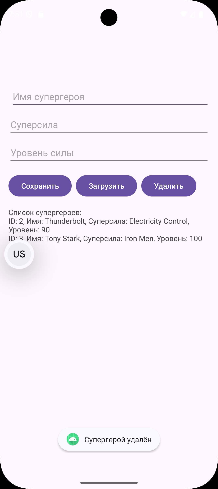

**Задание №1**

​	Был создан новый проект Lesson6.

​	activity_main.xml:

```xml
<?xml version="1.0" encoding="utf-8"?>
<LinearLayout xmlns:android="http://schemas.android.com/apk/res/android"
    android:layout_width="match_parent"
    android:layout_height="match_parent"
    android:orientation="vertical"
    android:padding="16dp">

    <TextView
        android:id="@+id/textView"
        android:layout_width="match_parent"
        android:layout_height="wrap_content" />

    <EditText
        android:id="@+id/editTextGroup"
        android:layout_width="match_parent"
        android:layout_height="wrap_content"
        android:hint="Номер группы"
        android:inputType="text" />

    <EditText
        android:id="@+id/editTextNumber"
        android:layout_width="match_parent"
        android:layout_height="wrap_content"
        android:hint="Номер по списку"
        android:inputType="number" />

    <EditText
        android:id="@+id/editTextFavoriteMovie"
        android:layout_width="match_parent"
        android:layout_height="wrap_content"
        android:hint="Любимый фильм/сериал"
        android:inputType="text" />

    <Button
        android:id="@+id/buttonSave"
        android:layout_width="wrap_content"
        android:layout_height="wrap_content"
        android:text="Сохранить"
        android:layout_gravity="center" />

</LinearLayout>
```

​	В файл MainActivity.java был добавлен код для работы с SharedPreferences. Код:

- Загружает сохранённые данные при запуске приложения.
- Сохраняет введённые данные по нажатию кнопки.
- Отображает сохранённые значения в полях ввода.

​	MainActivity.java:

```java
public class MainActivity extends AppCompatActivity {

    private EditText editTextGroup, editTextNumber, editTextFavoriteMovie;
    private SharedPreferences sharedPref;

    @Override
    protected void onCreate(Bundle savedInstanceState) {
        super.onCreate(savedInstanceState);
        setContentView(R.layout.activity_main);

        editTextGroup = findViewById(R.id.editTextGroup);
        editTextNumber = findViewById(R.id.editTextNumber);
        editTextFavoriteMovie = findViewById(R.id.editTextFavoriteMovie);
        Button buttonSave = findViewById(R.id.buttonSave);

        sharedPref = getSharedPreferences("mirea_settings", Context.MODE_PRIVATE);

        loadSavedData();

        buttonSave.setOnClickListener(new View.OnClickListener() {
            @Override
            public void onClick(View v) {
                saveData();
            }
        });
    }

    private void saveData() {
        SharedPreferences.Editor editor = sharedPref.edit();
        editor.putString("GROUP", editTextGroup.getText().toString());
        editor.putInt("NUMBER", Integer.parseInt(editTextNumber.getText().toString().isEmpty() ? "0" : editTextNumber.getText().toString()));
        editor.putString("FAVORITE_MOVIE", editTextFavoriteMovie.getText().toString());
        editor.apply();
    }

    private void loadSavedData() {
        String group = sharedPref.getString("GROUP", "");
        int number = sharedPref.getInt("NUMBER", 0);
        String favoriteMovie = sharedPref.getString("FAVORITE_MOVIE", "");

        editTextGroup.setText(group);
        editTextNumber.setText(String.valueOf(number));
        editTextFavoriteMovie.setText(favoriteMovie);
    }
}
```

​	При запуске приложения открылся экран:


​	Были введены следующие данные и нажата кнопка "Сохранить":


​	Далее был найден файл mirea_settings.xml:

```xml
<?xml version='1.0' encoding='utf-8' standalone='yes' ?>
<map>
    <string name="GROUP">БСБО-09-22</string>
    <int name="NUMBER" value="10" />
    <string name="FAVORITE_MOVIE">Сваты</string>
</map>
```

​	При повторном запуске приложения текстовые поля будут заполнены данными из этого файла.

​	Был сделан скриншот и добавлен в папку res/raw.

------


**Задание №2**

​	Создан модуль SecureSharedPreferences с экраном для отображения имени поэта и изображения. Реализовано безопасное хранение данных с использованием EncryptedSharedPreferences. Файл настроек найден в /data/data/ru.mirea.zakirovakr.securesharedpreferences/shared_prefs/secret_shared_prefs.xml. 	activity_main.xml:

```xml
<?xml version="1.0" encoding="utf-8"?>
<androidx.constraintlayout.widget.ConstraintLayout xmlns:android="http://schemas.android.com/apk/res/android"
    xmlns:app="http://schemas.android.com/apk/res-auto"
    android:layout_width="match_parent"
    android:layout_height="match_parent"
    android:padding="16dp">

    <ImageView
        android:id="@+id/imageViewPoet"
        android:layout_width="150dp"
        android:layout_height="150dp"
        android:src="@drawable/pushkin"
        app:layout_constraintTop_toTopOf="parent"
        app:layout_constraintStart_toStartOf="parent"
        app:layout_constraintEnd_toEndOf="parent" />

    <TextView
        android:id="@+id/textViewPoetName"
        android:layout_width="wrap_content"
        android:layout_height="wrap_content"
        android:text="Александр Пушкин"
        android:textSize="20sp"
        android:textStyle="bold"
        app:layout_constraintTop_toBottomOf="@id/imageViewPoet"
        app:layout_constraintStart_toStartOf="parent"
        app:layout_constraintEnd_toEndOf="parent"
        android:layout_marginTop="16dp" />

    <EditText
        android:id="@+id/editTextPoetName"
        android:layout_width="match_parent"
        android:layout_height="wrap_content"
        android:hint="Введите имя поэта"
        android:inputType="text"
        app:layout_constraintTop_toBottomOf="@id/textViewPoetName"
        app:layout_constraintStart_toStartOf="parent"
        android:layout_marginTop="16dp" />

    <Button
        android:id="@+id/buttonSave"
        android:layout_width="wrap_content"
        android:layout_height="wrap_content"
        android:text="Сохранить"
        app:layout_constraintTop_toBottomOf="@id/editTextPoetName"
        app:layout_constraintStart_toStartOf="parent"
        app:layout_constraintEnd_toEndOf="parent"
        android:layout_marginTop="16dp" />

</androidx.constraintlayout.widget.ConstraintLayout>
```

​	MainActivity.java:

```java
public class MainActivity extends AppCompatActivity {

    private TextView textViewPoetName;
    private EditText editTextPoetName;
    private SharedPreferences secureSharedPreferences;

    @Override
    protected void onCreate(Bundle savedInstanceState) {
        super.onCreate(savedInstanceState);
        setContentView(R.layout.activity_main);

        textViewPoetName = findViewById(R.id.textViewPoetName);
        editTextPoetName = findViewById(R.id.editTextPoetName);
        Button buttonSave = findViewById(R.id.buttonSave);

        try {
            String mainKeyAlias = MasterKeys.getOrCreate(MasterKeys.AES256_GCM_SPEC);
            secureSharedPreferences = EncryptedSharedPreferences.create(
                    "secret_shared_prefs",
                    mainKeyAlias,
                    getBaseContext(),
                    EncryptedSharedPreferences.PrefKeyEncryptionScheme.AES256_SIV,
                    EncryptedSharedPreferences.PrefValueEncryptionScheme.AES256_GCM
            );
        } catch (GeneralSecurityException | IOException e) {
            throw new RuntimeException(e);
        }

        loadSavedPoetName();

        buttonSave.setOnClickListener(new View.OnClickListener() {
            @Override
            public void onClick(View v) {
                savePoetName();
            }
        });
    }

    private void savePoetName() {
        String poetName = editTextPoetName.getText().toString();
        try {
            secureSharedPreferences.edit().putString("POET_NAME", poetName).apply();
            textViewPoetName.setText(poetName.isEmpty() ? "Александр Пушкин" : poetName);
        } catch (Exception e) {
            throw new RuntimeException(e);
        }
    }

    private void loadSavedPoetName() {
        String poetName = secureSharedPreferences.getString("POET_NAME", "Александр Пушкин");
        textViewPoetName.setText(poetName);
        editTextPoetName.setText(poetName);
    }
}
```

​	При запуске приложения открывается экран, была нажата кнопка сохранить:


​	secret_shared_prefs.xml:

```xml
<?xml version='1.0' encoding='utf-8' standalone='yes' ?>
<map>
    <string name="__androidx_security_crypto_encrypted_prefs_key_keyset__">12a901f3dd6b4a6572d39634a0b29262dfe40a47ebf6ed8fd577e8405fe9cf2a0758d94d59f261f2a9b292b22dfa920e72ea9bf39ff23655ca9a38733e7b62e06b3d6776418153438199474f489910ecccfee00f96f835e9e00ce95df8d12780b17abb23242b6a836416f1239e17c5378bcdc0ec3a97afcc315661b81e75a5ffe0e2d6e3a2e4771990131339de061bcc6c5f88cd3ec818968e85d157282166f662a61e17d8963bd7a9ea6fca1a4408c6b7ccaf06123c0a30747970652e676f6f676c65617069732e636f6d2f676f6f676c652e63727970746f2e74696e6b2e4165735369764b6579100118c6b7ccaf062001</string>
    <string name="AWXzG8ZfpVBRBlISj/KkqPOZ5hbOLFCVoDU+rBrF">ATFzOhEbXEhpnx3Aofyv4kfborEdE6yuOOYWAhfIz2BwEkei/JlsnX+zfPL96oei4LcaGL22MeVkc5YYroPItTgfVW11RTtK</string>
    <string name="__androidx_security_crypto_encrypted_prefs_value_keyset__">128801ca52d55075f9732fd42ab9446ccb037bc2c8f25777055a0e4ba0c66f22eaebbbd4c852dc64c76386a633b8f5212ab160553ce3b1916b0a8608d74c226f7139828f53a12ae5a0462fb2656398ab7b356e8e996f1fadbdde4428ae3df5143960dfa86119f013efe777aba7bd0017bf65e895ffcb515cb6b13a4e85be0da07e8c06ef0b769d1fd9fef01a440891f4cc8b03123c0a30747970652e676f6f676c65617069732e636f6d2f676f6f676c652e63727970746f2e74696e6b2e41657347636d4b657910011891f4cc8b032001</string>
</map>
```

​	Создана директория raw, скриншот сохранён.

------


**Задание №3.1**

​	Был создан новый модуль InternalFileStorage. реализующий запись и чтение памятной даты (9 мая 1945 года: День Победы) в файл history.txt во внутреннем хранилище. Приложение позволяет вводить текст в поле, сохранять его в файл по нажатию кнопки и отображать содержимое файла в TextView через 5 секунд после запуска. 

​	activity_main.xml:

```xml
<?xml version="1.0" encoding="utf-8"?>
<androidx.constraintlayout.widget.ConstraintLayout xmlns:android="http://schemas.android.com/apk/res/android"
    xmlns:app="http://schemas.android.com/apk/res-auto"
    android:layout_width="match_parent"
    android:layout_height="match_parent"
    android:padding="16dp">

    <EditText
        android:id="@+id/editTextDate"
        android:layout_width="match_parent"
        android:layout_height="wrap_content"
        android:hint="Памятная дата и описание"
        android:inputType="textMultiLine"
        app:layout_constraintTop_toTopOf="parent"
        app:layout_constraintStart_toStartOf="parent" />

    <Button
        android:id="@+id/buttonSave"
        android:layout_width="wrap_content"
        android:layout_height="wrap_content"
        android:text="Сохранить"
        app:layout_constraintTop_toBottomOf="@id/editTextDate"
        app:layout_constraintStart_toStartOf="parent"
        app:layout_constraintEnd_toEndOf="parent"
        android:layout_marginTop="16dp" />

    <TextView
        android:id="@+id/textViewResult"
        android:layout_width="match_parent"
        android:layout_height="wrap_content"
        android:text="Сохранённые данные появятся здесь"
        app:layout_constraintTop_toBottomOf="@id/buttonSave"
        app:layout_constraintStart_toStartOf="parent"
        android:layout_marginTop="16dp" />

</androidx.constraintlayout.widget.ConstraintLayout>
```

​	MainActivity.java:

```java
public class MainActivity extends AppCompatActivity {

    private static final String LOG_TAG = MainActivity.class.getSimpleName();
    private String fileName = "history.txt";
    private EditText editTextDate;
    private TextView textViewResult;

    @Override
    protected void onCreate(Bundle savedInstanceState) {
        super.onCreate(savedInstanceState);
        setContentView(R.layout.activity_main);

        editTextDate = findViewById(R.id.editTextDate);
        textViewResult = findViewById(R.id.textViewResult);
        Button buttonSave = findViewById(R.id.buttonSave);

        editTextDate.setText("9 мая 1945 года: День Победы в Великой Отечественной войне");

        buttonSave.setOnClickListener(new View.OnClickListener() {
            @Override
            public void onClick(View v) {
                saveToFile();
            }
        });

        new Thread(new Runnable() {
            public void run() {
                try {
                    Thread.sleep(5000); // Задержка 5 секунд
                } catch (InterruptedException e) {
                    e.printStackTrace();
                }
                textViewResult.post(new Runnable() {
                    public void run() {
                        String text = getTextFromFile();
                        textViewResult.setText(text != null ? text : "Файл не найден или пуст");
                    }
                });
            }
        }).start();
    }

    private void saveToFile() {
        String text = editTextDate.getText().toString();
        FileOutputStream outputStream = null;
        try {
            outputStream = openFileOutput(fileName, Context.MODE_PRIVATE);
            outputStream.write(text.getBytes());
            outputStream.close();
            Toast.makeText(this, "Данные сохранены", Toast.LENGTH_SHORT).show();
        } catch (IOException e) {
            e.printStackTrace();
            Toast.makeText(this, "Ошибка при сохранении: " + e.getMessage(), Toast.LENGTH_SHORT).show();
        } finally {
            try {
                if (outputStream != null) {
                    outputStream.close();
                }
            } catch (IOException e) {
                e.printStackTrace();
            }
        }
    }

    public String getTextFromFile() {
        FileInputStream fin = null;
        try {
            fin = openFileInput(fileName);
            byte[] bytes = new byte[fin.available()];
            int bytesRead = fin.read(bytes);
            if (bytesRead > 0) {
                String text = new String(bytes, 0, bytesRead);
                Log.d(LOG_TAG, "Прочитано из файла: " + text);
                return text;
            } else {
                Log.d(LOG_TAG, "Файл пуст");
                return "Файл пуст";
            }
        } catch (IOException ex) {
            Log.d(LOG_TAG, "Ошибка чтения файла: " + ex.getMessage());
            Toast.makeText(this, "Ошибка чтения: " + ex.getMessage(), Toast.LENGTH_SHORT).show();
            return null;
        } finally {
            try {
                if (fin != null) {
                    fin.close();
                }
            } catch (IOException ex) {
                Log.d(LOG_TAG, "Ошибка закрытия файла: " + ex.getMessage());
            }
        }
    }
}
```

​	При запуске приложения открывается экран:


​	Файл history.txt найден в /data/data/ru.mirea.zakirovakr.internalfilestorage/files/

```txt
9 мая 1945 года: День Победы в Великой Отечественной войне
```

​	Создана директория raw, скриншот сохранён.

------


**Задание №3.3**

​	Создан модуль Notebook с приложением "Блокнот" для сохранения и загрузки цитат. Реализовано сохранение цитат Эйнштейна и Конфуция в einstein_quote.txt и confucius_quote.txt в DIRECTORY_DOCUMENTS.

​	activity_main.xml

```xml
<?xml version="1.0" encoding="utf-8"?>
<androidx.constraintlayout.widget.ConstraintLayout xmlns:android="http://schemas.android.com/apk/res/android"
    xmlns:app="http://schemas.android.com/apk/res-auto"
    xmlns:tools="http://schemas.android.com/tools"
    android:layout_width="match_parent"
    android:layout_height="match_parent"
    android:padding="16dp">

    <EditText
        android:id="@+id/editTextFileName"
        android:layout_width="match_parent"
        android:layout_height="45dp"
        android:layout_marginTop="60dp"
        android:hint="Название файла (без .txt)"
        android:inputType="text"
        app:layout_constraintStart_toStartOf="parent"
        app:layout_constraintTop_toTopOf="parent" />

    <EditText
        android:id="@+id/editTextQuote"
        android:layout_width="match_parent"
        android:layout_height="100dp"
        android:hint="Цитата"
        android:inputType="textMultiLine"
        app:layout_constraintTop_toBottomOf="@id/editTextFileName"
        app:layout_constraintStart_toStartOf="parent"
        android:layout_marginTop="16dp" />

    <Button
        android:id="@+id/buttonSave"
        android:layout_width="wrap_content"
        android:layout_height="wrap_content"
        android:text="Сохранить"
        app:layout_constraintTop_toBottomOf="@id/editTextQuote"
        app:layout_constraintStart_toStartOf="parent"
        android:layout_marginTop="16dp" />

    <Button
        android:id="@+id/buttonLoad"
        android:layout_width="wrap_content"
        android:layout_height="wrap_content"
        android:text="Загрузить"
        app:layout_constraintTop_toBottomOf="@id/editTextQuote"
        app:layout_constraintEnd_toEndOf="parent"
        android:layout_marginTop="16dp" />

    <TextView
        android:id="@+id/textViewStatus"
        android:layout_width="match_parent"
        android:layout_height="wrap_content"
        android:text="Статус операции"
        app:layout_constraintTop_toBottomOf="@id/buttonSave"
        app:layout_constraintStart_toStartOf="parent"
        android:layout_marginTop="16dp" />

</androidx.constraintlayout.widget.ConstraintLayout>
```

​	MainActivity.java:

```java
public class MainActivity extends AppCompatActivity {

    private static final String TAG = MainActivity.class.getSimpleName();
    private static final int REQUEST_PERMISSION_CODE = 100;
    private EditText editTextFileName, editTextQuote;
    private TextView textViewStatus;

    @Override
    protected void onCreate(Bundle savedInstanceState) {
        super.onCreate(savedInstanceState);
        setContentView(R.layout.activity_main);

        editTextFileName = findViewById(R.id.editTextFileName);
        editTextQuote = findViewById(R.id.editTextQuote);
        textViewStatus = findViewById(R.id.textViewStatus);
        Button buttonSave = findViewById(R.id.buttonSave);
        Button buttonLoad = findViewById(R.id.buttonLoad);

        requestStoragePermissions();

        buttonSave.setOnClickListener(new View.OnClickListener() {
            @Override
            public void onClick(View v) {
                saveQuoteToFile();
            }
        });

        buttonLoad.setOnClickListener(new View.OnClickListener() {
            @Override
            public void onClick(View v) {
                readQuoteFromFile();
            }
        });

        saveInitialQuotes();
    }

    private void requestStoragePermissions() {
        if (ContextCompat.checkSelfPermission(this, android.Manifest.permission.WRITE_EXTERNAL_STORAGE)
                != PackageManager.PERMISSION_GRANTED) {
            ActivityCompat.requestPermissions(this,
                    new String[]{android.Manifest.permission.WRITE_EXTERNAL_STORAGE,
                            android.Manifest.permission.READ_EXTERNAL_STORAGE},
                    REQUEST_PERMISSION_CODE);
        }
    }

    private void saveInitialQuotes() {
        File path = Environment.getExternalStoragePublicDirectory(Environment.DIRECTORY_DOCUMENTS);
        if (!path.exists()) {
            path.mkdirs();
        }

        File file1 = new File(path, "einstein_quote.txt");
        try (FileOutputStream fos = new FileOutputStream(file1)) {
            String quote = "Стремись не к тому, чтобы добиться успеха, а к тому, чтобы твоя жизнь имела смысл. — Альберт Эйнштейн";
            fos.write(quote.getBytes(StandardCharsets.UTF_8));
            Log.d(TAG, "Цитата Эйнштейна сохранена");
        } catch (IOException e) {
            Log.e(TAG, "Ошибка сохранения цитаты Эйнштейна: " + e.getMessage());
        }

        File file2 = new File(path, "confucius_quote.txt");
        try (FileOutputStream fos = new FileOutputStream(file2)) {
            String quote = "Выбери себе работу по душе, и тебе не придется работать ни одного дня в своей жизни. — Конфуций";
            fos.write(quote.getBytes(StandardCharsets.UTF_8));
            Log.d(TAG, "Цитата Конфуция сохранена");
        } catch (IOException e) {
            Log.e(TAG, "Ошибка сохранения цитаты Конфуция: " + e.getMessage());
        }
    }

    private void saveQuoteToFile() {
        String fileName = editTextFileName.getText().toString().trim();
        String quote = editTextQuote.getText().toString().trim();

        if (fileName.isEmpty() || quote.isEmpty()) {
            Toast.makeText(this, "Введите название файла и цитату", Toast.LENGTH_SHORT).show();
            return;
        }

        if (!fileName.endsWith(".txt")) {
            fileName += ".txt";
        }

        File path = Environment.getExternalStoragePublicDirectory(Environment.DIRECTORY_DOCUMENTS);
        if (!path.exists()) {
            path.mkdirs();
        }

        File file = new File(path, fileName);
        try (FileOutputStream fos = new FileOutputStream(file)) {
            fos.write(quote.getBytes(StandardCharsets.UTF_8));
            textViewStatus.setText("Файл " + fileName + " сохранён");
            Toast.makeText(this, "Файл сохранён", Toast.LENGTH_SHORT).show();
        } catch (IOException e) {
            textViewStatus.setText("Ошибка сохранения: " + e.getMessage());
            Log.e(TAG, "Ошибка сохранения файла: " + e.getMessage());
        }
    }

    private void readQuoteFromFile() {
        String fileName = editTextFileName.getText().toString().trim();

        if (fileName.isEmpty()) {
            Toast.makeText(this, "Введите название файла", Toast.LENGTH_SHORT).show();
            return;
        }

        if (!fileName.endsWith(".txt")) {
            fileName += ".txt";
        }

        File path = Environment.getExternalStoragePublicDirectory(Environment.DIRECTORY_DOCUMENTS);
        File file = new File(path, fileName);
        try (FileInputStream fileInputStream = new FileInputStream(file);
             InputStreamReader inputStreamReader = new InputStreamReader(fileInputStream, StandardCharsets.UTF_8);
             BufferedReader reader = new BufferedReader(inputStreamReader)) {
            List<String> lines = new ArrayList<>();
            String line;
            while ((line = reader.readLine()) != null) {
                lines.add(line);
            }
            String quote = String.join("\n", lines);
            editTextQuote.setText(quote);
            textViewStatus.setText("Файл " + fileName + " загружен");
            Log.d(TAG, "Прочитано из файла: " + quote);
        } catch (IOException e) {
            textViewStatus.setText("Ошибка загрузки: " + e.getMessage());
            Toast.makeText(this, "Ошибка загрузки: " + e.getMessage(), Toast.LENGTH_SHORT).show();
            Log.e(TAG, "Ошибка чтения файла: " + e.getMessage());
        }
    }
}
```

​	При запуске приложения открылась страница и были введены данные:


​	Была нажата кнопка "Сохранить":


​	Цитата была сохранена в файл. Было введено название существующего файла:


​	И нажата кнопка "Загрузить":


​	Подгрузилась цитата из файла.

​	Файлы с цитатами были найдены в /storage/emulated/0/Documents/:


​	Создана директория raw, файлы перемещены из эмулятора в res/raw.

------


**Задание №4**

​	Создан модуль EmployeeDB с базой данных Room для хранения информации о супергероях. Реализован интерфейс для добавления, загрузки, обновления и удаления героев.

​	Был создан класс Superhero для таблицы супергероев:

```java
@Entity
public class Superhero {
    @PrimaryKey(autoGenerate = true)
    public long id;
    public String name;
    public String superpower;
    public int powerLevel;
}
```

​	Создан интерфейс SuperheroDao для операций с базой данных:

```java
@Dao
public interface SuperheroDao {
    @Query("SELECT * FROM superhero")
    List<Superhero> getAll();

    @Query("SELECT * FROM superhero WHERE id = :id")
    Superhero getById(long id);

    @Insert(onConflict = OnConflictStrategy.REPLACE)
    void insert(Superhero superhero);

    @Update
    void update(Superhero superhero);

    @Delete
    void delete(Superhero superhero);
}
```

​	Создан абстрактный класс AppDatabase:

```java
@Database(entities = {Superhero.class}, version = 1)
public abstract class AppDatabase extends RoomDatabase {
    public abstract SuperheroDao superheroDao();
}
```

​	Создан класс App для инициализации базы данных:

```java
public class App extends Application {
    public static App instance;
    private AppDatabase database;

    @Override
    public void onCreate() {
        super.onCreate();
        instance = this;
        database = Room.databaseBuilder(this, AppDatabase.class, "superhero_database")
                .allowMainThreadQueries()
                .build();
    }

    public static App getInstance() {
        return instance;
    }

    public AppDatabase getDatabase() {
        return database;
    }
}
```

​	activity_main.xml:

```xml
<?xml version="1.0" encoding="utf-8"?>
<androidx.constraintlayout.widget.ConstraintLayout xmlns:android="http://schemas.android.com/apk/res/android"
    xmlns:app="http://schemas.android.com/apk/res-auto"
    android:layout_width="match_parent"
    android:layout_height="match_parent"
    android:padding="16dp">

    <EditText
        android:id="@+id/editTextName"
        android:layout_width="match_parent"
        android:layout_height="0dp"
        android:layout_marginStart="4dp"
        android:layout_marginTop="144dp"
        android:hint="Имя супергероя"
        android:inputType="text"
        app:layout_constraintStart_toStartOf="parent"
        app:layout_constraintTop_toTopOf="parent" />

    <EditText
        android:id="@+id/editTextSuperpower"
        android:layout_width="match_parent"
        android:layout_height="wrap_content"
        android:hint="Суперсила"
        android:inputType="text"
        app:layout_constraintTop_toBottomOf="@id/editTextName"
        app:layout_constraintStart_toStartOf="parent"
        android:layout_marginTop="8dp" />

    <EditText
        android:id="@+id/editTextPowerLevel"
        android:layout_width="match_parent"
        android:layout_height="wrap_content"
        android:hint="Уровень силы"
        android:inputType="number"
        app:layout_constraintTop_toBottomOf="@id/editTextSuperpower"
        app:layout_constraintStart_toStartOf="parent"
        android:layout_marginTop="8dp" />

    <Button
        android:id="@+id/buttonSave"
        android:layout_width="wrap_content"
        android:layout_height="wrap_content"
        android:text="Сохранить"
        app:layout_constraintTop_toBottomOf="@id/editTextPowerLevel"
        app:layout_constraintStart_toStartOf="parent"
        android:layout_marginTop="16dp" />

    <Button
        android:id="@+id/buttonLoad"
        android:layout_width="wrap_content"
        android:layout_height="wrap_content"
        android:text="Загрузить"
        app:layout_constraintTop_toBottomOf="@id/editTextPowerLevel"
        app:layout_constraintStart_toEndOf="@id/buttonSave"
        android:layout_marginTop="16dp"
        android:layout_marginStart="8dp" />

    <Button
        android:id="@+id/buttonDelete"
        android:layout_width="wrap_content"
        android:layout_height="wrap_content"
        android:text="Удалить"
        app:layout_constraintTop_toBottomOf="@id/editTextPowerLevel"
        app:layout_constraintStart_toEndOf="@id/buttonLoad"
        android:layout_marginTop="16dp"
        android:layout_marginStart="8dp" />

    <TextView
        android:id="@+id/textViewHeroes"
        android:layout_width="match_parent"
        android:layout_height="wrap_content"
        android:text="Список супергероев"
        app:layout_constraintTop_toBottomOf="@id/buttonSave"
        app:layout_constraintStart_toStartOf="parent"
        android:layout_marginTop="16dp" />

</androidx.constraintlayout.widget.ConstraintLayout>
```

​	В MainActivity.java реализовано добавление, загрузку, обновление и удаление супергероев. Добавлены два вымышленных героя при запуске.

```java
public class MainActivity extends AppCompatActivity {

    private static final String TAG = MainActivity.class.getSimpleName();
    private EditText editTextName, editTextSuperpower, editTextPowerLevel;
    private TextView textViewHeroes;
    private SuperheroDao superheroDao;

    @Override
    protected void onCreate(Bundle savedInstanceState) {
        super.onCreate(savedInstanceState);
        setContentView(R.layout.activity_main);

        editTextName = findViewById(R.id.editTextName);
        editTextSuperpower = findViewById(R.id.editTextSuperpower);
        editTextPowerLevel = findViewById(R.id.editTextPowerLevel);
        textViewHeroes = findViewById(R.id.textViewHeroes);
        Button buttonSave = findViewById(R.id.buttonSave);
        Button buttonLoad = findViewById(R.id.buttonLoad);
        Button buttonDelete = findViewById(R.id.buttonDelete);

        AppDatabase db = App.getInstance().getDatabase();
        superheroDao = db.superheroDao();

        addInitialHeroes();

        updateHeroesList();

        buttonSave.setOnClickListener(new View.OnClickListener() {
            @Override
            public void onClick(View v) {
                saveSuperhero();
            }
        });

        buttonLoad.setOnClickListener(new View.OnClickListener() {
            @Override
            public void onClick(View v) {
                loadSuperhero();
            }
        });

        buttonDelete.setOnClickListener(new View.OnClickListener() {
            @Override
            public void onClick(View v) {
                deleteSuperhero();
            }
        });
    }

    private void addInitialHeroes() {
        Superhero hero1 = new Superhero();
        hero1.name = "Starlight";
        hero1.superpower = "Light Manipulation";
        hero1.powerLevel = 85;
        superheroDao.insert(hero1);

        Superhero hero2 = new Superhero();
        hero2.name = "Thunderbolt";
        hero2.superpower = "Electricity Control";
        hero2.powerLevel = 90;
        superheroDao.insert(hero2);
    }

    private void saveSuperhero() {
        String name = editTextName.getText().toString().trim();
        String superpower = editTextSuperpower.getText().toString().trim();
        String powerLevelStr = editTextPowerLevel.getText().toString().trim();

        if (name.isEmpty() || superpower.isEmpty() || powerLevelStr.isEmpty()) {
            Toast.makeText(this, "Заполните все поля", Toast.LENGTH_SHORT).show();
            return;
        }

        try {
            int powerLevel = Integer.parseInt(powerLevelStr);
            Superhero superhero = new Superhero();
            superhero.name = name;
            superhero.superpower = superpower;
            superhero.powerLevel = powerLevel;
            superheroDao.insert(superhero);
            Toast.makeText(this, "Супергерой сохранён", Toast.LENGTH_SHORT).show();
            updateHeroesList();
            clearFields();
        } catch (NumberFormatException e) {
            Toast.makeText(this, "Уровень силы должен быть числом", Toast.LENGTH_SHORT).show();
        }
    }

    private void loadSuperhero() {
        String name = editTextName.getText().toString().trim();
        if (name.isEmpty()) {
            Toast.makeText(this, "Введите имя для поиска", Toast.LENGTH_SHORT).show();
            return;
        }

        List<Superhero> heroes = superheroDao.getAll();
        for (Superhero hero : heroes) {
            if (hero.name.equalsIgnoreCase(name)) {
                editTextName.setText(hero.name);
                editTextSuperpower.setText(hero.superpower);
                editTextPowerLevel.setText(String.valueOf(hero.powerLevel));
                Toast.makeText(this, "Супергерой загружен", Toast.LENGTH_SHORT).show();
                return;
            }
        }
        Toast.makeText(this, "Супергерой не найден", Toast.LENGTH_SHORT).show();
    }

    private void deleteSuperhero() {
        String name = editTextName.getText().toString().trim();
        if (name.isEmpty()) {
            Toast.makeText(this, "Введите имя для удаления", Toast.LENGTH_SHORT).show();
            return;
        }

        List<Superhero> heroes = superheroDao.getAll();
        for (Superhero hero : heroes) {
            if (hero.name.equalsIgnoreCase(name)) {
                superheroDao.delete(hero);
                Toast.makeText(this, "Супергерой удалён", Toast.LENGTH_SHORT).show();
                updateHeroesList();
                clearFields();
                return;
            }
        }
        Toast.makeText(this, "Супергерой не найден", Toast.LENGTH_SHORT).show();
    }

    private void updateHeroesList() {
        List<Superhero> heroes = superheroDao.getAll();
        StringBuilder sb = new StringBuilder("Список супергероев:\n");
        for (Superhero hero : heroes) {
            sb.append("ID: ").append(hero.id)
                    .append(", Имя: ").append(hero.name)
                    .append(", Суперсила: ").append(hero.superpower)
                    .append(", Уровень: ").append(hero.powerLevel)
                    .append("\n");
        }
        textViewHeroes.setText(sb.toString());
        Log.d(TAG, sb.toString());
    }

    private void clearFields() {
        editTextName.setText("");
        editTextSuperpower.setText("");
        editTextPowerLevel.setText("");
    }
}
```

​	При запуске приложения открывается страница:


​	Была введена информация о супергероя для добавления:


​	Нажата кнопка "Сохранить", теперь супергерой отображается в общем списке:


​	Введено имя супергероя из бд:


​	При нажатии на кнопку "Загрузить" данные автоматически подгрузились:


​	Нажата кнопка "Удалить":



​	Файл базы данных найден в /data/data/ru.mirea.zakirovakr.employeedb/databases/superhero_database, директория raw создана, скриншот сохранён.

------


**КОНТРОЛЬНОЕ ЗАДАНИЕ**

​	