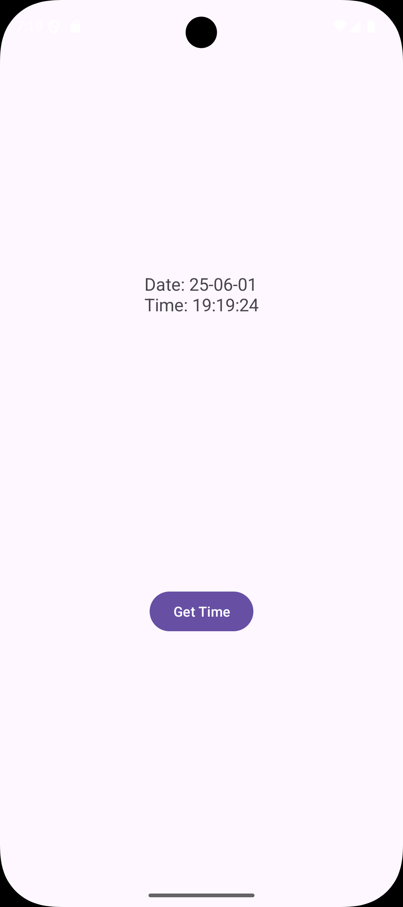
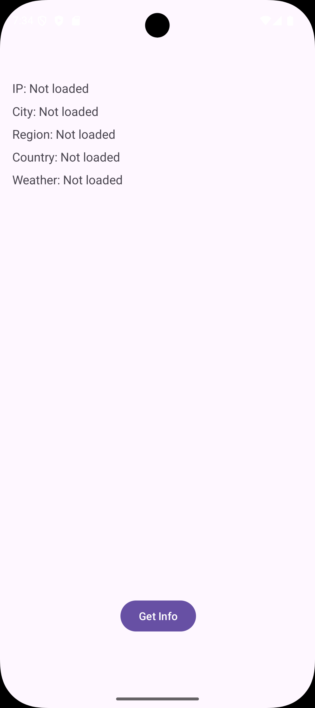
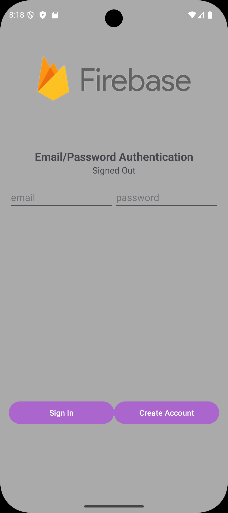
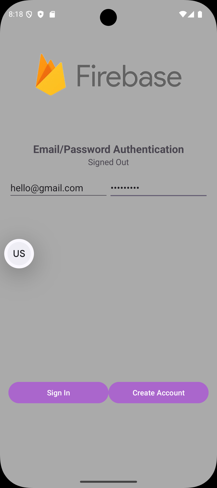
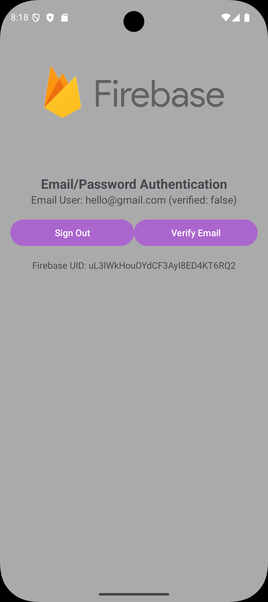
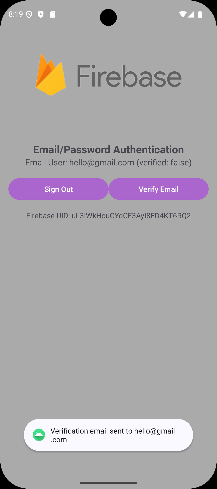
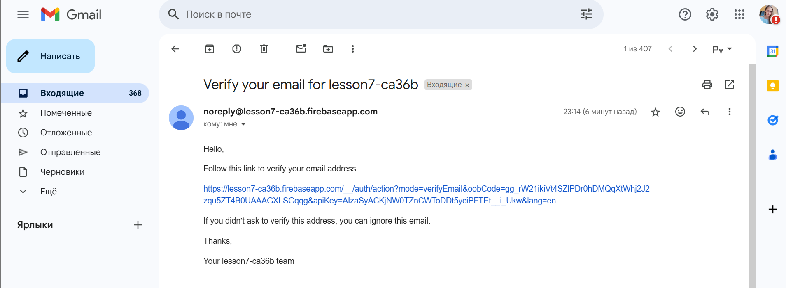
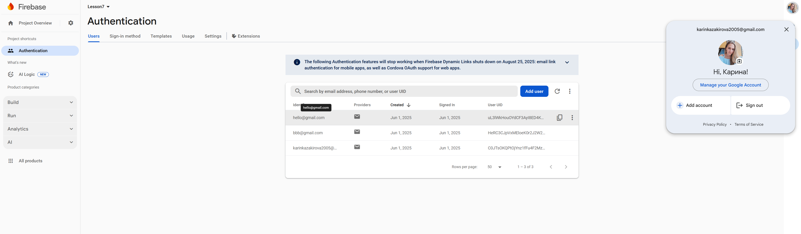

## Практическая работа 7

#### **Задание №1**

​	Был создан новый проект Lesson7 и модуль TimeService. Приложение подключается к серверу time.nist.gov через сокет, получает строку с временем, преобразует ее в объект JSON и отображает дату и время на экране.

​	Добавлено разрешение ИНТЕРНЕТ в AndroidManifest.xml

```xml
<uses-permission android:name="android.permission.INTERNET" />
```

​	Создан макет (activity_main.xml) с текстовым полем и кнопкой.

```xml
<?xml version="1.0" encoding="utf-8"?>
<androidx.constraintlayout.widget.ConstraintLayout xmlns:android="http://schemas.android.com/apk/res/android"
    xmlns:app="http://schemas.android.com/apk/res-auto"
    xmlns:tools="http://schemas.android.com/tools"
    android:layout_width="match_parent"
    android:layout_height="match_parent"
    tools:context=".MainActivity">

    <TextView
        android:id="@+id/textView"
        android:layout_width="wrap_content"
        android:layout_height="wrap_content"
        android:text="Time will appear here"
        android:textSize="18sp"
        app:layout_constraintBottom_toTopOf="@id/button"
        app:layout_constraintEnd_toEndOf="parent"
        app:layout_constraintStart_toStartOf="parent"
        app:layout_constraintTop_toTopOf="parent" />

    <Button
        android:id="@+id/button"
        android:layout_width="wrap_content"
        android:layout_height="wrap_content"
        android:text="Get Time"
        app:layout_constraintBottom_toBottomOf="parent"
        app:layout_constraintEnd_toEndOf="parent"
        app:layout_constraintStart_toStartOf="parent"
        app:layout_constraintTop_toBottomOf="@id/textView" />

</androidx.constraintlayout.widget.ConstraintLayout>
```

​	Класс для обработки ввода/вывода через сокет, предоставляющий BufferedReader для чтения ответов сервера.

```java
public class SocketUtils {
    public static BufferedReader getReader(Socket s) throws IOException {
        return new BufferedReader(new InputStreamReader(s.getInputStream()));
    }

    public static PrintWriter getWriter(Socket s) throws IOException {
        return new PrintWriter(s.getOutputStream(), true);
    }
}
```

​	MainActivity.java

```java
public class MainActivity extends AppCompatActivity {
    private ActivityMainBinding binding;
    private final String host = "time.nist.gov";
    private final int port = 13;
    private static final String TAG = MainActivity.class.getSimpleName();

    @Override
    protected void onCreate(Bundle savedInstanceState) {
        super.onCreate(savedInstanceState);
        binding = ActivityMainBinding.inflate(getLayoutInflater());
        setContentView(binding.getRoot());

        binding.button.setOnClickListener(new View.OnClickListener() {
            @Override
            public void onClick(View v) {
                new GetTimeTask().execute();
            }
        });
    }

    private class GetTimeTask extends AsyncTask<Void, Void, String> {
        @Override
        protected String doInBackground(Void... params) {
            String timeResult = "";
            try {
                Socket socket = new Socket(host, port);
                BufferedReader reader = SocketUtils.getReader(socket);
                reader.readLine();
                timeResult = reader.readLine();
                Log.d(TAG, timeResult);
                socket.close();

                String[] parts = timeResult.split(" ");
                if (parts.length >= 3) {
                    String date = parts[1];
                    String time = parts[2];
                    JSONObject jsonObject = new JSONObject();
                    jsonObject.put("date", date);
                    jsonObject.put("time", time);
                    timeResult = jsonObject.toString();
                }
            } catch (IOException e) {
                e.printStackTrace();
                timeResult = "Error: " + e.getMessage();
            } catch (Exception e) {
                e.printStackTrace();
                timeResult = "Error: " + e.getMessage();
            }
            return timeResult;
        }

        @Override
        protected void onPostExecute(String result) {
            super.onPostExecute(result);
            try {
                JSONObject jsonObject = new JSONObject(result);
                String date = jsonObject.getString("date");
                String time = jsonObject.getString("time");
                binding.textView.setText("Date: " + date + "\nTime: " + time);
            } catch (Exception e) {
                binding.textView.setText(result);
            }
        }
    }
}
```

​	ActivityMainBinding.java

```java
public class ActivityMainBinding implements ViewBinding {
    public final TextView textView;
    public final Button button;
    private final ConstraintLayout rootView;

    private ActivityMainBinding(ConstraintLayout rootView, TextView textView, Button button) {
        this.rootView = rootView;
        this.textView = textView;
        this.button = button;
    }

    public static ActivityMainBinding inflate(LayoutInflater inflater) {
        ConstraintLayout root = (ConstraintLayout) inflater.inflate(R.layout.activity_main, null, false);
        TextView textView = root.findViewById(R.id.textView);
        Button button = root.findViewById(R.id.button);
        return new ActivityMainBinding(root, textView, button);
    }

    public ConstraintLayout getRoot() {
        return rootView;
    }
}
```

​	В приложении отображается текстовое поле для отображения даты и времени и кнопка с надписью «Get Time».


​		При нажатии на кнопку отображается дата и время



------

#### **Задание №2**

​	Был создан модуль HttpURLConnection для получения внешнего IP-адреса устройства и данных о местоположении с ipinfo.io/json, а затем использования координат для получения данных о погоде с api.open-meteo.com. Приложение отображает IP-адрес, город, регион, страну и температуру в отдельных полях TextView.

​	Добавлены разрешения

```xml
<uses-permission android:name="android.permission.ACCESS_NETWORK_STATE" />
<uses-permission android:name="android.permission.INTERNET" />
```

​	Разработан activity_main.xml с полями TextView для IP-адреса, города, региона, страны и погоды, а также кнопкой «Get Info».

```xml
<?xml version="1.0" encoding="utf-8"?>
<androidx.constraintlayout.widget.ConstraintLayout xmlns:android="http://schemas.android.com/apk/res/android"
    xmlns:app="http://schemas.android.com/apk/res-auto"
    xmlns:tools="http://schemas.android.com/tools"
    android:layout_width="match_parent"
    android:layout_height="match_parent"
    android:padding="16dp"
    tools:context=".MainActivity">

    <TextView
        android:id="@+id/textViewIp"
        android:layout_width="wrap_content"
        android:layout_height="22dp"
        android:layout_marginTop="88dp"
        android:text="IP: Not loaded"
        android:textSize="16sp"
        app:layout_constraintStart_toStartOf="parent"
        app:layout_constraintTop_toTopOf="parent" />

    <TextView
        android:id="@+id/textViewCity"
        android:layout_width="wrap_content"
        android:layout_height="wrap_content"
        android:text="City: Not loaded"
        android:textSize="16sp"
        app:layout_constraintStart_toStartOf="parent"
        app:layout_constraintTop_toBottomOf="@id/textViewIp"
        android:layout_marginTop="8dp" />

    <TextView
        android:id="@+id/textViewRegion"
        android:layout_width="wrap_content"
        android:layout_height="wrap_content"
        android:text="Region: Not loaded"
        android:textSize="16sp"
        app:layout_constraintStart_toStartOf="parent"
        app:layout_constraintTop_toBottomOf="@id/textViewCity"
        android:layout_marginTop="8dp" />

    <TextView
        android:id="@+id/textViewCountry"
        android:layout_width="wrap_content"
        android:layout_height="wrap_content"
        android:text="Country: Not loaded"
        android:textSize="16sp"
        app:layout_constraintStart_toStartOf="parent"
        app:layout_constraintTop_toBottomOf="@id/textViewRegion"
        android:layout_marginTop="8dp" />

    <TextView
        android:id="@+id/textViewWeather"
        android:layout_width="wrap_content"
        android:layout_height="wrap_content"
        android:text="Weather: Not loaded"
        android:textSize="16sp"
        app:layout_constraintStart_toStartOf="parent"
        app:layout_constraintTop_toBottomOf="@id/textViewCountry"
        android:layout_marginTop="8dp" />

    <Button
        android:id="@+id/button"
        android:layout_width="wrap_content"
        android:layout_height="wrap_content"
        android:layout_marginBottom="80dp"
        android:text="Get Info"
        app:layout_constraintBottom_toBottomOf="parent"
        app:layout_constraintEnd_toEndOf="parent"
        app:layout_constraintHorizontal_bias="0.503"
        app:layout_constraintStart_toStartOf="parent" />

</androidx.constraintlayout.widget.ConstraintLayout>
```

​	MainActivity использует AsyncTask для проверки подключения к интернету, получения и анализа данных JSON, а также обновления пользовательского интерфейса.

```java
public class MainActivity extends AppCompatActivity {
    private ActivityMainBinding binding;
    private static final String TAG = MainActivity.class.getSimpleName();

    @Override
    protected void onCreate(Bundle savedInstanceState) {
        super.onCreate(savedInstanceState);
        binding = ActivityMainBinding.inflate(getLayoutInflater());
        setContentView(binding.getRoot());

        binding.button.setOnClickListener(new View.OnClickListener() {
            @Override
            public void onClick(View view) {
                ConnectivityManager connectivityManager =
                        (ConnectivityManager) getSystemService(Context.CONNECTIVITY_SERVICE);
                NetworkInfo networkInfo = null;
                if (connectivityManager != null) {
                    networkInfo = connectivityManager.getActiveNetworkInfo();
                }
                if (networkInfo != null && networkInfo.isConnected()) {
                    new DownloadPageTask().execute("https://ipinfo.io/json");
                } else {
                    Toast.makeText(MainActivity.this, "Нет интернета", Toast.LENGTH_SHORT).show();
                }
            }
        });
    }

    private class DownloadPageTask extends AsyncTask<String, Void, String> {
        @Override
        protected void onPreExecute() {
            super.onPreExecute();
            binding.textViewIp.setText("Загружаем...");
            binding.textViewCity.setText("Загружаем...");
            binding.textViewRegion.setText("Загружаем...");
            binding.textViewCountry.setText("Загружаем...");
            binding.textViewWeather.setText("Загружаем...");
        }

        @Override
        protected String doInBackground(String... urls) {
            try {
                String ipInfo = downloadIpInfo(urls[0]);
                JSONObject ipJson = new JSONObject(ipInfo);
                String latitude = ipJson.getString("loc").split(",")[0];
                String longitude = ipJson.getString("loc").split(",")[1];
                String weatherUrl = "https://api.open-meteo.com/v1/forecast?latitude=" + latitude +
                        "&longitude=" + longitude + "&current_weather=true";
                String weatherInfo = downloadIpInfo(weatherUrl);
                JSONObject combinedJson = new JSONObject();
                combinedJson.put("ip", ipJson.getString("ip"));
                combinedJson.put("city", ipJson.getString("city"));
                combinedJson.put("region", ipJson.getString("region"));
                combinedJson.put("country", ipJson.getString("country"));
                combinedJson.put("weather", new JSONObject(weatherInfo).getJSONObject("current_weather").getString("temperature"));
                return combinedJson.toString();
            } catch (Exception e) {
                e.printStackTrace();
                return "error: " + e.getMessage();
            }
        }

        @Override
        protected void onPostExecute(String result) {
            super.onPostExecute(result);
            try {
                JSONObject responseJson = new JSONObject(result);
                binding.textViewIp.setText("IP: " + responseJson.getString("ip"));
                binding.textViewCity.setText("City: " + responseJson.getString("city"));
                binding.textViewRegion.setText("Region: " + responseJson.getString("region"));
                binding.textViewCountry.setText("Country: " + responseJson.getString("country"));
                binding.textViewWeather.setText("Weather: " + responseJson.getString("weather") + "°C");
                Log.d(TAG, "Response: " + responseJson);
            } catch (Exception e) {
                e.printStackTrace();
                binding.textViewIp.setText("Error: " + result);
                binding.textViewCity.setText("");
                binding.textViewRegion.setText("");
                binding.textViewCountry.setText("");
                binding.textViewWeather.setText("");
            }
        }
    }

    private String downloadIpInfo(String address) throws IOException {
        InputStream inputStream = null;
        String data = "";
        try {
            URL url = new URL(address);
            HttpURLConnection connection = (HttpURLConnection) url.openConnection();
            connection.setReadTimeout(100000);
            connection.setConnectTimeout(100000);
            connection.setRequestMethod("GET");
            connection.setInstanceFollowRedirects(true);
            connection.setUseCaches(false);
            connection.setDoInput(true);
            int responseCode = connection.getResponseCode();
            if (responseCode == HttpURLConnection.HTTP_OK) {
                inputStream = connection.getInputStream();
                ByteArrayOutputStream bos = new ByteArrayOutputStream();
                int read;
                while ((read = inputStream.read()) != -1) {
                    bos.write(read);
                }
                bos.close();
                data = bos.toString();
            } else {
                data = connection.getResponseMessage() + ". Error Code: " + responseCode;
            }
            connection.disconnect();
        } catch (IOException e) {
            e.printStackTrace();
            throw e;
        } finally {
            if (inputStream != null) {
                inputStream.close();
            }
        }
        return data;
    }
}
```

​	При запуске приложения открывается экран 




​	При нажатии на кнопку отображаются данные


------

#### **Задание №3**

​	Модуль FirebaseAuth был создан для реализации аутентификации пользователей с помощью Firebase. Приложение воспроизводит предоставленный пользовательский интерфейс, позволяя пользователям регистрироваться, входить в систему, подтверждать свою электронную почту и выходить из системы.

​	Создан модуль с аутентификацией Firebase, добавлен google-services.json и включены необходимые зависимости (build.gradle).

​	Добавлены необходимые строковые константы в strings.xml.

```xml
<resources>
    <string name="app_name"> FirebaseAuth </string>
    <string name="label_emailpassword">Email/Password Authentication</string>
    <string name="desc_emailpassword">Use an email and password to authenticate
with Firebase.</string>
    <string name="hint_user_id">User ID</string>
    <string name="sign_in">Sign In</string>
    <string name="create_account">Create Account</string>
    <string name="sign_out">Sign Out</string>
    <string name="verify_email">Verify Email</string>
    <string name="signed_in">Signed In</string>
    <string name="signed_out">Signed Out</string>
    <string name="auth_failed">Authentication failed</string>
    <string name="firebase_status_fmt">Firebase UID: %s</string>
    <string name="firebase_user_management">Firebase User Management</string>
    <string name="emailpassword_status_fmt">Email User: %1$s (verified:
%2$b)</string>
    <string name="emailpassword_title_text">Email and Password</string>
    <string name="error_sign_in_failed">Sign in failed, see logs for details.</string>
</resources>
```

​	Разработан activity_main.xml с полями для ввода электронной почты и пароля, кнопками входа в систему/создания учетной записи (видны при выходе из системы) и кнопками выхода из системы/подтверждения электронной почты (видны при входе в систему).

```xml
<?xml version="1.0" encoding="utf-8"?>
<androidx.constraintlayout.widget.ConstraintLayout xmlns:android="http://schemas.android.com/apk/res/android"
    xmlns:app="http://schemas.android.com/apk/res-auto"
    android:layout_width="match_parent"
    android:layout_height="match_parent"
    android:background="@android:color/darker_gray"
    android:padding="16dp">

    <!-- Firebase Logo -->
    <ImageView
        android:id="@+id/imageView"
        android:layout_width="357dp"
        android:layout_height="252dp"
        android:contentDescription="Firebase Logo"
        android:src="@drawable/firebase_logo"
        app:layout_constraintEnd_toEndOf="parent"
        app:layout_constraintStart_toStartOf="parent"
        app:layout_constraintTop_toTopOf="parent" />

    <!-- Title Text -->
    <TextView
        android:id="@+id/titleTextView"
        android:layout_width="wrap_content"
        android:layout_height="wrap_content"
        android:text="@string/label_emailpassword"
        android:textSize="20sp"
        android:textStyle="bold"
        app:layout_constraintTop_toBottomOf="@id/imageView"
        app:layout_constraintStart_toStartOf="parent"
        app:layout_constraintEnd_toEndOf="parent" />

    <!-- Status Text -->
    <TextView
        android:id="@+id/statusTextView"
        android:layout_width="wrap_content"
        android:layout_height="wrap_content"
        android:text="@string/signed_out"
        android:textSize="16sp"
        app:layout_constraintTop_toBottomOf="@id/titleTextView"
        app:layout_constraintStart_toStartOf="parent"
        app:layout_constraintEnd_toEndOf="parent" />

    <!-- Email and Password Fields Container -->
    <LinearLayout
        android:id="@+id/emailPasswordFields"
        android:layout_width="0dp"
        android:layout_height="wrap_content"
        android:orientation="horizontal"
        app:layout_constraintTop_toBottomOf="@id/statusTextView"
        app:layout_constraintStart_toStartOf="parent"
        app:layout_constraintEnd_toEndOf="parent"
        android:layout_marginTop="16dp">

        <EditText
            android:id="@+id/fieldEmail"
            android:layout_width="0dp"
            android:layout_height="wrap_content"
            android:layout_weight="1"
            android:hint="email"
            android:inputType="textEmailAddress" />

        <EditText
            android:id="@+id/fieldPassword"
            android:layout_width="0dp"
            android:layout_height="wrap_content"
            android:layout_weight="1"
            android:hint="password"
            android:inputType="textPassword" />
    </LinearLayout>

    <!-- Buttons Container (Sign In/Create Account) -->
    <LinearLayout
        android:id="@+id/emailPasswordButtons"
        android:layout_width="0dp"
        android:layout_height="wrap_content"
        android:layout_marginTop="200dp"
        android:orientation="horizontal"
        app:layout_constraintBottom_toBottomOf="parent"
        app:layout_constraintEnd_toEndOf="parent"
        app:layout_constraintStart_toStartOf="parent"
        app:layout_constraintTop_toBottomOf="@id/emailPasswordFields">

        <Button
            android:id="@+id/emailSignInButton"
            android:layout_width="0dp"
            android:layout_height="wrap_content"
            android:layout_weight="1"
            android:backgroundTint="@android:color/holo_purple"
            android:text="@string/sign_in" />

        <Button
            android:id="@+id/emailCreateAccountButton"
            android:layout_width="0dp"
            android:layout_height="wrap_content"
            android:layout_weight="1"
            android:backgroundTint="@android:color/holo_purple"
            android:text="@string/create_account" />
    </LinearLayout>

    <!-- Signed-In Buttons Container -->
    <LinearLayout
        android:id="@+id/signedInButtons"
        android:layout_width="0dp"
        android:layout_height="wrap_content"
        android:orientation="horizontal"
        app:layout_constraintTop_toBottomOf="@id/emailPasswordFields"
        app:layout_constraintStart_toStartOf="parent"
        app:layout_constraintEnd_toEndOf="parent"
        android:visibility="gone"
        android:layout_marginTop="16dp">

        <Button
            android:id="@+id/signOutButton"
            android:layout_width="0dp"
            android:layout_height="wrap_content"
            android:layout_weight="1"
            android:text="@string/sign_out"
            android:backgroundTint="@android:color/holo_purple" />

        <Button
            android:id="@+id/verifyEmailButton"
            android:layout_width="0dp"
            android:layout_height="wrap_content"
            android:layout_weight="1"
            android:text="@string/verify_email"
            android:backgroundTint="@android:color/holo_purple" />
    </LinearLayout>

    <!-- Detail Text (UID) -->
    <TextView
        android:id="@+id/detailTextView"
        android:layout_width="wrap_content"
        android:layout_height="wrap_content"
        android:text=""
        android:textSize="14sp"
        app:layout_constraintTop_toBottomOf="@id/signedInButtons"
        app:layout_constraintStart_toStartOf="parent"
        app:layout_constraintEnd_toEndOf="parent"
        android:layout_marginTop="16dp" />

</androidx.constraintlayout.widget.ConstraintLayout>
```

​	В MainActivity  реализованы методы для регистрации (createAccount), входа (signIn), подтверждения электронной почты (sendEmailVerification) и выхода (signOut) с динамическим обновлением пользовательского интерфейса через updateUI.

```java
public class MainActivity extends AppCompatActivity {
    private static final String TAG = MainActivity.class.getSimpleName();
    private ActivityMainBinding binding;
    private FirebaseAuth mAuth;

    @Override
    protected void onCreate(Bundle savedInstanceState) {
        super.onCreate(savedInstanceState);
        binding = ActivityMainBinding.inflate(getLayoutInflater());
        setContentView(binding.getRoot());

        mAuth = FirebaseAuth.getInstance();

        // Set click listeners
        binding.emailSignInButton.setOnClickListener(v -> signIn(binding.fieldEmail.getText().toString().trim(), binding.fieldPassword.getText().toString().trim()));
        binding.emailCreateAccountButton.setOnClickListener(v -> createAccount(binding.fieldEmail.getText().toString().trim(), binding.fieldPassword.getText().toString().trim()));
        binding.signOutButton.setOnClickListener(v -> signOut());
        binding.verifyEmailButton.setOnClickListener(v -> sendEmailVerification());
    }

    @Override
    public void onStart() {
        super.onStart();
        FirebaseUser currentUser = mAuth.getCurrentUser();
        updateUI(currentUser);
    }

    private void updateUI(FirebaseUser user) {
        if (user != null) {
            binding.statusTextView.setText(getString(R.string.emailpassword_status_fmt, user.getEmail(), user.isEmailVerified()));
            binding.detailTextView.setText(getString(R.string.firebase_status_fmt, user.getUid()));
            binding.emailPasswordFields.setVisibility(View.GONE);
            binding.emailPasswordButtons.setVisibility(View.GONE);
            binding.signedInButtons.setVisibility(View.VISIBLE);
            binding.verifyEmailButton.setEnabled(!user.isEmailVerified());
        } else {
            binding.statusTextView.setText(R.string.signed_out);
            binding.detailTextView.setText(null);
            binding.emailPasswordFields.setVisibility(View.VISIBLE);
            binding.emailPasswordButtons.setVisibility(View.VISIBLE);
            binding.signedInButtons.setVisibility(View.GONE);
        }
    }

    private void createAccount(String email, String password) {
        Log.d(TAG, "createAccount:" + email);
        if (!validateForm()) return;

        mAuth.createUserWithEmailAndPassword(email, password)
                .addOnCompleteListener(this, task -> {
                    if (task.isSuccessful()) {
                        Log.d(TAG, "createUserWithEmail:success");
                        FirebaseUser user = mAuth.getCurrentUser();
                        updateUI(user);
                        Toast.makeText(MainActivity.this, "Registration successful", Toast.LENGTH_SHORT).show();
                    } else {
                        Log.w(TAG, "createUserWithEmail:failure", task.getException());
                        Toast.makeText(MainActivity.this, "Authentication failed", Toast.LENGTH_SHORT).show();
                        updateUI(null);
                    }
                });
    }

    private void signIn(String email, String password) {
        Log.d(TAG, "signIn:" + email);
        if (!validateForm()) return;

        mAuth.signInWithEmailAndPassword(email, password)
                .addOnCompleteListener(this, task -> {
                    if (task.isSuccessful()) {
                        Log.d(TAG, "signInWithEmail:success");
                        FirebaseUser user = mAuth.getCurrentUser();
                        updateUI(user);
                        Toast.makeText(MainActivity.this, "Login successful", Toast.LENGTH_SHORT).show();
                    } else {
                        Log.w(TAG, "signInWithEmail:failure", task.getException());
                        Toast.makeText(MainActivity.this, "Authentication failed", Toast.LENGTH_SHORT).show();
                        updateUI(null);
                        if (!task.isSuccessful()) {
                            binding.statusTextView.setText(R.string.auth_failed);
                        }
                    }
                });
    }

    private void signOut() {
        mAuth.signOut();
        updateUI(null);
    }

    private void sendEmailVerification() {
        binding.verifyEmailButton.setEnabled(false);
        FirebaseUser user = mAuth.getCurrentUser();
        if (user != null) {
            user.sendEmailVerification()
                    .addOnCompleteListener(this, task -> {
                        binding.verifyEmailButton.setEnabled(true);
                        if (task.isSuccessful()) {
                            Toast.makeText(MainActivity.this, "Verification email sent to " + user.getEmail(), Toast.LENGTH_SHORT).show();
                        } else {
                            Log.e(TAG, "sendEmailVerification", task.getException());
                            Toast.makeText(MainActivity.this, "Failed to send verification email", Toast.LENGTH_SHORT).show();
                        }
                    });
        }
    }

    private boolean validateForm() {
        String email = binding.fieldEmail.getText().toString().trim();
        String password = binding.fieldPassword.getText().toString().trim();
        if (TextUtils.isEmpty(email) || TextUtils.isEmpty(password)) {
            Toast.makeText(this, "Enter email and password", Toast.LENGTH_SHORT).show();
            return false;
        }
        return true;
    }
}
```

​	При запуске приложения открывается экран




​	Вводим данные для регистрации пользователя



Пользователь зарегистрирован вход выполнен



​	Запрос подтверждения почты



​	Письмо с ссылкой для подтверждения



​	Скриншот с Firebase c pfhtubcnhbhjdfyysvb gjkmpjdfntkzvb




------

#### Контрольное задание

​	
