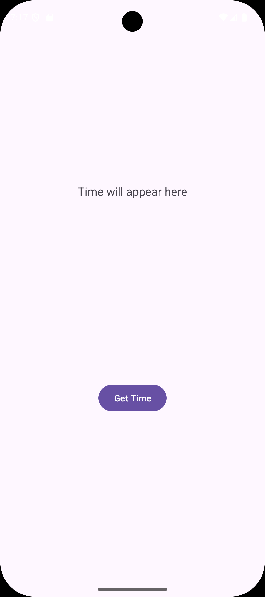
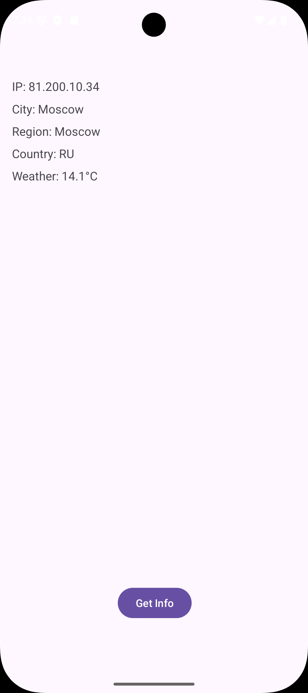
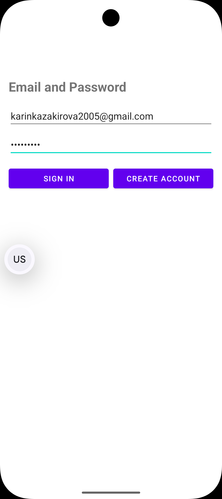
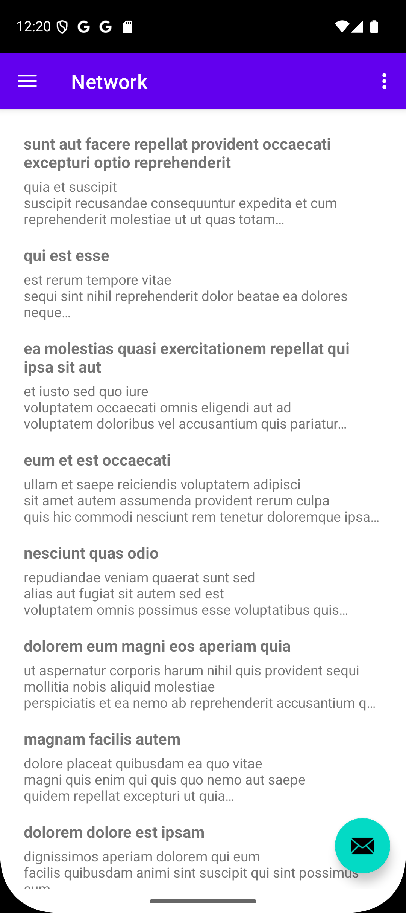

## Практическая работа 7

#### **Задание №1**

​	Был создан новый проект Lesson7 и модуль TimeService. Приложение подключается к серверу time.nist.gov через сокет, получает строку с временем, преобразует ее в объект JSON и отображает дату и время на экране.

​	Добавлено разрешение ИНТЕРНЕТ в AndroidManifest.xml

```xml
<uses-permission android:name="android.permission.INTERNET" />
```

​	Создан макет (activity_main.xml) с текстовым полем и кнопкой.

```xml
<?xml version="1.0" encoding="utf-8"?>
<androidx.constraintlayout.widget.ConstraintLayout xmlns:android="http://schemas.android.com/apk/res/android"
    xmlns:app="http://schemas.android.com/apk/res-auto"
    xmlns:tools="http://schemas.android.com/tools"
    android:layout_width="match_parent"
    android:layout_height="match_parent"
    tools:context=".MainActivity">

    <TextView
        android:id="@+id/textView"
        android:layout_width="wrap_content"
        android:layout_height="wrap_content"
        android:text="Time will appear here"
        android:textSize="18sp"
        app:layout_constraintBottom_toTopOf="@id/button"
        app:layout_constraintEnd_toEndOf="parent"
        app:layout_constraintStart_toStartOf="parent"
        app:layout_constraintTop_toTopOf="parent" />

    <Button
        android:id="@+id/button"
        android:layout_width="wrap_content"
        android:layout_height="wrap_content"
        android:text="Get Time"
        app:layout_constraintBottom_toBottomOf="parent"
        app:layout_constraintEnd_toEndOf="parent"
        app:layout_constraintStart_toStartOf="parent"
        app:layout_constraintTop_toBottomOf="@id/textView" />

</androidx.constraintlayout.widget.ConstraintLayout>
```

​	Класс для обработки ввода/вывода через сокет, предоставляющий BufferedReader для чтения ответов сервера.

```java
public class SocketUtils {
    public static BufferedReader getReader(Socket s) throws IOException {
        return new BufferedReader(new InputStreamReader(s.getInputStream()));
    }

    public static PrintWriter getWriter(Socket s) throws IOException {
        return new PrintWriter(s.getOutputStream(), true);
    }
}
```

​	MainActivity.java

```java
public class MainActivity extends AppCompatActivity {
    private ActivityMainBinding binding;
    private final String host = "time.nist.gov";
    private final int port = 13;
    private static final String TAG = MainActivity.class.getSimpleName();

    @Override
    protected void onCreate(Bundle savedInstanceState) {
        super.onCreate(savedInstanceState);
        binding = ActivityMainBinding.inflate(getLayoutInflater());
        setContentView(binding.getRoot());

        binding.button.setOnClickListener(new View.OnClickListener() {
            @Override
            public void onClick(View v) {
                new GetTimeTask().execute();
            }
        });
    }

    private class GetTimeTask extends AsyncTask<Void, Void, String> {
        @Override
        protected String doInBackground(Void... params) {
            String timeResult = "";
            try {
                Socket socket = new Socket(host, port);
                BufferedReader reader = SocketUtils.getReader(socket);
                reader.readLine();
                timeResult = reader.readLine();
                Log.d(TAG, timeResult);
                socket.close();

                String[] parts = timeResult.split(" ");
                if (parts.length >= 3) {
                    String date = parts[1];
                    String time = parts[2];
                    JSONObject jsonObject = new JSONObject();
                    jsonObject.put("date", date);
                    jsonObject.put("time", time);
                    timeResult = jsonObject.toString();
                }
            } catch (IOException e) {
                e.printStackTrace();
                timeResult = "Error: " + e.getMessage();
            } catch (Exception e) {
                e.printStackTrace();
                timeResult = "Error: " + e.getMessage();
            }
            return timeResult;
        }

        @Override
        protected void onPostExecute(String result) {
            super.onPostExecute(result);
            try {
                JSONObject jsonObject = new JSONObject(result);
                String date = jsonObject.getString("date");
                String time = jsonObject.getString("time");
                binding.textView.setText("Date: " + date + "\nTime: " + time);
            } catch (Exception e) {
                binding.textView.setText(result);
            }
        }
    }
}
```

​	ActivityMainBinding.java

```java
public class ActivityMainBinding implements ViewBinding {
    public final TextView textView;
    public final Button button;
    private final ConstraintLayout rootView;

    private ActivityMainBinding(ConstraintLayout rootView, TextView textView, Button button) {
        this.rootView = rootView;
        this.textView = textView;
        this.button = button;
    }

    public static ActivityMainBinding inflate(LayoutInflater inflater) {
        ConstraintLayout root = (ConstraintLayout) inflater.inflate(R.layout.activity_main, null, false);
        TextView textView = root.findViewById(R.id.textView);
        Button button = root.findViewById(R.id.button);
        return new ActivityMainBinding(root, textView, button);
    }

    public ConstraintLayout getRoot() {
        return rootView;
    }
}
```

​	В приложении отображается текстовое поле для отображения даты и времени и кнопка с надписью «Get Time».



​		При нажатии на кнопку отображается дата и время


------

#### **Задание №2**

​	Был создан модуль HttpURLConnection для получения внешнего IP-адреса устройства и данных о местоположении с ipinfo.io/json, а затем использования координат для получения данных о погоде с api.open-meteo.com. Приложение отображает IP-адрес, город, регион, страну и температуру в отдельных полях TextView.

​	Добавлены разрешения

```xml
<uses-permission android:name="android.permission.ACCESS_NETWORK_STATE" />
<uses-permission android:name="android.permission.INTERNET" />
```

​	Разработан activity_main.xml с полями TextView для IP-адреса, города, региона, страны и погоды, а также кнопкой «Get Info».

```xml
<?xml version="1.0" encoding="utf-8"?>
<androidx.constraintlayout.widget.ConstraintLayout xmlns:android="http://schemas.android.com/apk/res/android"
    xmlns:app="http://schemas.android.com/apk/res-auto"
    xmlns:tools="http://schemas.android.com/tools"
    android:layout_width="match_parent"
    android:layout_height="match_parent"
    android:padding="16dp"
    tools:context=".MainActivity">

    <TextView
        android:id="@+id/textViewIp"
        android:layout_width="wrap_content"
        android:layout_height="22dp"
        android:layout_marginTop="88dp"
        android:text="IP: Not loaded"
        android:textSize="16sp"
        app:layout_constraintStart_toStartOf="parent"
        app:layout_constraintTop_toTopOf="parent" />

    <TextView
        android:id="@+id/textViewCity"
        android:layout_width="wrap_content"
        android:layout_height="wrap_content"
        android:text="City: Not loaded"
        android:textSize="16sp"
        app:layout_constraintStart_toStartOf="parent"
        app:layout_constraintTop_toBottomOf="@id/textViewIp"
        android:layout_marginTop="8dp" />

    <TextView
        android:id="@+id/textViewRegion"
        android:layout_width="wrap_content"
        android:layout_height="wrap_content"
        android:text="Region: Not loaded"
        android:textSize="16sp"
        app:layout_constraintStart_toStartOf="parent"
        app:layout_constraintTop_toBottomOf="@id/textViewCity"
        android:layout_marginTop="8dp" />

    <TextView
        android:id="@+id/textViewCountry"
        android:layout_width="wrap_content"
        android:layout_height="wrap_content"
        android:text="Country: Not loaded"
        android:textSize="16sp"
        app:layout_constraintStart_toStartOf="parent"
        app:layout_constraintTop_toBottomOf="@id/textViewRegion"
        android:layout_marginTop="8dp" />

    <TextView
        android:id="@+id/textViewWeather"
        android:layout_width="wrap_content"
        android:layout_height="wrap_content"
        android:text="Weather: Not loaded"
        android:textSize="16sp"
        app:layout_constraintStart_toStartOf="parent"
        app:layout_constraintTop_toBottomOf="@id/textViewCountry"
        android:layout_marginTop="8dp" />

    <Button
        android:id="@+id/button"
        android:layout_width="wrap_content"
        android:layout_height="wrap_content"
        android:layout_marginBottom="80dp"
        android:text="Get Info"
        app:layout_constraintBottom_toBottomOf="parent"
        app:layout_constraintEnd_toEndOf="parent"
        app:layout_constraintHorizontal_bias="0.503"
        app:layout_constraintStart_toStartOf="parent" />

</androidx.constraintlayout.widget.ConstraintLayout>
```

​	MainActivity использует AsyncTask для проверки подключения к интернету, получения и анализа данных JSON, а также обновления пользовательского интерфейса.

```java
public class MainActivity extends AppCompatActivity {
    private ActivityMainBinding binding;
    private static final String TAG = MainActivity.class.getSimpleName();

    @Override
    protected void onCreate(Bundle savedInstanceState) {
        super.onCreate(savedInstanceState);
        binding = ActivityMainBinding.inflate(getLayoutInflater());
        setContentView(binding.getRoot());

        binding.button.setOnClickListener(new View.OnClickListener() {
            @Override
            public void onClick(View view) {
                ConnectivityManager connectivityManager =
                        (ConnectivityManager) getSystemService(Context.CONNECTIVITY_SERVICE);
                NetworkInfo networkInfo = null;
                if (connectivityManager != null) {
                    networkInfo = connectivityManager.getActiveNetworkInfo();
                }
                if (networkInfo != null && networkInfo.isConnected()) {
                    new DownloadPageTask().execute("https://ipinfo.io/json");
                } else {
                    Toast.makeText(MainActivity.this, "Нет интернета", Toast.LENGTH_SHORT).show();
                }
            }
        });
    }

    private class DownloadPageTask extends AsyncTask<String, Void, String> {
        @Override
        protected void onPreExecute() {
            super.onPreExecute();
            binding.textViewIp.setText("Загружаем...");
            binding.textViewCity.setText("Загружаем...");
            binding.textViewRegion.setText("Загружаем...");
            binding.textViewCountry.setText("Загружаем...");
            binding.textViewWeather.setText("Загружаем...");
        }

        @Override
        protected String doInBackground(String... urls) {
            try {
                String ipInfo = downloadIpInfo(urls[0]);
                JSONObject ipJson = new JSONObject(ipInfo);
                String latitude = ipJson.getString("loc").split(",")[0];
                String longitude = ipJson.getString("loc").split(",")[1];
                String weatherUrl = "https://api.open-meteo.com/v1/forecast?latitude=" + latitude +
                        "&longitude=" + longitude + "&current_weather=true";
                String weatherInfo = downloadIpInfo(weatherUrl);
                JSONObject combinedJson = new JSONObject();
                combinedJson.put("ip", ipJson.getString("ip"));
                combinedJson.put("city", ipJson.getString("city"));
                combinedJson.put("region", ipJson.getString("region"));
                combinedJson.put("country", ipJson.getString("country"));
                combinedJson.put("weather", new JSONObject(weatherInfo).getJSONObject("current_weather").getString("temperature"));
                return combinedJson.toString();
            } catch (Exception e) {
                e.printStackTrace();
                return "error: " + e.getMessage();
            }
        }

        @Override
        protected void onPostExecute(String result) {
            super.onPostExecute(result);
            try {
                JSONObject responseJson = new JSONObject(result);
                binding.textViewIp.setText("IP: " + responseJson.getString("ip"));
                binding.textViewCity.setText("City: " + responseJson.getString("city"));
                binding.textViewRegion.setText("Region: " + responseJson.getString("region"));
                binding.textViewCountry.setText("Country: " + responseJson.getString("country"));
                binding.textViewWeather.setText("Weather: " + responseJson.getString("weather") + "°C");
                Log.d(TAG, "Response: " + responseJson);
            } catch (Exception e) {
                e.printStackTrace();
                binding.textViewIp.setText("Error: " + result);
                binding.textViewCity.setText("");
                binding.textViewRegion.setText("");
                binding.textViewCountry.setText("");
                binding.textViewWeather.setText("");
            }
        }
    }

    private String downloadIpInfo(String address) throws IOException {
        InputStream inputStream = null;
        String data = "";
        try {
            URL url = new URL(address);
            HttpURLConnection connection = (HttpURLConnection) url.openConnection();
            connection.setReadTimeout(100000);
            connection.setConnectTimeout(100000);
            connection.setRequestMethod("GET");
            connection.setInstanceFollowRedirects(true);
            connection.setUseCaches(false);
            connection.setDoInput(true);
            int responseCode = connection.getResponseCode();
            if (responseCode == HttpURLConnection.HTTP_OK) {
                inputStream = connection.getInputStream();
                ByteArrayOutputStream bos = new ByteArrayOutputStream();
                int read;
                while ((read = inputStream.read()) != -1) {
                    bos.write(read);
                }
                bos.close();
                data = bos.toString();
            } else {
                data = connection.getResponseMessage() + ". Error Code: " + responseCode;
            }
            connection.disconnect();
        } catch (IOException e) {
            e.printStackTrace();
            throw e;
        } finally {
            if (inputStream != null) {
                inputStream.close();
            }
        }
        return data;
    }
}
```

​	При запуске приложения открывается экран 


​	При нажатии на кнопку отображаются данные



------

#### **Задание №3**

​	Модуль FirebaseAuth был создан для реализации аутентификации пользователей с помощью Firebase. Приложение воспроизводит предоставленный пользовательский интерфейс, позволяя пользователям регистрироваться, входить в систему, подтверждать свою электронную почту и выходить из системы.

​	Создан модуль с аутентификацией Firebase, добавлен google-services.json и включены необходимые зависимости (build.gradle).

​	Добавлены необходимые строковые константы в strings.xml.

```xml
<resources>
    <string name="app_name"> FirebaseAuth </string>
    <string name="label_emailpassword">Email/Password Authentication</string>
    <string name="desc_emailpassword">Use an email and password to authenticate
with Firebase.</string>
    <string name="hint_user_id">User ID</string>
    <string name="sign_in">Sign In</string>
    <string name="create_account">Create Account</string>
    <string name="sign_out">Sign Out</string>
    <string name="verify_email">Verify Email</string>
    <string name="signed_in">Signed In</string>
    <string name="signed_out">Signed Out</string>
    <string name="auth_failed">Authentication failed</string>
    <string name="firebase_status_fmt">Firebase UID: %s</string>
    <string name="firebase_user_management">Firebase User Management</string>
    <string name="emailpassword_status_fmt">Email User: %1$s (verified:
%2$b)</string>
    <string name="emailpassword_title_text">Email and Password</string>
    <string name="error_sign_in_failed">Sign in failed, see logs for details.</string>
</resources>
```

​	Разработан activity_main.xml с полями для ввода электронной почты и пароля, кнопками входа в систему/создания учетной записи (видны при выходе из системы) и кнопками выхода из системы/подтверждения электронной почты (видны при входе в систему).

```xml
<?xml version="1.0" encoding="utf-8"?>
<androidx.constraintlayout.widget.ConstraintLayout xmlns:android="http://schemas.android.com/apk/res/android"
    xmlns:app="http://schemas.android.com/apk/res-auto"
    android:layout_width="match_parent"
    android:layout_height="match_parent"
    android:background="@android:color/darker_gray"
    android:padding="16dp">

    <!-- Firebase Logo -->
    <ImageView
        android:id="@+id/imageView"
        android:layout_width="357dp"
        android:layout_height="252dp"
        android:contentDescription="Firebase Logo"
        android:src="@drawable/firebase_logo"
        app:layout_constraintEnd_toEndOf="parent"
        app:layout_constraintStart_toStartOf="parent"
        app:layout_constraintTop_toTopOf="parent" />

    <!-- Title Text -->
    <TextView
        android:id="@+id/titleTextView"
        android:layout_width="wrap_content"
        android:layout_height="wrap_content"
        android:text="@string/label_emailpassword"
        android:textSize="20sp"
        android:textStyle="bold"
        app:layout_constraintTop_toBottomOf="@id/imageView"
        app:layout_constraintStart_toStartOf="parent"
        app:layout_constraintEnd_toEndOf="parent" />

    <!-- Status Text -->
    <TextView
        android:id="@+id/statusTextView"
        android:layout_width="wrap_content"
        android:layout_height="wrap_content"
        android:text="@string/signed_out"
        android:textSize="16sp"
        app:layout_constraintTop_toBottomOf="@id/titleTextView"
        app:layout_constraintStart_toStartOf="parent"
        app:layout_constraintEnd_toEndOf="parent" />

    <!-- Email and Password Fields Container -->
    <LinearLayout
        android:id="@+id/emailPasswordFields"
        android:layout_width="0dp"
        android:layout_height="wrap_content"
        android:orientation="horizontal"
        app:layout_constraintTop_toBottomOf="@id/statusTextView"
        app:layout_constraintStart_toStartOf="parent"
        app:layout_constraintEnd_toEndOf="parent"
        android:layout_marginTop="16dp">

        <EditText
            android:id="@+id/fieldEmail"
            android:layout_width="0dp"
            android:layout_height="wrap_content"
            android:layout_weight="1"
            android:hint="email"
            android:inputType="textEmailAddress" />

        <EditText
            android:id="@+id/fieldPassword"
            android:layout_width="0dp"
            android:layout_height="wrap_content"
            android:layout_weight="1"
            android:hint="password"
            android:inputType="textPassword" />
    </LinearLayout>

    <!-- Buttons Container (Sign In/Create Account) -->
    <LinearLayout
        android:id="@+id/emailPasswordButtons"
        android:layout_width="0dp"
        android:layout_height="wrap_content"
        android:layout_marginTop="200dp"
        android:orientation="horizontal"
        app:layout_constraintBottom_toBottomOf="parent"
        app:layout_constraintEnd_toEndOf="parent"
        app:layout_constraintStart_toStartOf="parent"
        app:layout_constraintTop_toBottomOf="@id/emailPasswordFields">

        <Button
            android:id="@+id/emailSignInButton"
            android:layout_width="0dp"
            android:layout_height="wrap_content"
            android:layout_weight="1"
            android:backgroundTint="@android:color/holo_purple"
            android:text="@string/sign_in" />

        <Button
            android:id="@+id/emailCreateAccountButton"
            android:layout_width="0dp"
            android:layout_height="wrap_content"
            android:layout_weight="1"
            android:backgroundTint="@android:color/holo_purple"
            android:text="@string/create_account" />
    </LinearLayout>

    <!-- Signed-In Buttons Container -->
    <LinearLayout
        android:id="@+id/signedInButtons"
        android:layout_width="0dp"
        android:layout_height="wrap_content"
        android:orientation="horizontal"
        app:layout_constraintTop_toBottomOf="@id/emailPasswordFields"
        app:layout_constraintStart_toStartOf="parent"
        app:layout_constraintEnd_toEndOf="parent"
        android:visibility="gone"
        android:layout_marginTop="16dp">

        <Button
            android:id="@+id/signOutButton"
            android:layout_width="0dp"
            android:layout_height="wrap_content"
            android:layout_weight="1"
            android:text="@string/sign_out"
            android:backgroundTint="@android:color/holo_purple" />

        <Button
            android:id="@+id/verifyEmailButton"
            android:layout_width="0dp"
            android:layout_height="wrap_content"
            android:layout_weight="1"
            android:text="@string/verify_email"
            android:backgroundTint="@android:color/holo_purple" />
    </LinearLayout>

    <!-- Detail Text (UID) -->
    <TextView
        android:id="@+id/detailTextView"
        android:layout_width="wrap_content"
        android:layout_height="wrap_content"
        android:text=""
        android:textSize="14sp"
        app:layout_constraintTop_toBottomOf="@id/signedInButtons"
        app:layout_constraintStart_toStartOf="parent"
        app:layout_constraintEnd_toEndOf="parent"
        android:layout_marginTop="16dp" />

</androidx.constraintlayout.widget.ConstraintLayout>
```

​	В MainActivity  реализованы методы для регистрации (createAccount), входа (signIn), подтверждения электронной почты (sendEmailVerification) и выхода (signOut) с динамическим обновлением пользовательского интерфейса через updateUI.

```java
public class MainActivity extends AppCompatActivity {
    private static final String TAG = MainActivity.class.getSimpleName();
    private ActivityMainBinding binding;
    private FirebaseAuth mAuth;

    @Override
    protected void onCreate(Bundle savedInstanceState) {
        super.onCreate(savedInstanceState);
        binding = ActivityMainBinding.inflate(getLayoutInflater());
        setContentView(binding.getRoot());

        mAuth = FirebaseAuth.getInstance();

        // Set click listeners
        binding.emailSignInButton.setOnClickListener(v -> signIn(binding.fieldEmail.getText().toString().trim(), binding.fieldPassword.getText().toString().trim()));
        binding.emailCreateAccountButton.setOnClickListener(v -> createAccount(binding.fieldEmail.getText().toString().trim(), binding.fieldPassword.getText().toString().trim()));
        binding.signOutButton.setOnClickListener(v -> signOut());
        binding.verifyEmailButton.setOnClickListener(v -> sendEmailVerification());
    }

    @Override
    public void onStart() {
        super.onStart();
        FirebaseUser currentUser = mAuth.getCurrentUser();
        updateUI(currentUser);
    }

    private void updateUI(FirebaseUser user) {
        if (user != null) {
            binding.statusTextView.setText(getString(R.string.emailpassword_status_fmt, user.getEmail(), user.isEmailVerified()));
            binding.detailTextView.setText(getString(R.string.firebase_status_fmt, user.getUid()));
            binding.emailPasswordFields.setVisibility(View.GONE);
            binding.emailPasswordButtons.setVisibility(View.GONE);
            binding.signedInButtons.setVisibility(View.VISIBLE);
            binding.verifyEmailButton.setEnabled(!user.isEmailVerified());
        } else {
            binding.statusTextView.setText(R.string.signed_out);
            binding.detailTextView.setText(null);
            binding.emailPasswordFields.setVisibility(View.VISIBLE);
            binding.emailPasswordButtons.setVisibility(View.VISIBLE);
            binding.signedInButtons.setVisibility(View.GONE);
        }
    }

    private void createAccount(String email, String password) {
        Log.d(TAG, "createAccount:" + email);
        if (!validateForm()) return;

        mAuth.createUserWithEmailAndPassword(email, password)
                .addOnCompleteListener(this, task -> {
                    if (task.isSuccessful()) {
                        Log.d(TAG, "createUserWithEmail:success");
                        FirebaseUser user = mAuth.getCurrentUser();
                        updateUI(user);
                        Toast.makeText(MainActivity.this, "Registration successful", Toast.LENGTH_SHORT).show();
                    } else {
                        Log.w(TAG, "createUserWithEmail:failure", task.getException());
                        Toast.makeText(MainActivity.this, "Authentication failed", Toast.LENGTH_SHORT).show();
                        updateUI(null);
                    }
                });
    }

    private void signIn(String email, String password) {
        Log.d(TAG, "signIn:" + email);
        if (!validateForm()) return;

        mAuth.signInWithEmailAndPassword(email, password)
                .addOnCompleteListener(this, task -> {
                    if (task.isSuccessful()) {
                        Log.d(TAG, "signInWithEmail:success");
                        FirebaseUser user = mAuth.getCurrentUser();
                        updateUI(user);
                        Toast.makeText(MainActivity.this, "Login successful", Toast.LENGTH_SHORT).show();
                    } else {
                        Log.w(TAG, "signInWithEmail:failure", task.getException());
                        Toast.makeText(MainActivity.this, "Authentication failed", Toast.LENGTH_SHORT).show();
                        updateUI(null);
                        if (!task.isSuccessful()) {
                            binding.statusTextView.setText(R.string.auth_failed);
                        }
                    }
                });
    }

    private void signOut() {
        mAuth.signOut();
        updateUI(null);
    }

    private void sendEmailVerification() {
        binding.verifyEmailButton.setEnabled(false);
        FirebaseUser user = mAuth.getCurrentUser();
        if (user != null) {
            user.sendEmailVerification()
                    .addOnCompleteListener(this, task -> {
                        binding.verifyEmailButton.setEnabled(true);
                        if (task.isSuccessful()) {
                            Toast.makeText(MainActivity.this, "Verification email sent to " + user.getEmail(), Toast.LENGTH_SHORT).show();
                        } else {
                            Log.e(TAG, "sendEmailVerification", task.getException());
                            Toast.makeText(MainActivity.this, "Failed to send verification email", Toast.LENGTH_SHORT).show();
                        }
                    });
        }
    }

    private boolean validateForm() {
        String email = binding.fieldEmail.getText().toString().trim();
        String password = binding.fieldPassword.getText().toString().trim();
        if (TextUtils.isEmpty(email) || TextUtils.isEmpty(password)) {
            Toast.makeText(this, "Enter email and password", Toast.LENGTH_SHORT).show();
            return false;
        }
        return true;
    }
}
```

​	При запуске приложения открывается экран


​	Вводим данные для регистрации пользователя


Пользователь зарегистрирован вход выполнен


​	Запрос подтверждения почты


​	Письмо с ссылкой для подтверждения


​	Скриншот с Firebase c pfhtubcnhbhjdfyysvb gjkmpjdfntkzvb


------

#### Контрольное задание

​	Создана новая активность LoginActivity с интерфейсом для входа и регистрации пользователей через Firebase Authentication (email/пароль). Реализована проверка ввода (email и пароль), создание учетной записи (createUserWithEmailAndPassword) и вход (signInWithEmailAndPassword). После успешной авторизации пользователь перенаправляется в MainActivity.

```java
public class LoginActivity extends AppCompatActivity {
    private static final String TAG = LoginActivity.class.getSimpleName();
    private ActivityLoginBinding binding;
    private FirebaseAuth mAuth;

    @Override
    protected void onCreate(Bundle savedInstanceState) {
        super.onCreate(savedInstanceState);
        binding = ActivityLoginBinding.inflate(getLayoutInflater());
        setContentView(binding.getRoot());

        mAuth = FirebaseAuth.getInstance();

        // Check if user is already signed in
        FirebaseUser currentUser = mAuth.getCurrentUser();
        if (currentUser != null) {
            startMainActivity();
        }

        // Set up button listeners
        binding.signInButton.setOnClickListener(v -> signIn(
                binding.emailField.getText().toString(),
                binding.passwordField.getText().toString()
        ));

        binding.createAccountButton.setOnClickListener(v -> createAccount(
                binding.emailField.getText().toString(),
                binding.passwordField.getText().toString()
        ));
    }

    private void signIn(String email, String password) {
        Log.d(TAG, "signIn:" + email);
        if (!validateForm()) {
            return;
        }

        mAuth.signInWithEmailAndPassword(email, password)
                .addOnCompleteListener(this, task -> {
                    if (task.isSuccessful()) {
                        Log.d(TAG, "signInWithEmail:success");
                        startMainActivity();
                    } else {
                        Log.w(TAG, "signInWithEmail:failure", task.getException());
                        Toast.makeText(LoginActivity.this, R.string.auth_failed,
                                Toast.LENGTH_SHORT).show();
                    }
                });
    }

    private void createAccount(String email, String password) {
        Log.d(TAG, "createAccount:" + email);
        if (!validateForm()) {
            return;
        }

        mAuth.createUserWithEmailAndPassword(email, password)
                .addOnCompleteListener(this, task -> {
                    if (task.isSuccessful()) {
                        Log.d(TAG, "createUserWithEmail:success");
                        startMainActivity();
                    } else {
                        Log.w(TAG, "createUserWithEmail:failure", task.getException());
                        Toast.makeText(LoginActivity.this, R.string.auth_failed,
                                Toast.LENGTH_SHORT).show();
                    }
                });
    }

    private boolean validateForm() {
        String email = binding.emailField.getText().toString();
        String password = binding.passwordField.getText().toString();

        if (TextUtils.isEmpty(email)) {
            binding.emailField.setError("Required");
            return false;
        }
        if (TextUtils.isEmpty(password)) {
            binding.passwordField.setError("Required");
            return false;
        }
        return true;
    }

    private void startMainActivity() {
        Intent intent = new Intent(this, MainActivity.class);
        startActivity(intent);
        finish();
    }
}
```

​	Подключен Firebase к проекту через google-services.json и зависимости в build.gradle. Настроена авторизация в Firebase Console с использованием email/пароль.

​	LoginActivity установлен как начальная активность в AndroidManifest.xml, а MainActivity проверяет наличие авторизованного пользователя, перенаправляя в LoginActivity, если пользователь не вошел.

```xml
<?xml version="1.0" encoding="utf-8"?>
<manifest xmlns:android="http://schemas.android.com/apk/res/android"
    xmlns:tools="http://schemas.android.com/tools">

    <uses-permission android:name="android.permission.INTERNET" />
    <uses-permission android:name="android.permission.ACCESS_NETWORK_STATE" />
    <uses-permission android:name="android.permission.CAMERA" />
    <uses-permission android:name="android.permission.RECORD_AUDIO" />
    <uses-permission android:name="android.permission.WRITE_EXTERNAL_STORAGE" />
    <uses-permission android:name="android.permission.READ_EXTERNAL_STORAGE" />
    <uses-feature android:name="android.hardware.camera" android:required="true" />
    <uses-feature android:name="android.hardware.sensor.compass" android:required="true" />
    <uses-feature android:name="android.hardware.microphone" android:required="true" />

    <application
        android:allowBackup="true"
        android:dataExtractionRules="@xml/data_extraction_rules"
        android:fullBackupContent="@xml/backup_rules"
        android:icon="@mipmap/ic_launcher"
        android:label="@string/app_name"
        android:roundIcon="@mipmap/ic_launcher_round"
        android:supportsRtl="true"
        android:theme="@style/Theme.MireaProject"
        tools:targetApi="31">
        <activity
            android:name=".LoginActivity"
            android:exported="true"
            android:label="@string/app_name"
            android:theme="@style/Theme.MireaProject.NoActionBar">
            <intent-filter>
                <action android:name="android.intent.action.MAIN" />
                <category android:name="android.intent.category.LAUNCHER" />
            </intent-filter>
        </activity>
        <activity
            android:name=".MainActivity"
            android:exported="false"
            android:label="@string/app_name"
            android:theme="@style/Theme.MireaProject.NoActionBar" />
    </application>

</manifest>
```

​	Создан NetworkFragment, использующий Retrofit для получения списка постов с публичного API https://jsonplaceholder.typicode.com/posts.

```java
public class NetworkFragment extends Fragment {

    private static final String TAG = NetworkFragment.class.getSimpleName();
    private FragmentNetworkBinding binding;
    private PostAdapter adapter;

    @Override
    public View onCreateView(LayoutInflater inflater, ViewGroup container, Bundle savedInstanceState) {
        binding = FragmentNetworkBinding.inflate(inflater, container, false);
        View view = binding.getRoot();

        // Initialize RecyclerView
        adapter = new PostAdapter(new ArrayList<>());
        binding.recyclerView.setLayoutManager(new LinearLayoutManager(getContext()));
        binding.recyclerView.setAdapter(adapter);
        binding.recyclerView.setHasFixedSize(true); // Optimize for fixed-size items
        binding.recyclerView.setVisibility(View.VISIBLE);
        Log.d(TAG, "RecyclerView initialized, visibility: " + binding.recyclerView.getVisibility());

        // Show loading state
        binding.progressBar.setVisibility(View.VISIBLE);
        binding.textView.setText("Loading posts...");
        binding.textView.setVisibility(View.VISIBLE);

        // Fetch data
        fetchPosts();

        return view;
    }

    private void fetchPosts() {
        Gson gson = new GsonBuilder().setLenient().create();
        Retrofit retrofit = new Retrofit.Builder()
                .baseUrl("https://jsonplaceholder.typicode.com/")
                .addConverterFactory(GsonConverterFactory.create(gson))
                .build();

        JsonPlaceholderApi api = retrofit.create(JsonPlaceholderApi.class);
        Call<List<Post>> call = api.getPosts();
        call.enqueue(new Callback<List<Post>>() {
            @Override
            public void onResponse(Call<List<Post>> call, Response<List<Post>> response) {
                binding.progressBar.setVisibility(View.GONE);
                if (response.isSuccessful() && response.body() != null) {
                    Log.d(TAG, "API call successful, posts received: " + response.body().size());
                    adapter.setPosts(response.body());
                    binding.textView.setVisibility(View.GONE);
                    binding.recyclerView.post(() -> {
                        binding.recyclerView.invalidate();
                        binding.recyclerView.requestLayout();
                        binding.recyclerView.scrollToPosition(0); // Scroll to top
                        Log.d(TAG, "RecyclerView updated, item count: " + adapter.getItemCount());
                    });
                } else {
                    Log.e(TAG, "API call failed with code: " + response.code());
                    binding.textView.setText("Failed to load posts: HTTP " + response.code());
                    binding.textView.setVisibility(View.VISIBLE);
                }
            }

            @Override
            public void onFailure(Call<List<Post>> call, Throwable t) {
                binding.progressBar.setVisibility(View.GONE);
                Log.e(TAG, "API call error: " + t.getMessage(), t);
                binding.textView.setText("Error: " + t.getMessage());
                binding.textView.setVisibility(View.VISIBLE);
            }
        });
    }

    public interface JsonPlaceholderApi {
        @GET("posts")
        Call<List<Post>> getPosts();
    }

    public static class Post {
        private int id;
        private String title;
        private String body;

        public int getId() {
            return id;
        }

        public String getTitle() {
            return title;
        }

        public String getBody() {
            return body;
        }
    }
}
```

​	Реализован RecyclerView с кастомным адаптером PostAdapter для отображения заголовков и текста постов.

```java
public class PostAdapter extends RecyclerView.Adapter<PostAdapter.PostViewHolder> {

    private static final String TAG = PostAdapter.class.getSimpleName();
    private List<NetworkFragment.Post> posts;

    public PostAdapter(List<NetworkFragment.Post> posts) {
        this.posts = posts;
        Log.d(TAG, "PostAdapter initialized with posts: " + posts.size());
    }

    public void setPosts(List<NetworkFragment.Post> posts) {
        this.posts.clear();
        this.posts.addAll(posts);
        Log.d(TAG, "Setting posts, count: " + posts.size());
        for (int i = 0; i < Math.min(posts.size(), 5); i++) {
            Log.d(TAG, "Post " + i + ": Title=" + posts.get(i).getTitle() + ", Body=" + posts.get(i).getBody());
        }
        notifyDataSetChanged();
    }

    @NonNull
    @Override
    public PostViewHolder onCreateViewHolder(@NonNull ViewGroup parent, int viewType) {
        View view = LayoutInflater.from(parent.getContext())
                .inflate(R.layout.item_post, parent, false);
        Log.d(TAG, "Creating ViewHolder for viewType: " + viewType);
        return new PostViewHolder(view);
    }

    @Override
    public void onBindViewHolder(@NonNull PostViewHolder holder, int position) {
        NetworkFragment.Post post = posts.get(position);
        holder.title.setText(post.getTitle() != null ? post.getTitle() : "No Title");
        holder.body.setText(post.getBody() != null ? post.getBody() : "No Body");
        Log.d(TAG, "Binding post at position " + position + ": Title=" + post.getTitle());
    }

    @Override
    public int getItemCount() {
        int count = posts.size();
        Log.d(TAG, "getItemCount: " + count);
        return count;
    }

    static class PostViewHolder extends RecyclerView.ViewHolder {
        TextView title;
        TextView body;

        PostViewHolder(View itemView) {
            super(itemView);
            title = itemView.findViewById(R.id.postTitle);
            body = itemView.findViewById(R.id.postBody);
            Log.d(TAG, "PostViewHolder created, title view: " + (title != null) + ", body view: " + (body != null));
        }
    }
}
```

​	Изменена MainActivity

```java
public class MainActivity extends AppCompatActivity {

    private AppBarConfiguration mAppBarConfiguration;
    private ActivityMainBinding binding;
    private FirebaseAuth mAuth;

    private final ActivityResultLauncher<String[]> permissionLauncher =
            registerForActivityResult(new ActivityResultContracts.RequestMultiplePermissions(), result -> {
                Boolean cameraGranted = result.getOrDefault(Manifest.permission.CAMERA, false);
                Boolean audioGranted = result.getOrDefault(Manifest.permission.RECORD_AUDIO, false);
                Boolean storageWriteGranted = result.getOrDefault(Manifest.permission.WRITE_EXTERNAL_STORAGE, false);
                Boolean storageReadGranted = result.getOrDefault(Manifest.permission.READ_EXTERNAL_STORAGE, false);

                if (cameraGranted != null && cameraGranted &&
                        audioGranted != null && audioGranted &&
                        storageWriteGranted != null && storageWriteGranted &&
                        storageReadGranted != null && storageReadGranted) {
                    Toast.makeText(this, "All permissions granted", Toast.LENGTH_SHORT).show();
                } else {
                    Toast.makeText(this, "Permissions denied", Toast.LENGTH_SHORT).show();
                }
            });

    @Override
    protected void onCreate(Bundle savedInstanceState) {
        super.onCreate(savedInstanceState);

        mAuth = FirebaseAuth.getInstance();
        FirebaseUser currentUser = mAuth.getCurrentUser();
        if (currentUser == null) {
            startActivity(new Intent(this, LoginActivity.class));
            finish();
            return;
        }

        binding = ActivityMainBinding.inflate(getLayoutInflater());
        setContentView(binding.getRoot());

        setSupportActionBar(binding.appBarMain.toolbar);
        binding.appBarMain.fab.setOnClickListener(view ->
                Snackbar.make(view, "Replace with your own action", Snackbar.LENGTH_LONG)
                        .setAction("Action", null)
                        .setAnchorView(R.id.fab).show());

        DrawerLayout drawer = binding.drawerLayout;
        NavigationView navigationView = binding.navView;
        mAppBarConfiguration = new AppBarConfiguration.Builder(
                R.id.nav_home,
                R.id.nav_gallery,
                R.id.nav_slideshow,
                R.id.nav_data,
                R.id.nav_webview,
                R.id.nav_sensor,
                R.id.nav_camera,
                R.id.nav_microphone,
                R.id.nav_profile,
                R.id.nav_file_work,
                R.id.nav_network
        ).setOpenableLayout(drawer).build();
        NavController navController = Navigation.findNavController(this, R.id.nav_host_fragment_content_main);
        NavigationUI.setupActionBarWithNavController(this, navController, mAppBarConfiguration);
        NavigationUI.setupWithNavController(navigationView, navController);

        checkAndRequestPermissions();
    }

    private void checkAndRequestPermissions() {
        String[] permissions = {
                Manifest.permission.CAMERA,
                Manifest.permission.RECORD_AUDIO,
                Manifest.permission.WRITE_EXTERNAL_STORAGE,
                Manifest.permission.READ_EXTERNAL_STORAGE
        };

        boolean allPermissionsGranted = true;
        for (String permission : permissions) {
            if (ContextCompat.checkSelfPermission(this, permission) != PackageManager.PERMISSION_GRANTED) {
                allPermissionsGranted = false;
                break;
            }
        }

        if (!allPermissionsGranted) {
            permissionLauncher.launch(permissions);
        }
    }

    @Override
    public boolean onCreateOptionsMenu(Menu menu) {
        getMenuInflater().inflate(R.menu.main, menu);
        return true;
    }

    @Override
    public boolean onSupportNavigateUp() {
        NavController navController = Navigation.findNavController(this, R.id.nav_host_fragment_content_main);
        return NavigationUI.navigateUp(navController, mAppBarConfiguration)
                || super.onSupportNavigateUp();
    }
}
```

​	Добавлены отображения activity_login.xml

```xml
<?xml version="1.0" encoding="utf-8"?>
<androidx.constraintlayout.widget.ConstraintLayout
    xmlns:android="http://schemas.android.com/apk/res/android"
    xmlns:app="http://schemas.android.com/apk/res-auto"
    android:layout_width="match_parent"
    android:layout_height="match_parent"
    android:padding="16dp">

    <TextView
        android:id="@+id/titleTextView"
        android:layout_width="wrap_content"
        android:layout_height="wrap_content"
        android:layout_marginTop="128dp"
        android:text="@string/emailpassword_title_text"
        android:textSize="24sp"
        android:textStyle="bold"
        app:layout_constraintEnd_toEndOf="parent"
        app:layout_constraintHorizontal_bias="0.0"
        app:layout_constraintStart_toStartOf="parent"
        app:layout_constraintTop_toTopOf="parent" />

    <EditText
        android:id="@+id/emailField"
        android:layout_width="0dp"
        android:layout_height="wrap_content"
        android:hint="@string/hint_email"
        android:inputType="textEmailAddress"
        app:layout_constraintTop_toBottomOf="@id/titleTextView"
        app:layout_constraintStart_toStartOf="parent"
        app:layout_constraintEnd_toEndOf="parent"
        android:layout_marginTop="16dp"/>

    <EditText
        android:id="@+id/passwordField"
        android:layout_width="0dp"
        android:layout_height="wrap_content"
        android:hint="@string/hint_password"
        android:inputType="textPassword"
        app:layout_constraintTop_toBottomOf="@id/emailField"
        app:layout_constraintStart_toStartOf="parent"
        app:layout_constraintEnd_toEndOf="parent"
        android:layout_marginTop="8dp"/>

    <Button
        android:id="@+id/signInButton"
        android:layout_width="0dp"
        android:layout_height="wrap_content"
        android:text="@string/sign_in"
        app:layout_constraintTop_toBottomOf="@id/passwordField"
        app:layout_constraintStart_toStartOf="parent"
        app:layout_constraintEnd_toStartOf="@id/createAccountButton"
        android:layout_marginTop="16dp"
        android:layout_marginEnd="4dp"/>

    <Button
        android:id="@+id/createAccountButton"
        android:layout_width="0dp"
        android:layout_height="wrap_content"
        android:text="@string/create_account"
        app:layout_constraintTop_toBottomOf="@id/passwordField"
        app:layout_constraintStart_toEndOf="@id/signInButton"
        app:layout_constraintEnd_toEndOf="parent"
        android:layout_marginTop="16dp"
        android:layout_marginStart="4dp"/>

</androidx.constraintlayout.widget.ConstraintLayout>
```

​	fragment_network.xml

```xml
<?xml version="1.0" encoding="utf-8"?>
<LinearLayout
    xmlns:android="http://schemas.android.com/apk/res/android"
    android:layout_width="match_parent"
    android:layout_height="match_parent"
    android:orientation="vertical"
    android:padding="16dp">

    <ProgressBar
        android:id="@+id/progressBar"
        android:layout_width="wrap_content"
        android:layout_height="wrap_content"
        android:layout_gravity="center"
        android:visibility="gone"/>

    <TextView
        android:id="@+id/textView"
        android:layout_width="wrap_content"
        android:layout_height="wrap_content"
        android:layout_gravity="center"
        android:text="Loading posts..."
        android:layout_marginTop="8dp"/>

    <androidx.recyclerview.widget.RecyclerView
        android:id="@+id/recyclerView"
        android:layout_width="match_parent"
        android:layout_height="0dp"
        android:layout_weight="1"
        android:scrollbars="vertical"
        android:visibility="visible"/>

</LinearLayout>
```

​	item_post.xml

```xml
<?xml version="1.0" encoding="utf-8"?>
<LinearLayout
    xmlns:android="http://schemas.android.com/apk/res/android"
    android:layout_width="match_parent"
    android:layout_height="wrap_content"
    android:orientation="vertical"
    android:padding="8dp">

    <TextView
        android:id="@+id/postTitle"
        android:layout_width="match_parent"
        android:layout_height="wrap_content"
        android:textSize="16sp"
        android:textStyle="bold"
        android:ellipsize="end"
        android:maxLines="2"/>

    <TextView
        android:id="@+id/postBody"
        android:layout_width="match_parent"
        android:layout_height="wrap_content"
        android:textSize="14sp"
        android:ellipsize="end"
        android:maxLines="3"
        android:layout_marginTop="4dp"/>

</LinearLayout>
```

​	При открытии приложения необходимо зарегистрироваться или войти



​	Зарегистрированные пользователи отображаются в Firebase


​	При успешном входе открывается домашняя страница. Далее открываем меню чтобы перейти в раздел Network


​	При нажатии на кнопку Network открывается страница с постами




