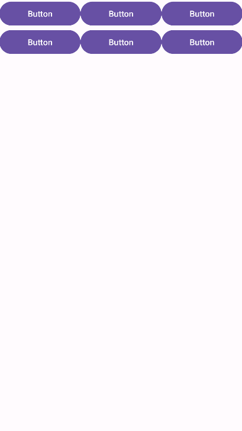
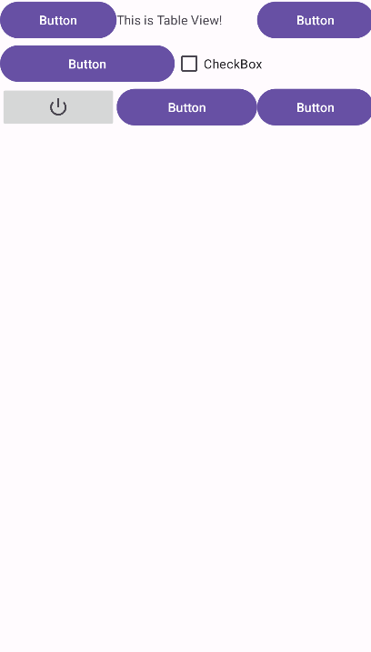
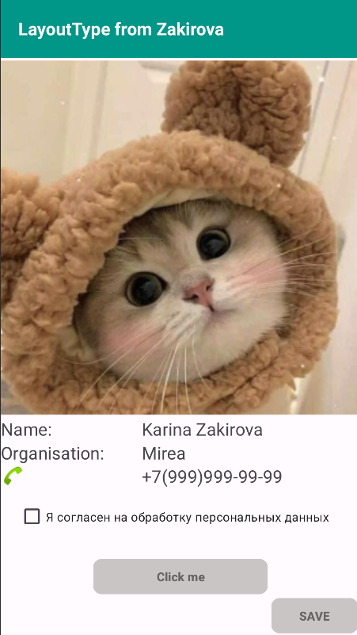
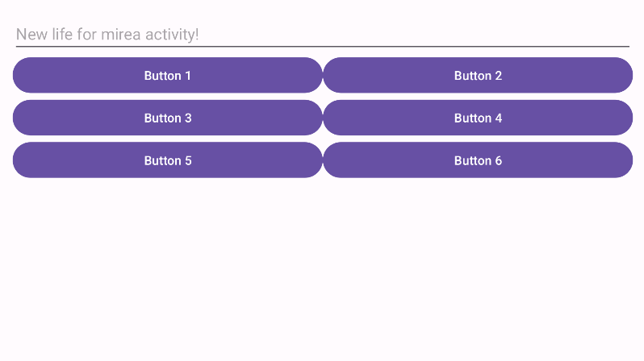
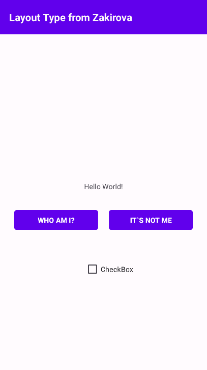

# Отчет по практической работе №1

## Выполненные задачи

В ходе работы были созданы несколько модулей:

1. **layouttype**
2. **control_lesson1**
3. **buttonclicker**

Был создан эмулятор **Pixel 9 API 35 New**.

------

## Изучение Layout

### **Linear Layout**




### **Table Layout**



------

## **control_lesson1**

### **Создан экран с информацией о контакте:**



### **Настроено переключение экранов при смене ориентации:**

**Вертикальный режим:** !

**Горизонтальный режим:** 

------

## **buttonclicker**

### **Создан экран:**



### **Реализована обработка событий кнопок:**

```java
package ru.mirea.zakirovakr.buttonclicker;

import android.os.Bundle;
import android.widget.Button;
import android.widget.TextView;
import android.widget.CheckBox;

import androidx.activity.EdgeToEdge;
import androidx.appcompat.app.AppCompatActivity;
import androidx.core.graphics.Insets;
import androidx.core.view.ViewCompat;
import androidx.core.view.WindowInsetsCompat;
import android.view.View;
import android.widget.Toast;


public class MainActivity extends AppCompatActivity {
    private TextView tvOut;
    private Button btnWhoAmI;
    private CheckBox checkBox;

    @Override
    protected void onCreate(Bundle savedInstanceState) {
        super.onCreate(savedInstanceState);
        EdgeToEdge.enable(this);
        setContentView(R.layout.activity_main);
        tvOut = findViewById(R.id.tvOut);
        btnWhoAmI = findViewById(R.id.btnWhoAmI);
        checkBox = findViewById(R.id.checkBox);

        ViewCompat.setOnApplyWindowInsetsListener(findViewById(R.id.main), (v, insets) -> {
            Insets systemBars = insets.getInsets(WindowInsetsCompat.Type.systemBars());
            v.setPadding(systemBars.left, systemBars.top, systemBars.right, systemBars.bottom);
            return insets;
        });

        View.OnClickListener oclBtnWhoAmI = new View.OnClickListener() {
            @Override
            public void onClick(View v) {
                tvOut.setText("Мой номер по списку № 10");
            }
        };

        btnWhoAmI.setOnClickListener(oclBtnWhoAmI);

    }

    public void onMyButtonClick(View view) {
        boolean isChecked = !checkBox.isChecked();
        checkBox.setChecked(isChecked);

        if (isChecked) {
            tvOut.setText("Я не этот студент!");
        } else {
            tvOut.setText("Мой номер по списку № 10");
        }

    }
}
```

### **Особенности реализации:**

- **btnItIsNotMe** использует обработчик через `onClick` в XML.
- **CheckBox** меняет свое состояние и текст `TextView` в зависимости от нажатия кнопки.

------

### **Вывод:**

В ходе работы были изучены различные виды разметки, обработка событий кнопок, а также работа с ориентацией экрана.
