# Пр3

Был создан новый проект MireaProject типа с двумя дополнительными фрагментами DataFragment WebViewFragment.

MainActivity 

```java
public class MainActivity extends AppCompatActivity {

    private AppBarConfiguration mAppBarConfiguration;
    private ActivityMainBinding binding;

    @Override
    protected void onCreate(Bundle savedInstanceState) {
        super.onCreate(savedInstanceState);

        binding = ActivityMainBinding.inflate(getLayoutInflater());
        setContentView(binding.getRoot());

        setSupportActionBar(binding.appBarMain.toolbar);
        binding.appBarMain.fab.setOnClickListener(new View.OnClickListener() {
            @Override
            public void onClick(View view) {
                Snackbar.make(view, "Replace with your own action", Snackbar.LENGTH_LONG)
                        .setAction("Action", null)
                        .setAnchorView(R.id.fab).show();
            }
        });
        DrawerLayout drawer = binding.drawerLayout;
        NavigationView navigationView = binding.navView;
        mAppBarConfiguration = new AppBarConfiguration.Builder(
                R.id.nav_home,
                R.id.nav_gallery,
                R.id.nav_slideshow,
                R.id.nav_data,
                R.id.nav_webview
        ).setOpenableLayout(drawer).build();
        NavController navController = Navigation.findNavController(this, R.id.nav_host_fragment_content_main);
        NavigationUI.setupActionBarWithNavController(this, navController, mAppBarConfiguration);
        NavigationUI.setupWithNavController(navigationView, navController);
    }

    @Override
    public boolean onCreateOptionsMenu(Menu menu) {
        getMenuInflater().inflate(R.menu.main, menu);
        return true;
    }

    @Override
    public boolean onSupportNavigateUp() {
        NavController navController = Navigation.findNavController(this, R.id.nav_host_fragment_content_main);
        return NavigationUI.navigateUp(navController, mAppBarConfiguration)
                || super.onSupportNavigateUp();
    }
}
```

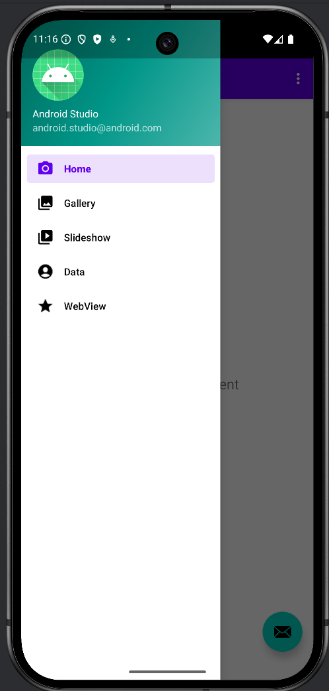

DataFragment

```java
public class DataFragment extends Fragment {
    @Override
    public View onCreateView(LayoutInflater inflater, ViewGroup container, Bundle savedInstanceState) {
        View view = inflater.inflate(R.layout.fragment_data, container, false);
        return view;
    }
}
```

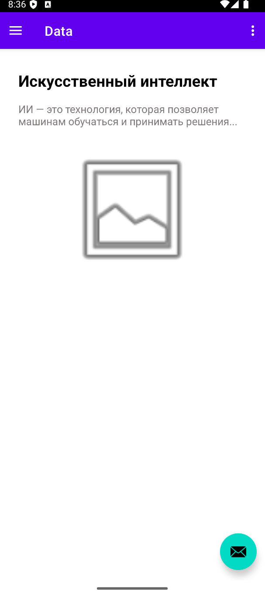

WebViewFragment

```java
public class WebViewFragment extends Fragment {
    private WebView webView;

    @Override
    public View onCreateView(LayoutInflater inflater, ViewGroup container, Bundle savedInstanceState) {
        View view = inflater.inflate(R.layout.fragment_web_view, container, false);
        webView = view.findViewById(R.id.webView);
        webView.getSettings().setJavaScriptEnabled(true);
        webView.setWebViewClient(new WebViewClient());
        webView.loadUrl("https://google.com");
        return view;
    }
}
```

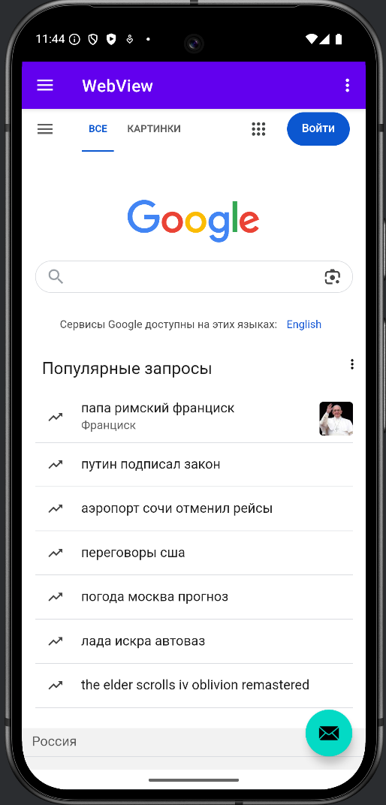


# Пр4

**Задание №6**

​	В проекте MireaProject создан новый модуль pr4 и фрагмент BackgroundTaskFragment, который использует WorkManager для выполнения фоновой задачи с классом TaskWorker, имитирующим работу с задержкой 5 секунд и требующим наличия интернета. Фрагмент отображает статус задачи ("Running", "Succeeded" и т.д.) в TextView и запускает задачу по нажатию на кнопку, а MainActivity настроена для отображения этого фрагмента через FragmentContainerView. Добавлены необходимые зависимости в build.gradle, разрешение на интернет в AndroidManifest.xml, а также проведено тестирование, подтвердившее корректное выполнение задачи с логированием в Logcat.

​	MainActivity:

```java
public class MainActivity extends AppCompatActivity {

    @Override
    protected void onCreate(Bundle savedInstanceState) {
        super.onCreate(savedInstanceState);
        EdgeToEdge.enable(this);
        setContentView(R.layout.activity_main);

        ViewCompat.setOnApplyWindowInsetsListener(findViewById(R.id.fragment_container), (v, insets) -> {
            Insets systemBars = insets.getInsets(WindowInsetsCompat.Type.systemBars());
            v.setPadding(systemBars.left, systemBars.top, systemBars.right, systemBars.bottom);
            return insets;
        });

        if (savedInstanceState == null) {
            getSupportFragmentManager().beginTransaction()
                    .replace(R.id.fragment_container, new BackgroundTaskFragment())
                    .commit();
        }
    }
}
```

​	BackgroundTaskFragment:

```java
public class BackgroundTaskFragment extends Fragment {

    private TextView statusTextView;
    private Button startTaskButton;

    @Override
    public View onCreateView(LayoutInflater inflater, ViewGroup container, Bundle savedInstanceState) {
        View view = inflater.inflate(R.layout.fragment_background_task, container, false);

        statusTextView = view.findViewById(R.id.statusTextView);
        startTaskButton = view.findViewById(R.id.startTaskButton);

        startTaskButton.setOnClickListener(v -> startBackgroundTask());

        return view;
    }

    private void startBackgroundTask() {
        Constraints constraints = new Constraints.Builder()
                .setRequiredNetworkType(NetworkType.CONNECTED) 
                .build();

        WorkRequest taskRequest = new OneTimeWorkRequest.Builder(TaskWorker.class)
                .setConstraints(constraints)
                .build();

        WorkManager workManager = WorkManager.getInstance(requireContext());
        workManager.enqueue(taskRequest);

        workManager.getWorkInfoByIdLiveData(taskRequest.getId()).observe(getViewLifecycleOwner(), workInfo -> {
            if (workInfo != null) {
                WorkInfo.State state = workInfo.getState();
                switch (state) {
                    case ENQUEUED:
                        statusTextView.setText("Task Status: Enqueued...");
                        break;
                    case RUNNING:
                        statusTextView.setText("Task Status: Running...");
                        break;
                    case SUCCEEDED:
                        statusTextView.setText("Task Status: Succeeded!");
                        break;
                    case FAILED:
                        statusTextView.setText("Task Status: Failed.");
                        break;
                    case BLOCKED:
                        statusTextView.setText("Task Status: Blocked...");
                        break;
                    case CANCELLED:
                        statusTextView.setText("Task Status: Cancelled.");
                        break;
                }
            }
        });
    }
}
```

​	TaskWorker:

```java
public class TaskWorker extends Worker {
    private static final String TAG = "TaskWorker";

    public TaskWorker(@NonNull Context context, @NonNull WorkerParameters params) {
        super(context, params);
    }

    @Override
    public Result doWork() {
        Log.d(TAG, "doWork: Starting background task");
        try {
            TimeUnit.SECONDS.sleep(5);
        } catch (InterruptedException e) {
            e.printStackTrace();
            Log.e(TAG, "doWork: Task failed", e);
            return Result.failure();
        }
        Log.d(TAG, "doWork: Task completed successfully");
        return Result.success();
    }
}
```

​	При запуске приложения открывается экран:

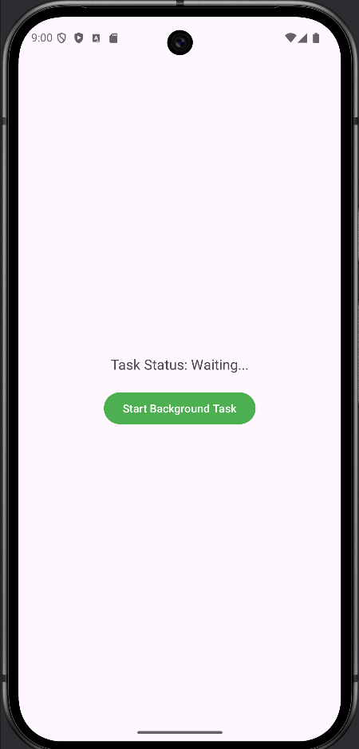

​	После нажатия на кнопку начинается выполнение задачи, запускается задержка:

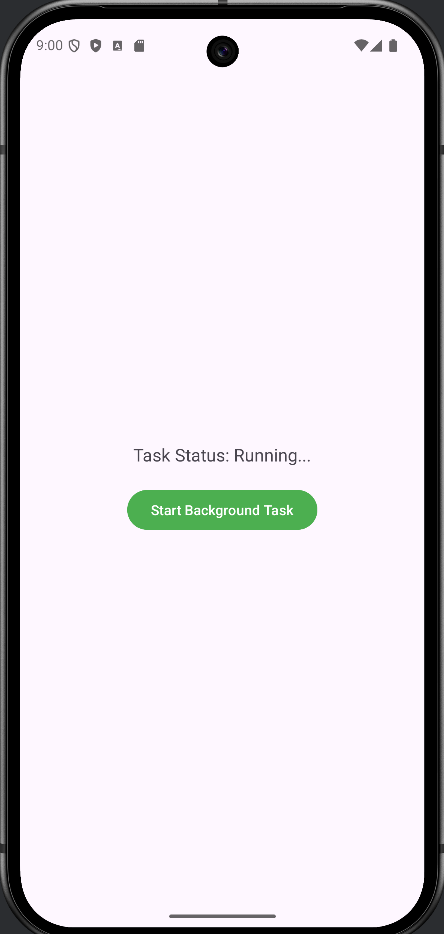

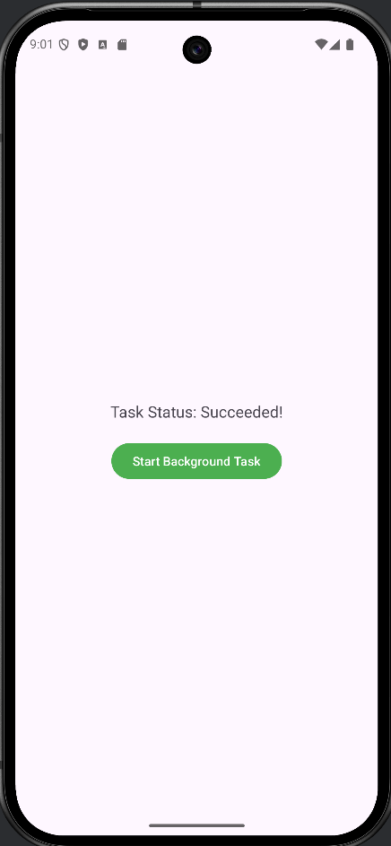

​	В Logcat были выведены следующие логи с разницей 5 секунд: 

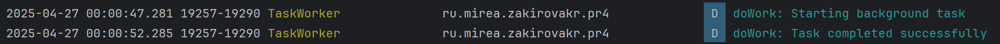


# Пр5

**Контрольное задание**

​		В проекте MireaProject в модуле app были созданы новые фрагменты: CameraFragment, MicrophoneFragment, SensorFragment. Эти фрагменты предназначены для взаимодействия с аппаратным обеспечением устройства (камерой, микрофоном и датчиками).

​	AndroidManifest.xml:

```xml
<?xml version="1.0" encoding="utf-8"?>
<manifest xmlns:android="http://schemas.android.com/apk/res/android"
    xmlns:tools="http://schemas.android.com/tools">

    <uses-permission android:name="android.permission.INTERNET" />
    <uses-permission android:name="android.permission.CAMERA" />
    <uses-permission android:name="android.permission.RECORD_AUDIO" />
    <uses-permission android:name="android.permission.WRITE_EXTERNAL_STORAGE" />
    <uses-permission android:name="android.permission.READ_EXTERNAL_STORAGE" />
    <uses-feature android:name="android.hardware.camera" android:required="true" />
    <uses-feature android:name="android.hardware.sensor.compass" android:required="true" />
    <uses-feature android:name="android.hardware.microphone" android:required="true" />

    <application
        android:allowBackup="true"
        android:dataExtractionRules="@xml/data_extraction_rules"
        android:fullBackupContent="@xml/backup_rules"
        android:icon="@mipmap/ic_launcher"
        android:label="@string/app_name"
        android:roundIcon="@mipmap/ic_launcher_round"
        android:supportsRtl="true"
        android:theme="@style/Theme.MireaProject"
        tools:targetApi="31">
        <activity
            android:name=".MainActivity"
            android:exported="true"
            android:label="@string/app_name"
            android:theme="@style/Theme.MireaProject.NoActionBar">
            <intent-filter>
                <action android:name="android.intent.action.MAIN" />
                <category android:name="android.intent.category.LAUNCHER" />
            </intent-filter>
        </activity>
    </application>

</manifest>
```

​	MainActivity.java:

```java
public class MainActivity extends AppCompatActivity {

    private AppBarConfiguration mAppBarConfiguration;
    private ActivityMainBinding binding;

    private final ActivityResultLauncher<String[]> permissionLauncher =
            registerForActivityResult(new ActivityResultContracts.RequestMultiplePermissions(), result -> {
                Boolean cameraGranted = result.getOrDefault(Manifest.permission.CAMERA, false);
                Boolean audioGranted = result.getOrDefault(Manifest.permission.RECORD_AUDIO, false);
                Boolean storageWriteGranted = result.getOrDefault(Manifest.permission.WRITE_EXTERNAL_STORAGE, false);
                Boolean storageReadGranted = result.getOrDefault(Manifest.permission.READ_EXTERNAL_STORAGE, false);

                if (cameraGranted != null && cameraGranted &&
                        audioGranted != null && audioGranted &&
                        storageWriteGranted != null && storageWriteGranted &&
                        storageReadGranted != null && storageReadGranted) {
                    Toast.makeText(this, "All permissions granted", Toast.LENGTH_SHORT).show();
                } else {
                    Toast.makeText(this, "Permissions denied", Toast.LENGTH_SHORT).show();
                }
            });

    @Override
    protected void onCreate(Bundle savedInstanceState) {
        super.onCreate(savedInstanceState);

        binding = ActivityMainBinding.inflate(getLayoutInflater());
        setContentView(binding.getRoot());

        setSupportActionBar(binding.appBarMain.toolbar);
        binding.appBarMain.fab.setOnClickListener(view ->
                Snackbar.make(view, "Replace with your own action", Snackbar.LENGTH_LONG)
                        .setAction("Action", null)
                        .setAnchorView(R.id.fab).show());

        DrawerLayout drawer = binding.drawerLayout;
        NavigationView navigationView = binding.navView;
        mAppBarConfiguration = new AppBarConfiguration.Builder(
                R.id.nav_home,
                R.id.nav_gallery,
                R.id.nav_slideshow,
                R.id.nav_data,
                R.id.nav_webview,
                R.id.nav_sensor,
                R.id.nav_camera,
                R.id.nav_microphone
        ).setOpenableLayout(drawer).build();
        NavController navController = Navigation.findNavController(this, R.id.nav_host_fragment_content_main);
        NavigationUI.setupActionBarWithNavController(this, navController, mAppBarConfiguration);
        NavigationUI.setupWithNavController(navigationView, navController);

        checkAndRequestPermissions();
    }

    private void checkAndRequestPermissions() {
        String[] permissions = {
                Manifest.permission.CAMERA,
                Manifest.permission.RECORD_AUDIO,
                Manifest.permission.WRITE_EXTERNAL_STORAGE,
                Manifest.permission.READ_EXTERNAL_STORAGE
        };

        boolean allPermissionsGranted = true;
        for (String permission : permissions) {
            if (ContextCompat.checkSelfPermission(this, permission) != PackageManager.PERMISSION_GRANTED) {
                allPermissionsGranted = false;
                break;
            }
        }

        if (!allPermissionsGranted) {
            permissionLauncher.launch(permissions);
        }
    }

    @Override
    public boolean onCreateOptionsMenu(Menu menu) {
        getMenuInflater().inflate(R.menu.main, menu);
        return true;
    }

    @Override
    public boolean onSupportNavigateUp() {
        NavController navController = Navigation.findNavController(this, R.id.nav_host_fragment_content_main);
        return NavigationUI.navigateUp(navController, mAppBarConfiguration)
                || super.onSupportNavigateUp();
    }
}
```

​	Фрагмент камеры позволяет пользователю сделать снимок с помощью камеры устройства, отобразить полученное изображение и ввести информацию о профиле (ФИО, группу и номер в списке).

​	CameraFragment.java:

```java
public class CameraFragment extends Fragment {

    private ImageView imageView;
    private EditText fioEditText, groupEditText, listNumberEditText;
    private TextView profileInfoTextView;
    private final ActivityResultLauncher<Intent> cameraLauncher =
            registerForActivityResult(new ActivityResultContracts.StartActivityForResult(), result -> {
                if (result.getResultCode() == requireActivity().RESULT_OK && result.getData() != null) {
                    Bundle extras = result.getData().getExtras();
                    Bitmap imageBitmap = (Bitmap) extras.get("data");
                    imageView.setImageBitmap(imageBitmap);
                } else {
                    Toast.makeText(requireContext(), "Не удалось сделать фото", Toast.LENGTH_SHORT).show();
                }
            });
    private final ActivityResultLauncher<String> permissionLauncher =
            registerForActivityResult(new ActivityResultContracts.RequestPermission(), isGranted -> {
                if (isGranted) {
                    launchCamera();
                } else {
                    Toast.makeText(requireContext(), "Для съемки фото требуется разрешение на использование камеры", Toast.LENGTH_SHORT).show();
                }
            });

    @Override
    public View onCreateView(LayoutInflater inflater, ViewGroup container, Bundle savedInstanceState) {
        View view = inflater.inflate(R.layout.fragment_camera, container, false);

        imageView = view.findViewById(R.id.imageView);
        fioEditText = view.findViewById(R.id.fioEditText);
        groupEditText = view.findViewById(R.id.groupEditText);
        listNumberEditText = view.findViewById(R.id.listNumberEditText);
        profileInfoTextView = view.findViewById(R.id.profileInfoTextView);
        Button captureButton = view.findViewById(R.id.captureButton);
        Button saveButton = view.findViewById(R.id.saveButton);

        captureButton.setOnClickListener(v -> {
            if (ContextCompat.checkSelfPermission(requireContext(), Manifest.permission.CAMERA) == PackageManager.PERMISSION_GRANTED) {
                launchCamera();
            } else {
                permissionLauncher.launch(Manifest.permission.CAMERA);
            }
        });

        saveButton.setOnClickListener(v -> {
            String fio = fioEditText.getText().toString().trim();
            String group = groupEditText.getText().toString().trim();
            String listNumber = listNumberEditText.getText().toString().trim();

            if (fio.isEmpty() || group.isEmpty() || listNumber.isEmpty()) {
                Toast.makeText(requireContext(), "Пожалуйста, заполните все поля", Toast.LENGTH_SHORT).show();
            } else {
                String profileInfo = "ФИО: " + fio + "\n" +
                        "Группа: " + group + "\n" +
                        "Номер в списке: " + listNumber;
                profileInfoTextView.setText(profileInfo);
                Toast.makeText(requireContext(), "Профиль сохранен", Toast.LENGTH_SHORT).show();
            }
        });

        return view;
    }

    private void launchCamera() {
        Intent takePictureIntent = new Intent(MediaStore.ACTION_IMAGE_CAPTURE);
        cameraLauncher.launch(takePictureIntent);
    }
}
```

 	fragment_camera.xml:

```xml
<?xml version="1.0" encoding="utf-8"?>
<LinearLayout xmlns:android="http://schemas.android.com/apk/res/android"
    android:layout_width="match_parent"
    android:layout_height="match_parent"
    android:orientation="vertical"
    android:padding="16dp">

    <Button
        android:id="@+id/captureButton"
        android:layout_width="wrap_content"
        android:layout_height="wrap_content"
        android:text="Сделать фото"
        android:layout_gravity="center" />

    <ImageView
        android:id="@+id/imageView"
        android:layout_width="200dp"
        android:layout_height="200dp"
        android:layout_gravity="center"
        android:layout_marginTop="16dp"
        android:contentDescription="Сфотографированное изображение" />

    <EditText
        android:id="@+id/fioEditText"
        android:layout_width="match_parent"
        android:layout_height="wrap_content"
        android:layout_marginTop="16dp"
        android:hint="ФИО"
        android:inputType="textPersonName" />

    <EditText
        android:id="@+id/groupEditText"
        android:layout_width="match_parent"
        android:layout_height="wrap_content"
        android:layout_marginTop="8dp"
        android:hint="Группа"
        android:inputType="text" />

    <EditText
        android:id="@+id/listNumberEditText"
        android:layout_width="match_parent"
        android:layout_height="wrap_content"
        android:layout_marginTop="8dp"
        android:hint="Номер в списке"
        android:inputType="number" />

    <Button
        android:id="@+id/saveButton"
        android:layout_width="wrap_content"
        android:layout_height="wrap_content"
        android:layout_gravity="center"
        android:layout_marginTop="16dp"
        android:text="Сохранить профиль" />

    <TextView
        android:id="@+id/profileInfoTextView"
        android:layout_width="match_parent"
        android:layout_height="wrap_content"
        android:layout_marginTop="16dp"
        android:text="Информация о профиле появится здесь"
        android:textSize="16sp"
        android:textAlignment="center" />

    <TextView
        android:layout_width="match_parent"
        android:layout_height="wrap_content"
        android:layout_marginTop="16dp"
        android:text="Сделайте фото и введите данные для создания профиля."
        android:textSize="16sp" />

</LinearLayout>
```

​	Фрагмент микрофона позволяет пользователю записывать звук, останавливать запись и воспроизводить записанный звук.

​	MicrophoneFragment.java:

```java
public class MicrophoneFragment extends Fragment {

    private MediaRecorder mediaRecorder;
    private MediaPlayer mediaPlayer;
    private TextView statusTextView;
    private Button startRecordButton, stopRecordButton, playButton;
    private boolean isRecording = false;
    private String audioFilePath;

    @Override
    public View onCreateView(LayoutInflater inflater, ViewGroup container, Bundle savedInstanceState) {
        View view = inflater.inflate(R.layout.fragment_microphone, container, false);

        statusTextView = view.findViewById(R.id.statusTextView);
        startRecordButton = view.findViewById(R.id.startRecordButton);
        stopRecordButton = view.findViewById(R.id.stopRecordButton);
        playButton = view.findViewById(R.id.playButton);

        audioFilePath = requireActivity().getExternalFilesDir(Environment.DIRECTORY_MUSIC) + "/audio_record.3gp";

        startRecordButton.setOnClickListener(v -> startRecording());
        stopRecordButton.setOnClickListener(v -> stopRecording());
        playButton.setOnClickListener(v -> playRecording());

        // Initial button states
        stopRecordButton.setEnabled(false);
        playButton.setEnabled(false);

        return view;
    }

    private void startRecording() {
        if (!isRecording) {
            mediaRecorder = new MediaRecorder();
            mediaRecorder.setAudioSource(MediaRecorder.AudioSource.MIC);
            mediaRecorder.setOutputFormat(MediaRecorder.OutputFormat.THREE_GPP);
            mediaRecorder.setOutputFile(audioFilePath);
            mediaRecorder.setAudioEncoder(MediaRecorder.AudioEncoder.AMR_NB);

            try {
                mediaRecorder.prepare();
                mediaRecorder.start();
                isRecording = true;
                statusTextView.setText("Идёт запись...");
                startRecordButton.setEnabled(false);
                stopRecordButton.setEnabled(true);
                playButton.setEnabled(false);
            } catch (IOException e) {
                e.printStackTrace();
                Toast.makeText(requireContext(), "Не удалось начать запись", Toast.LENGTH_SHORT).show();
            }
        }
    }

    private void stopRecording() {
        if (isRecording) {
            try {
                mediaRecorder.stop();
            } catch (RuntimeException e) {
                e.printStackTrace();
            }
            mediaRecorder.release();
            mediaRecorder = null;
            isRecording = false;
            statusTextView.setText("Запись остановлена. Готово к воспроизведению.");
            startRecordButton.setEnabled(true);
            stopRecordButton.setEnabled(false);
            playButton.setEnabled(true);
        }
    }

    private void playRecording() {
        if (mediaPlayer != null) {
            mediaPlayer.release();
        }
        mediaPlayer = new MediaPlayer();
        try {
            mediaPlayer.setDataSource(audioFilePath);
            mediaPlayer.prepare();
            mediaPlayer.start();
            statusTextView.setText("Воспроизведение...");
            playButton.setEnabled(false);
            mediaPlayer.setOnCompletionListener(mp -> {
                statusTextView.setText("Воспроизведение завершено.");
                playButton.setEnabled(true);
                mediaPlayer.release();
                mediaPlayer = null;
            });
        } catch (IOException e) {
            e.printStackTrace();
            Toast.makeText(requireContext(), "Не удалось воспроизвести запись", Toast.LENGTH_SHORT).show();
        }
    }

    @Override
    public void onPause() {
        super.onPause();
        if (isRecording) {
            stopRecording();
        }
        if (mediaPlayer != null) {
            mediaPlayer.release();
            mediaPlayer = null;
        }
    }

    @Override
    public void onDestroy() {
        super.onDestroy();
        if (mediaRecorder != null) {
            mediaRecorder.release();
            mediaRecorder = null;
        }
        if (mediaPlayer != null) {
            mediaPlayer.release();
            mediaPlayer = null;
        }
    }
}
```

​	fragment_microphone.xml:

```xml
<?xml version="1.0" encoding="utf-8"?>
<LinearLayout xmlns:android="http://schemas.android.com/apk/res/android"
    android:layout_width="match_parent"
    android:layout_height="match_parent"
    android:orientation="vertical"
    android:padding="16dp">

    <Button
        android:id="@+id/startRecordButton"
        android:layout_width="wrap_content"
        android:layout_height="wrap_content"
        android:text="Начать запись"
        android:layout_gravity="center" />

    <Button
        android:id="@+id/stopRecordButton"
        android:layout_width="wrap_content"
        android:layout_height="wrap_content"
        android:text="Остановить запись"
        android:layout_gravity="center"
        android:enabled="false" />

    <Button
        android:id="@+id/playButton"
        android:layout_width="wrap_content"
        android:layout_height="wrap_content"
        android:text="Воспроизвести запись"
        android:layout_gravity="center"
        android:enabled="false" />

    <TextView
        android:id="@+id/statusTextView"
        android:layout_width="match_parent"
        android:layout_height="wrap_content"
        android:layout_marginTop="16dp"
        android:text="Готово к записи"
        android:textSize="20sp"
        android:textAlignment="center" />

    <TextView
        android:layout_width="match_parent"
        android:layout_height="wrap_content"
        android:layout_marginTop="16dp"
        android:text="Записывайте аудио и воспроизводите его для создания голосовых заметок или анализа звука."
        android:textSize="16sp" />

</LinearLayout>
```

​	Фрагмент сенсора использует датчики акселерометра и магнитометра устройства для определения направления (компаса) и отображения его для пользователя.

​	SensorFragment.java:

```java
public class SensorFragment extends Fragment implements SensorEventListener {

    private SensorManager sensorManager;
    private Sensor accelerometer;
    private Sensor magnetometer;
    private TextView directionTextView;

    private float[] gravity;
    private float[] geomagnetic;

    @Override
    public View onCreateView(LayoutInflater inflater, ViewGroup container, Bundle savedInstanceState) {
        View view = inflater.inflate(R.layout.fragment_sensor, container, false);

        directionTextView = view.findViewById(R.id.directionTextView);
        sensorManager = (SensorManager) requireActivity().getSystemService(Context.SENSOR_SERVICE);
        accelerometer = sensorManager.getDefaultSensor(Sensor.TYPE_ACCELEROMETER);
        magnetometer = sensorManager.getDefaultSensor(Sensor.TYPE_MAGNETIC_FIELD);

        return view;
    }

    @Override
    public void onResume() {
        super.onResume();
        sensorManager.registerListener(this, accelerometer, SensorManager.SENSOR_DELAY_UI);
        sensorManager.registerListener(this, magnetometer, SensorManager.SENSOR_DELAY_UI);
    }

    @Override
    public void onPause() {
        super.onPause();
        sensorManager.unregisterListener(this);
    }

    @Override
    public void onSensorChanged(SensorEvent event) {
        if (event.sensor.getType() == Sensor.TYPE_ACCELEROMETER) {
            gravity = event.values.clone();
        } else if (event.sensor.getType() == Sensor.TYPE_MAGNETIC_FIELD) {
            geomagnetic = event.values.clone();
        }

        if (gravity != null && geomagnetic != null) {
            float[] R = new float[9];
            float[] I = new float[9];
            boolean success = SensorManager.getRotationMatrix(R, I, gravity, geomagnetic);
            if (success) {
                float[] orientation = new float[3];
                SensorManager.getOrientation(R, orientation);
                float azimuth = (float) Math.toDegrees(orientation[0]);
                azimuth = (azimuth + 360) % 360;

                String direction;
                if (azimuth >= 337.5 || azimuth < 22.5) {
                    direction = "Север";
                } else if (azimuth >= 22.5 && azimuth < 67.5) {
                    direction = "Северо-восток";
                } else if (azimuth >= 67.5 && azimuth < 112.5) {
                    direction = "Восток";
                } else if (azimuth >= 112.5 && azimuth < 157.5) {
                    direction = "Юго-восток";
                } else if (azimuth >= 157.5 && azimuth < 202.5) {
                    direction = "Юг";
                } else if (azimuth >= 202.5 && azimuth < 247.5) {
                    direction = "Юго-запад";
                } else if (azimuth >= 247.5 && azimuth < 292.5) {
                    direction = "Запад";
                } else {
                    direction = "Северо-запад";
                }

                directionTextView.setText("Направление: " + direction + " (" + String.format("%.1f", azimuth) + "°)");
            }
        }
    }

    @Override
    public void onAccuracyChanged(Sensor sensor, int accuracy) {
        // Not used
    }
}
```

​	fragment_sensor.xml:

```xml
<?xml version="1.0" encoding="utf-8"?>
<LinearLayout xmlns:android="http://schemas.android.com/apk/res/android"
    android:layout_width="match_parent"
    android:layout_height="match_parent"
    android:orientation="vertical"
    android:padding="16dp">

    <TextView
        android:id="@+id/directionTextView"
        android:layout_width="match_parent"
        android:layout_height="wrap_content"
        android:text="Направление: Неизвестно"
        android:textSize="20sp"
        android:textAlignment="center" />

    <TextView
        android:layout_width="match_parent"
        android:layout_height="wrap_content"
        android:layout_marginTop="16dp"
        android:text="Направьте устройство, чтобы определить направление на север. Это поможет ориентироваться по природным признакам, таким как солнце или мох."
        android:textSize="16sp" />

</LinearLayout>
```

​	Далее демонстрация работы приложения.

​	При запуске приложения запрашиваются разрешения:

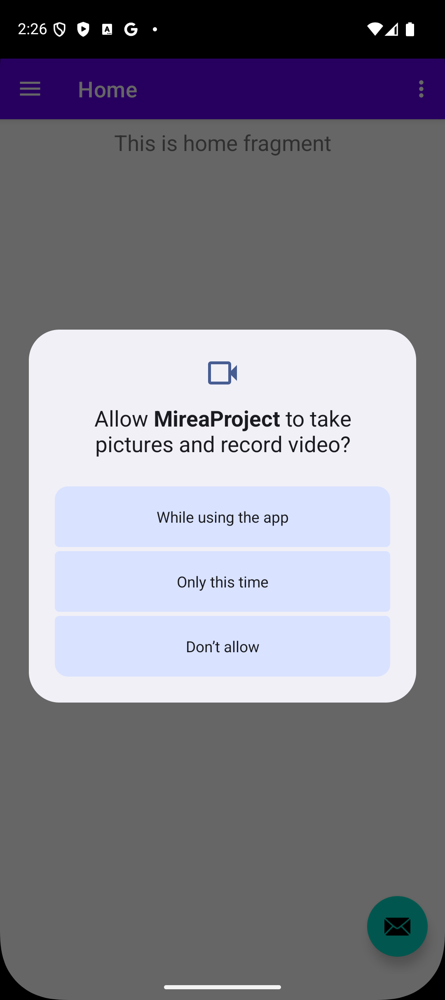

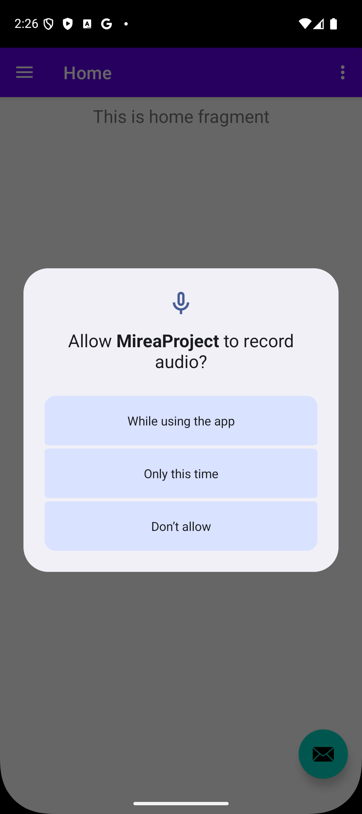

​	Меню выглядит так:


​	Переходим в раздел сенсора:

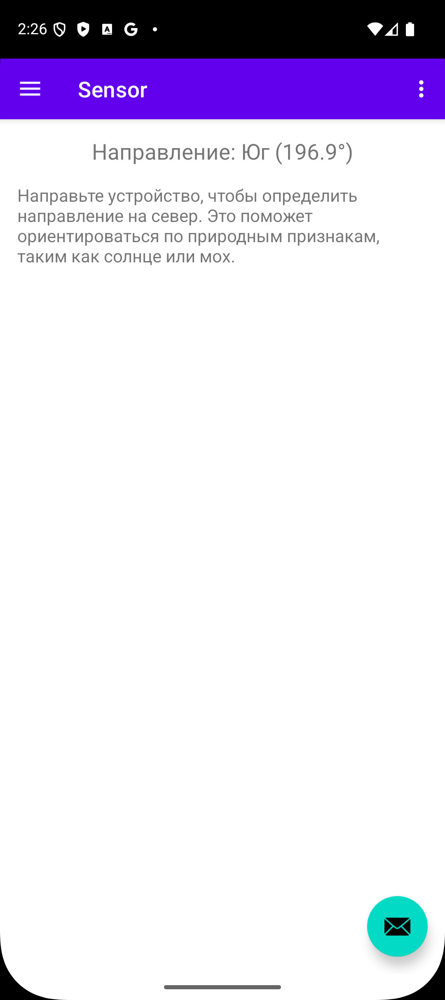

​	Раздел камеры:

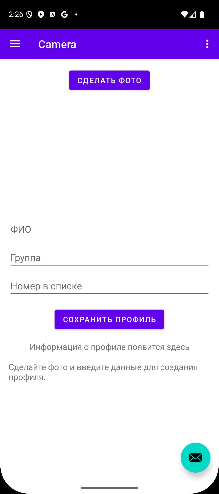

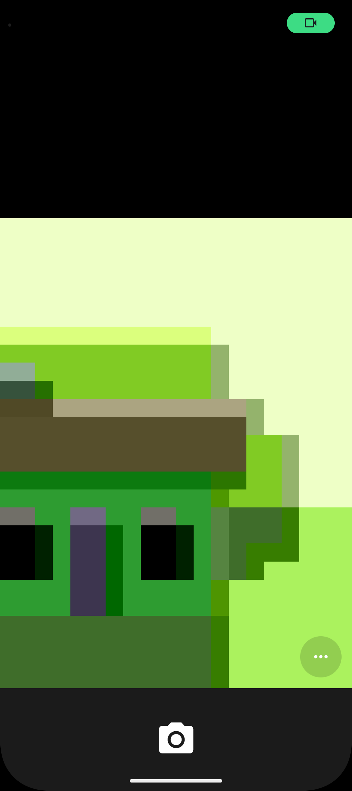

​	Создание профиля с заполнением данных:

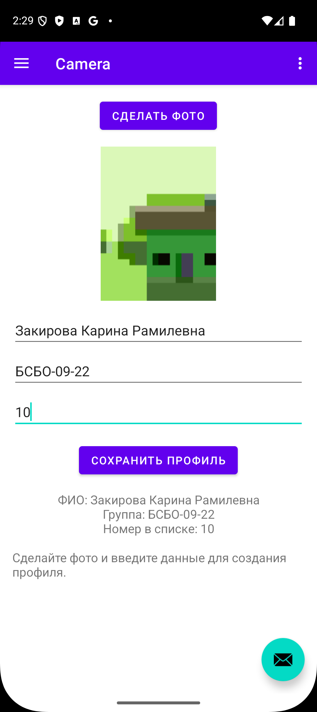

​	Раздел микрофона:

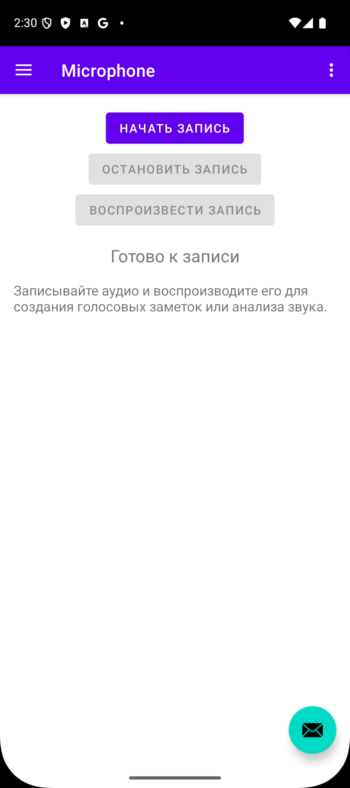

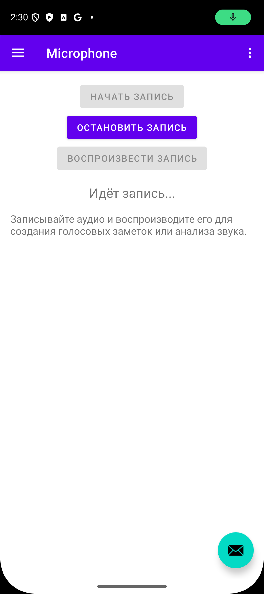

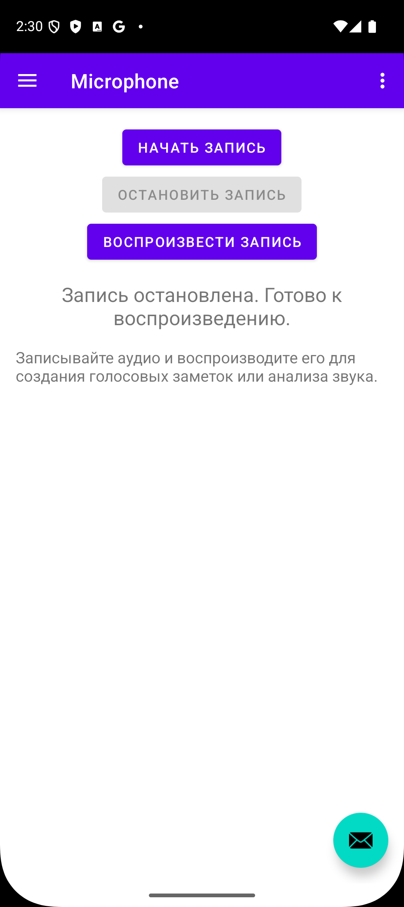


# 	Пр6

**КОНТРОЛЬНОЕ ЗАДАНИЕ**

​	В проекте MireaProject добавлены два фрагмента: Профиль (сохранение имени, возраста и хобби в SharedPreferences с автоматической загрузкой при открытии) и Работа с файлами (шифрование/дешифрование текста шифром Цезаря, сохранение в DIRECTORY_DOCUMENTS, диалоговое окно для ввода через FloatingActionButton). Фрагменты интегрированы в существующую навигацию (mobile_navigation.xml, activity_main_drawer.xml), создана директория raw для скриншота. Разрешения для работы с файлами запрашиваются в MainActivity.

​	ProfileFragment.java:

```java
public class ProfileFragment extends Fragment {

    private EditText editTextName, editTextAge, editTextHobby;
    private SharedPreferences preferences;

    @Override
    public View onCreateView(LayoutInflater inflater, ViewGroup container, Bundle savedInstanceState) {
        View view = inflater.inflate(R.layout.fragment_profile, container, false);

        editTextName = view.findViewById(R.id.editTextName);
        editTextAge = view.findViewById(R.id.editTextAge);
        editTextHobby = view.findViewById(R.id.editTextHobby);
        Button buttonSave = view.findViewById(R.id.buttonSave);

        preferences = requireActivity().getSharedPreferences("user_profile", Context.MODE_PRIVATE);

        loadProfileData();

        buttonSave.setOnClickListener(v -> saveProfileData());

        return view;
    }

    private void saveProfileData() {
        String name = editTextName.getText().toString().trim();
        String age = editTextAge.getText().toString().trim();
        String hobby = editTextHobby.getText().toString().trim();

        if (name.isEmpty() || age.isEmpty() || hobby.isEmpty()) {
            Toast.makeText(requireContext(), "Заполните все поля", Toast.LENGTH_SHORT).show();
            return;
        }

        SharedPreferences.Editor editor = preferences.edit();
        editor.putString("NAME", name);
        editor.putInt("AGE", Integer.parseInt(age));
        editor.putString("HOBBY", hobby);
        editor.apply();

        Toast.makeText(requireContext(), "Профиль сохранён", Toast.LENGTH_SHORT).show();
    }

    private void loadProfileData() {
        String name = preferences.getString("NAME", "");
        int age = preferences.getInt("AGE", 0);
        String hobby = preferences.getString("HOBBY", "");

        editTextName.setText(name);
        editTextAge.setText(age == 0 ? "" : String.valueOf(age));
        editTextHobby.setText(hobby);
    }
}
```

​	fragment_profile.xml:

```xml
<?xml version="1.0" encoding="utf-8"?>
<androidx.constraintlayout.widget.ConstraintLayout xmlns:android="http://schemas.android.com/apk/res/android"
    xmlns:app="http://schemas.android.com/apk/res-auto"
    android:layout_width="match_parent"
    android:layout_height="match_parent"
    android:padding="16dp">

    <EditText
        android:id="@+id/editTextName"
        android:layout_width="match_parent"
        android:layout_height="wrap_content"
        android:hint="Имя"
        android:inputType="text"
        app:layout_constraintTop_toTopOf="parent"
        app:layout_constraintStart_toStartOf="parent" />

    <EditText
        android:id="@+id/editTextAge"
        android:layout_width="match_parent"
        android:layout_height="wrap_content"
        android:hint="Возраст"
        android:inputType="number"
        app:layout_constraintTop_toBottomOf="@id/editTextName"
        app:layout_constraintStart_toStartOf="parent"
        android:layout_marginTop="16dp" />

    <EditText
        android:id="@+id/editTextHobby"
        android:layout_width="match_parent"
        android:layout_height="wrap_content"
        android:hint="Любимое хобби"
        android:inputType="text"
        app:layout_constraintTop_toBottomOf="@id/editTextAge"
        app:layout_constraintStart_toStartOf="parent"
        android:layout_marginTop="16dp" />

    <Button
        android:id="@+id/buttonSave"
        android:layout_width="wrap_content"
        android:layout_height="wrap_content"
        android:text="Сохранить"
        app:layout_constraintTop_toBottomOf="@id/editTextHobby"
        app:layout_constraintStart_toStartOf="parent"
        android:layout_marginTop="16dp" />

</androidx.constraintlayout.widget.ConstraintLayout>
```

​	FileWorkFragment.java

```java
public class FileWorkFragment extends Fragment {

    private static final String TAG = FileWorkFragment.class.getSimpleName();
    private static final int REQUEST_PERMISSION_CODE = 100;
    private TextView textViewFiles;

    @Override
    public View onCreateView(LayoutInflater inflater, ViewGroup container, Bundle savedInstanceState) {
        View view = inflater.inflate(R.layout.fragment_file_work, container, false);

        textViewFiles = view.findViewById(R.id.textViewFiles);
        FloatingActionButton fab = view.findViewById(R.id.fab);

        requestStoragePermissions();

        updateFileList();

        fab.setOnClickListener(v -> showFileDialog());

        return view;
    }

    private void requestStoragePermissions() {
        if (ContextCompat.checkSelfPermission(requireContext(), android.Manifest.permission.WRITE_EXTERNAL_STORAGE)
                != PackageManager.PERMISSION_GRANTED) {
            ActivityCompat.requestPermissions(requireActivity(),
                    new String[]{android.Manifest.permission.WRITE_EXTERNAL_STORAGE,
                            android.Manifest.permission.READ_EXTERNAL_STORAGE},
                    REQUEST_PERMISSION_CODE);
        }
    }

    private void showFileDialog() {
        Dialog dialog = new Dialog(requireContext());
        dialog.setContentView(R.layout.dialog_file_entry);

        EditText editTextFileName = dialog.findViewById(R.id.editTextFileName);
        EditText editTextContent = dialog.findViewById(R.id.editTextContent);
        Button buttonEncrypt = dialog.findViewById(R.id.buttonEncrypt);
        Button buttonDecrypt = dialog.findViewById(R.id.buttonDecrypt);

        buttonEncrypt.setOnClickListener(v -> {
            String fileName = editTextFileName.getText().toString().trim();
            String content = editTextContent.getText().toString().trim();
            if (fileName.isEmpty() || content.isEmpty()) {
                Toast.makeText(requireContext(), "Заполните все поля", Toast.LENGTH_SHORT).show();
                return;
            }
            encryptAndSave(fileName, content);
            dialog.dismiss();
        });

        buttonDecrypt.setOnClickListener(v -> {
            String fileName = editTextFileName.getText().toString().trim();
            if (fileName.isEmpty()) {
                Toast.makeText(requireContext(), "Введите название файла", Toast.LENGTH_SHORT).show();
                return;
            }
            String decrypted = decryptFile(fileName);
            editTextContent.setText(decrypted);
        });

        dialog.show();
    }

    private void encryptAndSave(String fileName, String content) {
        if (!fileName.endsWith(".txt")) {
            fileName += ".txt";
        }

        String encrypted = caesarCipher(content, 3); // Шифр Цезаря со сдвигом 3
        File path = Environment.getExternalStoragePublicDirectory(Environment.DIRECTORY_DOCUMENTS);
        if (!path.exists()) {
            path.mkdirs();
        }

        File file = new File(path, fileName);
        try (FileOutputStream fos = new FileOutputStream(file)) {
            fos.write(encrypted.getBytes(StandardCharsets.UTF_8));
            Toast.makeText(requireContext(), "Файл зашифрован и сохранён", Toast.LENGTH_SHORT).show();
            updateFileList();
        } catch (IOException e) {
            Toast.makeText(requireContext(), "Ошибка сохранения: " + e.getMessage(), Toast.LENGTH_SHORT).show();
            Log.e(TAG, "Ошибка сохранения: " + e.getMessage());
        }
    }

    private String decryptFile(String fileName) {
        if (!fileName.endsWith(".txt")) {
            fileName += ".txt";
        }

        File path = Environment.getExternalStoragePublicDirectory(Environment.DIRECTORY_DOCUMENTS);
        File file = new File(path, fileName);
        try (FileInputStream fis = new FileInputStream(file);
             InputStreamReader isr = new InputStreamReader(fis, StandardCharsets.UTF_8);
             BufferedReader reader = new BufferedReader(isr)) {
            List<String> lines = new ArrayList<>();
            String line;
            while ((line = reader.readLine()) != null) {
                lines.add(line);
            }
            String encrypted = String.join("\n", lines);
            String decrypted = caesarCipher(encrypted, -3); // Дешифровка со сдвигом -3
            Toast.makeText(requireContext(), "Файл расшифрован", Toast.LENGTH_SHORT).show();
            return decrypted;
        } catch (IOException e) {
            Toast.makeText(requireContext(), "Ошибка чтения: " + e.getMessage(), Toast.LENGTH_SHORT).show();
            Log.e(TAG, "Ошибка чтения: " + e.getMessage());
            return "";
        }
    }

    private String caesarCipher(String text, int shift) {
        StringBuilder result = new StringBuilder();
        for (char c : text.toCharArray()) {
            if (Character.isLetter(c)) {
                char base = Character.isUpperCase(c) ? 'A' : 'a';
                result.append((char) ((c - base + shift + 26) % 26 + base));
            } else {
                result.append(c);
            }
        }
        return result.toString();
    }

    private void updateFileList() {
        File path = Environment.getExternalStoragePublicDirectory(Environment.DIRECTORY_DOCUMENTS);
        File[] files = path.listFiles();
        StringBuilder sb = new StringBuilder("Список зашифрованных файлов:\n");
        if (files != null) {
            for (File file : files) {
                if (file.getName().endsWith(".txt")) {
                    sb.append(file.getName()).append("\n");
                }
            }
        } else {
            sb.append("Папка пуста");
        }
        textViewFiles.setText(sb.toString());
    }
}
```

​	fragment_file_work.xml:

```xml
<?xml version="1.0" encoding="utf-8"?>
<androidx.constraintlayout.widget.ConstraintLayout xmlns:android="http://schemas.android.com/apk/res/android"
    xmlns:app="http://schemas.android.com/apk/res-auto"
    android:layout_width="match_parent"
    android:layout_height="match_parent"
    android:padding="16dp">

    <TextView
        android:id="@+id/textViewFiles"
        android:layout_width="match_parent"
        android:layout_height="wrap_content"
        android:text="Список зашифрованных файлов"
        app:layout_constraintTop_toTopOf="parent"
        app:layout_constraintStart_toStartOf="parent" />

    <com.google.android.material.floatingactionbutton.FloatingActionButton
        android:id="@+id/fab"
        android:layout_width="wrap_content"
        android:layout_height="wrap_content"
        android:src="@android:drawable/ic_input_add"
        app:layout_constraintBottom_toBottomOf="parent"
        app:layout_constraintEnd_toEndOf="parent" />

</androidx.constraintlayout.widget.ConstraintLayout>
```

​	dialog_file_entry.xml:

```xml
<?xml version="1.0" encoding="utf-8"?>
<androidx.constraintlayout.widget.ConstraintLayout xmlns:android="http://schemas.android.com/apk/res/android"
    xmlns:app="http://schemas.android.com/apk/res-auto"
    android:layout_width="match_parent"
    android:layout_height="wrap_content"
    android:padding="16dp">

    <EditText
        android:id="@+id/editTextFileName"
        android:layout_width="match_parent"
        android:layout_height="wrap_content"
        android:hint="Название файла (без .txt)"
        android:inputType="text"
        app:layout_constraintTop_toTopOf="parent"
        app:layout_constraintStart_toStartOf="parent" />

    <EditText
        android:id="@+id/editTextContent"
        android:layout_width="match_parent"
        android:layout_height="wrap_content"
        android:hint="Текст для шифрования"
        android:inputType="textMultiLine"
        app:layout_constraintTop_toBottomOf="@id/editTextFileName"
        app:layout_constraintStart_toStartOf="parent"
        android:layout_marginTop="8dp" />

    <Button
        android:id="@+id/buttonEncrypt"
        android:layout_width="wrap_content"
        android:layout_height="wrap_content"
        android:layout_marginStart="56dp"
        android:layout_marginTop="8dp"
        android:text="Зашифровать и сохранить"
        app:layout_constraintStart_toStartOf="parent"
        app:layout_constraintTop_toBottomOf="@id/editTextContent" />

    <Button
        android:id="@+id/buttonDecrypt"
        android:layout_width="wrap_content"
        android:layout_height="wrap_content"
        android:layout_marginTop="64dp"
        android:layout_marginEnd="108dp"
        android:text="Расшифровать"
        app:layout_constraintEnd_toEndOf="parent"
        app:layout_constraintTop_toBottomOf="@id/editTextContent" />

</androidx.constraintlayout.widget.ConstraintLayout>
```

​	MainActivity.java:

```java
public class MainActivity extends AppCompatActivity {

    private AppBarConfiguration mAppBarConfiguration;
    private ActivityMainBinding binding;

    private final ActivityResultLauncher<String[]> permissionLauncher =
            registerForActivityResult(new ActivityResultContracts.RequestMultiplePermissions(), result -> {
                Boolean cameraGranted = result.getOrDefault(Manifest.permission.CAMERA, false);
                Boolean audioGranted = result.getOrDefault(Manifest.permission.RECORD_AUDIO, false);
                Boolean storageWriteGranted = result.getOrDefault(Manifest.permission.WRITE_EXTERNAL_STORAGE, false);
                Boolean storageReadGranted = result.getOrDefault(Manifest.permission.READ_EXTERNAL_STORAGE, false);

                if (cameraGranted != null && cameraGranted &&
                        audioGranted != null && audioGranted &&
                        storageWriteGranted != null && storageWriteGranted &&
                        storageReadGranted != null && storageReadGranted) {
                    Toast.makeText(this, "All permissions granted", Toast.LENGTH_SHORT).show();
                } else {
                    Toast.makeText(this, "Permissions denied", Toast.LENGTH_SHORT).show();
                }
            });

    @Override
    protected void onCreate(Bundle savedInstanceState) {
        super.onCreate(savedInstanceState);

        binding = ActivityMainBinding.inflate(getLayoutInflater());
        setContentView(binding.getRoot());

        setSupportActionBar(binding.appBarMain.toolbar);
        binding.appBarMain.fab.setOnClickListener(view ->
                Snackbar.make(view, "Replace with your own action", Snackbar.LENGTH_LONG)
                        .setAction("Action", null)
                        .setAnchorView(R.id.fab).show());

        DrawerLayout drawer = binding.drawerLayout;
        NavigationView navigationView = binding.navView;
        mAppBarConfiguration = new AppBarConfiguration.Builder(
                R.id.nav_home,
                R.id.nav_gallery,
                R.id.nav_slideshow,
                R.id.nav_data,
                R.id.nav_webview,
                R.id.nav_sensor,
                R.id.nav_camera,
                R.id.nav_microphone,
                R.id.nav_profile,
                R.id.nav_file_work
        ).setOpenableLayout(drawer).build();
        NavController navController = Navigation.findNavController(this, R.id.nav_host_fragment_content_main);
        NavigationUI.setupActionBarWithNavController(this, navController, mAppBarConfiguration);
        NavigationUI.setupWithNavController(navigationView, navController);

        checkAndRequestPermissions();
    }

    private void checkAndRequestPermissions() {
        String[] permissions = {
                Manifest.permission.CAMERA,
                Manifest.permission.RECORD_AUDIO,
                Manifest.permission.WRITE_EXTERNAL_STORAGE,
                Manifest.permission.READ_EXTERNAL_STORAGE
        };

        boolean allPermissionsGranted = true;
        for (String permission : permissions) {
            if (ContextCompat.checkSelfPermission(this, permission) != PackageManager.PERMISSION_GRANTED) {
                allPermissionsGranted = false;
                break;
            }
        }

        if (!allPermissionsGranted) {
            permissionLauncher.launch(permissions);
        }
    }

    @Override
    public boolean onCreateOptionsMenu(Menu menu) {
        getMenuInflater().inflate(R.menu.main, menu);
        return true;
    }

    @Override
    public boolean onSupportNavigateUp() {
        NavController navController = Navigation.findNavController(this, R.id.nav_host_fragment_content_main);
        return NavigationUI.navigateUp(navController, mAppBarConfiguration)
                || super.onSupportNavigateUp();
    }
}
```

​	При запуске приложения app можно открыть меню:

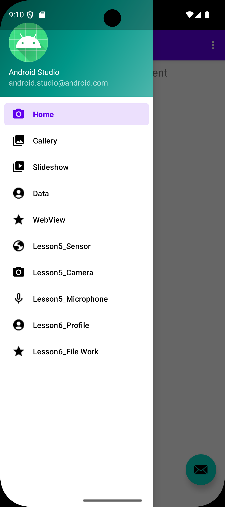

​	Переходим в профиль:

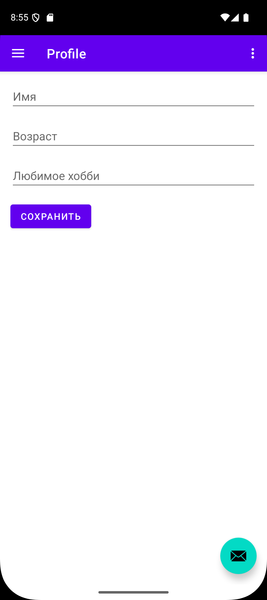

​	Вводим данные и сохраняем:

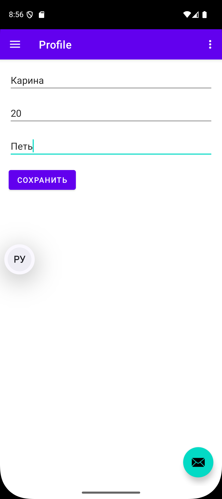

​	При следующем запуске данные автоматически подгрузятся из файла /data/data/ru.mirea.zakirovakr.mireaproject/shared_prefs/user_profile.xml:

```xml
<?xml version='1.0' encoding='utf-8' standalone='yes' ?>
<map>
    <string name="HOBBY">Петь</string>
    <string name="NAME">Карина</string>
    <int name="AGE" value="20" />
</map>
```

​	Переходим к работа с файлами:

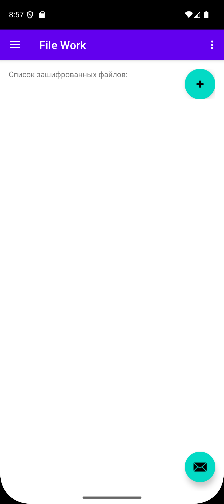

​	Создаем новый файл шифруем и сохраняем:

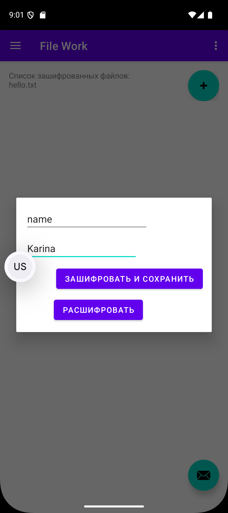

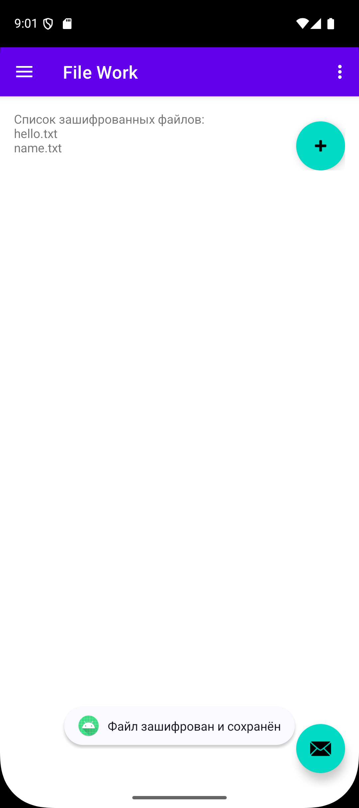

​	Теперь расшифруем сообщение из файла по его названию: 


​	Нажимаем "Расшифровать":

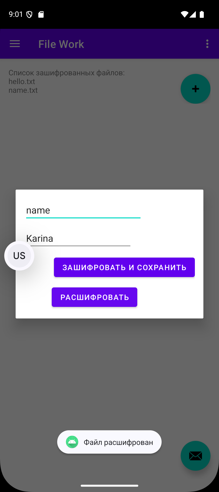

​	/storage/emulated/0/Documents/hello.txt:

```txt
Pb qdph lv Ndulqd
```

​	/storage/emulated/0/Documents/name.txt:

```txt
Ndulqd
```

​	Созданные файлы были перенесены в папку res/raw/


# Пр7

Контрольное задание

​	Создана новая активность LoginActivity с интерфейсом для входа и регистрации пользователей через Firebase Authentication (email/пароль). Реализована проверка ввода (email и пароль), создание учетной записи (createUserWithEmailAndPassword) и вход (signInWithEmailAndPassword). После успешной авторизации пользователь перенаправляется в MainActivity.

```java
public class LoginActivity extends AppCompatActivity {
    private static final String TAG = LoginActivity.class.getSimpleName();
    private ActivityLoginBinding binding;
    private FirebaseAuth mAuth;

    @Override
    protected void onCreate(Bundle savedInstanceState) {
        super.onCreate(savedInstanceState);
        binding = ActivityLoginBinding.inflate(getLayoutInflater());
        setContentView(binding.getRoot());

        mAuth = FirebaseAuth.getInstance();

        // Check if user is already signed in
        FirebaseUser currentUser = mAuth.getCurrentUser();
        if (currentUser != null) {
            startMainActivity();
        }

        // Set up button listeners
        binding.signInButton.setOnClickListener(v -> signIn(
                binding.emailField.getText().toString(),
                binding.passwordField.getText().toString()
        ));

        binding.createAccountButton.setOnClickListener(v -> createAccount(
                binding.emailField.getText().toString(),
                binding.passwordField.getText().toString()
        ));
    }

    private void signIn(String email, String password) {
        Log.d(TAG, "signIn:" + email);
        if (!validateForm()) {
            return;
        }

        mAuth.signInWithEmailAndPassword(email, password)
                .addOnCompleteListener(this, task -> {
                    if (task.isSuccessful()) {
                        Log.d(TAG, "signInWithEmail:success");
                        startMainActivity();
                    } else {
                        Log.w(TAG, "signInWithEmail:failure", task.getException());
                        Toast.makeText(LoginActivity.this, R.string.auth_failed,
                                Toast.LENGTH_SHORT).show();
                    }
                });
    }

    private void createAccount(String email, String password) {
        Log.d(TAG, "createAccount:" + email);
        if (!validateForm()) {
            return;
        }

        mAuth.createUserWithEmailAndPassword(email, password)
                .addOnCompleteListener(this, task -> {
                    if (task.isSuccessful()) {
                        Log.d(TAG, "createUserWithEmail:success");
                        startMainActivity();
                    } else {
                        Log.w(TAG, "createUserWithEmail:failure", task.getException());
                        Toast.makeText(LoginActivity.this, R.string.auth_failed,
                                Toast.LENGTH_SHORT).show();
                    }
                });
    }

    private boolean validateForm() {
        String email = binding.emailField.getText().toString();
        String password = binding.passwordField.getText().toString();

        if (TextUtils.isEmpty(email)) {
            binding.emailField.setError("Required");
            return false;
        }
        if (TextUtils.isEmpty(password)) {
            binding.passwordField.setError("Required");
            return false;
        }
        return true;
    }

    private void startMainActivity() {
        Intent intent = new Intent(this, MainActivity.class);
        startActivity(intent);
        finish();
    }
}
```

​	Подключен Firebase к проекту через google-services.json и зависимости в build.gradle. Настроена авторизация в Firebase Console с использованием email/пароль.

​	LoginActivity установлен как начальная активность в AndroidManifest.xml, а MainActivity проверяет наличие авторизованного пользователя, перенаправляя в LoginActivity, если пользователь не вошел.

```xml
<?xml version="1.0" encoding="utf-8"?>
<manifest xmlns:android="http://schemas.android.com/apk/res/android"
    xmlns:tools="http://schemas.android.com/tools">

    <uses-permission android:name="android.permission.INTERNET" />
    <uses-permission android:name="android.permission.ACCESS_NETWORK_STATE" />
    <uses-permission android:name="android.permission.CAMERA" />
    <uses-permission android:name="android.permission.RECORD_AUDIO" />
    <uses-permission android:name="android.permission.WRITE_EXTERNAL_STORAGE" />
    <uses-permission android:name="android.permission.READ_EXTERNAL_STORAGE" />
    <uses-feature android:name="android.hardware.camera" android:required="true" />
    <uses-feature android:name="android.hardware.sensor.compass" android:required="true" />
    <uses-feature android:name="android.hardware.microphone" android:required="true" />

    <application
        android:allowBackup="true"
        android:dataExtractionRules="@xml/data_extraction_rules"
        android:fullBackupContent="@xml/backup_rules"
        android:icon="@mipmap/ic_launcher"
        android:label="@string/app_name"
        android:roundIcon="@mipmap/ic_launcher_round"
        android:supportsRtl="true"
        android:theme="@style/Theme.MireaProject"
        tools:targetApi="31">
        <activity
            android:name=".LoginActivity"
            android:exported="true"
            android:label="@string/app_name"
            android:theme="@style/Theme.MireaProject.NoActionBar">
            <intent-filter>
                <action android:name="android.intent.action.MAIN" />
                <category android:name="android.intent.category.LAUNCHER" />
            </intent-filter>
        </activity>
        <activity
            android:name=".MainActivity"
            android:exported="false"
            android:label="@string/app_name"
            android:theme="@style/Theme.MireaProject.NoActionBar" />
    </application>

</manifest>
```

​	Создан NetworkFragment, использующий Retrofit для получения списка постов с публичного API https://jsonplaceholder.typicode.com/posts.

```java
public class NetworkFragment extends Fragment {

    private static final String TAG = NetworkFragment.class.getSimpleName();
    private FragmentNetworkBinding binding;
    private PostAdapter adapter;

    @Override
    public View onCreateView(LayoutInflater inflater, ViewGroup container, Bundle savedInstanceState) {
        binding = FragmentNetworkBinding.inflate(inflater, container, false);
        View view = binding.getRoot();

        // Initialize RecyclerView
        adapter = new PostAdapter(new ArrayList<>());
        binding.recyclerView.setLayoutManager(new LinearLayoutManager(getContext()));
        binding.recyclerView.setAdapter(adapter);
        binding.recyclerView.setHasFixedSize(true); // Optimize for fixed-size items
        binding.recyclerView.setVisibility(View.VISIBLE);
        Log.d(TAG, "RecyclerView initialized, visibility: " + binding.recyclerView.getVisibility());

        // Show loading state
        binding.progressBar.setVisibility(View.VISIBLE);
        binding.textView.setText("Loading posts...");
        binding.textView.setVisibility(View.VISIBLE);

        // Fetch data
        fetchPosts();

        return view;
    }

    private void fetchPosts() {
        Gson gson = new GsonBuilder().setLenient().create();
        Retrofit retrofit = new Retrofit.Builder()
                .baseUrl("https://jsonplaceholder.typicode.com/")
                .addConverterFactory(GsonConverterFactory.create(gson))
                .build();

        JsonPlaceholderApi api = retrofit.create(JsonPlaceholderApi.class);
        Call<List<Post>> call = api.getPosts();
        call.enqueue(new Callback<List<Post>>() {
            @Override
            public void onResponse(Call<List<Post>> call, Response<List<Post>> response) {
                binding.progressBar.setVisibility(View.GONE);
                if (response.isSuccessful() && response.body() != null) {
                    Log.d(TAG, "API call successful, posts received: " + response.body().size());
                    adapter.setPosts(response.body());
                    binding.textView.setVisibility(View.GONE);
                    binding.recyclerView.post(() -> {
                        binding.recyclerView.invalidate();
                        binding.recyclerView.requestLayout();
                        binding.recyclerView.scrollToPosition(0); // Scroll to top
                        Log.d(TAG, "RecyclerView updated, item count: " + adapter.getItemCount());
                    });
                } else {
                    Log.e(TAG, "API call failed with code: " + response.code());
                    binding.textView.setText("Failed to load posts: HTTP " + response.code());
                    binding.textView.setVisibility(View.VISIBLE);
                }
            }

            @Override
            public void onFailure(Call<List<Post>> call, Throwable t) {
                binding.progressBar.setVisibility(View.GONE);
                Log.e(TAG, "API call error: " + t.getMessage(), t);
                binding.textView.setText("Error: " + t.getMessage());
                binding.textView.setVisibility(View.VISIBLE);
            }
        });
    }

    public interface JsonPlaceholderApi {
        @GET("posts")
        Call<List<Post>> getPosts();
    }

    public static class Post {
        private int id;
        private String title;
        private String body;

        public int getId() {
            return id;
        }

        public String getTitle() {
            return title;
        }

        public String getBody() {
            return body;
        }
    }
}
```

​	Реализован RecyclerView с кастомным адаптером PostAdapter для отображения заголовков и текста постов.

```java
public class PostAdapter extends RecyclerView.Adapter<PostAdapter.PostViewHolder> {

    private static final String TAG = PostAdapter.class.getSimpleName();
    private List<NetworkFragment.Post> posts;

    public PostAdapter(List<NetworkFragment.Post> posts) {
        this.posts = posts;
        Log.d(TAG, "PostAdapter initialized with posts: " + posts.size());
    }

    public void setPosts(List<NetworkFragment.Post> posts) {
        this.posts.clear();
        this.posts.addAll(posts);
        Log.d(TAG, "Setting posts, count: " + posts.size());
        for (int i = 0; i < Math.min(posts.size(), 5); i++) {
            Log.d(TAG, "Post " + i + ": Title=" + posts.get(i).getTitle() + ", Body=" + posts.get(i).getBody());
        }
        notifyDataSetChanged();
    }

    @NonNull
    @Override
    public PostViewHolder onCreateViewHolder(@NonNull ViewGroup parent, int viewType) {
        View view = LayoutInflater.from(parent.getContext())
                .inflate(R.layout.item_post, parent, false);
        Log.d(TAG, "Creating ViewHolder for viewType: " + viewType);
        return new PostViewHolder(view);
    }

    @Override
    public void onBindViewHolder(@NonNull PostViewHolder holder, int position) {
        NetworkFragment.Post post = posts.get(position);
        holder.title.setText(post.getTitle() != null ? post.getTitle() : "No Title");
        holder.body.setText(post.getBody() != null ? post.getBody() : "No Body");
        Log.d(TAG, "Binding post at position " + position + ": Title=" + post.getTitle());
    }

    @Override
    public int getItemCount() {
        int count = posts.size();
        Log.d(TAG, "getItemCount: " + count);
        return count;
    }

    static class PostViewHolder extends RecyclerView.ViewHolder {
        TextView title;
        TextView body;

        PostViewHolder(View itemView) {
            super(itemView);
            title = itemView.findViewById(R.id.postTitle);
            body = itemView.findViewById(R.id.postBody);
            Log.d(TAG, "PostViewHolder created, title view: " + (title != null) + ", body view: " + (body != null));
        }
    }
}
```

​	Изменена MainActivity

```java
public class MainActivity extends AppCompatActivity {

    private AppBarConfiguration mAppBarConfiguration;
    private ActivityMainBinding binding;
    private FirebaseAuth mAuth;

    private final ActivityResultLauncher<String[]> permissionLauncher =
            registerForActivityResult(new ActivityResultContracts.RequestMultiplePermissions(), result -> {
                Boolean cameraGranted = result.getOrDefault(Manifest.permission.CAMERA, false);
                Boolean audioGranted = result.getOrDefault(Manifest.permission.RECORD_AUDIO, false);
                Boolean storageWriteGranted = result.getOrDefault(Manifest.permission.WRITE_EXTERNAL_STORAGE, false);
                Boolean storageReadGranted = result.getOrDefault(Manifest.permission.READ_EXTERNAL_STORAGE, false);

                if (cameraGranted != null && cameraGranted &&
                        audioGranted != null && audioGranted &&
                        storageWriteGranted != null && storageWriteGranted &&
                        storageReadGranted != null && storageReadGranted) {
                    Toast.makeText(this, "All permissions granted", Toast.LENGTH_SHORT).show();
                } else {
                    Toast.makeText(this, "Permissions denied", Toast.LENGTH_SHORT).show();
                }
            });

    @Override
    protected void onCreate(Bundle savedInstanceState) {
        super.onCreate(savedInstanceState);

        mAuth = FirebaseAuth.getInstance();
        FirebaseUser currentUser = mAuth.getCurrentUser();
        if (currentUser == null) {
            startActivity(new Intent(this, LoginActivity.class));
            finish();
            return;
        }

        binding = ActivityMainBinding.inflate(getLayoutInflater());
        setContentView(binding.getRoot());

        setSupportActionBar(binding.appBarMain.toolbar);
        binding.appBarMain.fab.setOnClickListener(view ->
                Snackbar.make(view, "Replace with your own action", Snackbar.LENGTH_LONG)
                        .setAction("Action", null)
                        .setAnchorView(R.id.fab).show());

        DrawerLayout drawer = binding.drawerLayout;
        NavigationView navigationView = binding.navView;
        mAppBarConfiguration = new AppBarConfiguration.Builder(
                R.id.nav_home,
                R.id.nav_gallery,
                R.id.nav_slideshow,
                R.id.nav_data,
                R.id.nav_webview,
                R.id.nav_sensor,
                R.id.nav_camera,
                R.id.nav_microphone,
                R.id.nav_profile,
                R.id.nav_file_work,
                R.id.nav_network
        ).setOpenableLayout(drawer).build();
        NavController navController = Navigation.findNavController(this, R.id.nav_host_fragment_content_main);
        NavigationUI.setupActionBarWithNavController(this, navController, mAppBarConfiguration);
        NavigationUI.setupWithNavController(navigationView, navController);

        checkAndRequestPermissions();
    }

    private void checkAndRequestPermissions() {
        String[] permissions = {
                Manifest.permission.CAMERA,
                Manifest.permission.RECORD_AUDIO,
                Manifest.permission.WRITE_EXTERNAL_STORAGE,
                Manifest.permission.READ_EXTERNAL_STORAGE
        };

        boolean allPermissionsGranted = true;
        for (String permission : permissions) {
            if (ContextCompat.checkSelfPermission(this, permission) != PackageManager.PERMISSION_GRANTED) {
                allPermissionsGranted = false;
                break;
            }
        }

        if (!allPermissionsGranted) {
            permissionLauncher.launch(permissions);
        }
    }

    @Override
    public boolean onCreateOptionsMenu(Menu menu) {
        getMenuInflater().inflate(R.menu.main, menu);
        return true;
    }

    @Override
    public boolean onSupportNavigateUp() {
        NavController navController = Navigation.findNavController(this, R.id.nav_host_fragment_content_main);
        return NavigationUI.navigateUp(navController, mAppBarConfiguration)
                || super.onSupportNavigateUp();
    }
}
```

​	Добавлены отображения activity_login.xml

```xml
<?xml version="1.0" encoding="utf-8"?>
<androidx.constraintlayout.widget.ConstraintLayout
    xmlns:android="http://schemas.android.com/apk/res/android"
    xmlns:app="http://schemas.android.com/apk/res-auto"
    android:layout_width="match_parent"
    android:layout_height="match_parent"
    android:padding="16dp">

    <TextView
        android:id="@+id/titleTextView"
        android:layout_width="wrap_content"
        android:layout_height="wrap_content"
        android:layout_marginTop="128dp"
        android:text="@string/emailpassword_title_text"
        android:textSize="24sp"
        android:textStyle="bold"
        app:layout_constraintEnd_toEndOf="parent"
        app:layout_constraintHorizontal_bias="0.0"
        app:layout_constraintStart_toStartOf="parent"
        app:layout_constraintTop_toTopOf="parent" />

    <EditText
        android:id="@+id/emailField"
        android:layout_width="0dp"
        android:layout_height="wrap_content"
        android:hint="@string/hint_email"
        android:inputType="textEmailAddress"
        app:layout_constraintTop_toBottomOf="@id/titleTextView"
        app:layout_constraintStart_toStartOf="parent"
        app:layout_constraintEnd_toEndOf="parent"
        android:layout_marginTop="16dp"/>

    <EditText
        android:id="@+id/passwordField"
        android:layout_width="0dp"
        android:layout_height="wrap_content"
        android:hint="@string/hint_password"
        android:inputType="textPassword"
        app:layout_constraintTop_toBottomOf="@id/emailField"
        app:layout_constraintStart_toStartOf="parent"
        app:layout_constraintEnd_toEndOf="parent"
        android:layout_marginTop="8dp"/>

    <Button
        android:id="@+id/signInButton"
        android:layout_width="0dp"
        android:layout_height="wrap_content"
        android:text="@string/sign_in"
        app:layout_constraintTop_toBottomOf="@id/passwordField"
        app:layout_constraintStart_toStartOf="parent"
        app:layout_constraintEnd_toStartOf="@id/createAccountButton"
        android:layout_marginTop="16dp"
        android:layout_marginEnd="4dp"/>

    <Button
        android:id="@+id/createAccountButton"
        android:layout_width="0dp"
        android:layout_height="wrap_content"
        android:text="@string/create_account"
        app:layout_constraintTop_toBottomOf="@id/passwordField"
        app:layout_constraintStart_toEndOf="@id/signInButton"
        app:layout_constraintEnd_toEndOf="parent"
        android:layout_marginTop="16dp"
        android:layout_marginStart="4dp"/>

</androidx.constraintlayout.widget.ConstraintLayout>
```

​	fragment_network.xml

```xml
<?xml version="1.0" encoding="utf-8"?>
<LinearLayout
    xmlns:android="http://schemas.android.com/apk/res/android"
    android:layout_width="match_parent"
    android:layout_height="match_parent"
    android:orientation="vertical"
    android:padding="16dp">

    <ProgressBar
        android:id="@+id/progressBar"
        android:layout_width="wrap_content"
        android:layout_height="wrap_content"
        android:layout_gravity="center"
        android:visibility="gone"/>

    <TextView
        android:id="@+id/textView"
        android:layout_width="wrap_content"
        android:layout_height="wrap_content"
        android:layout_gravity="center"
        android:text="Loading posts..."
        android:layout_marginTop="8dp"/>

    <androidx.recyclerview.widget.RecyclerView
        android:id="@+id/recyclerView"
        android:layout_width="match_parent"
        android:layout_height="0dp"
        android:layout_weight="1"
        android:scrollbars="vertical"
        android:visibility="visible"/>

</LinearLayout>
```

​	item_post.xml

```xml
<?xml version="1.0" encoding="utf-8"?>
<LinearLayout
    xmlns:android="http://schemas.android.com/apk/res/android"
    android:layout_width="match_parent"
    android:layout_height="wrap_content"
    android:orientation="vertical"
    android:padding="8dp">

    <TextView
        android:id="@+id/postTitle"
        android:layout_width="match_parent"
        android:layout_height="wrap_content"
        android:textSize="16sp"
        android:textStyle="bold"
        android:ellipsize="end"
        android:maxLines="2"/>

    <TextView
        android:id="@+id/postBody"
        android:layout_width="match_parent"
        android:layout_height="wrap_content"
        android:textSize="14sp"
        android:ellipsize="end"
        android:maxLines="3"
        android:layout_marginTop="4dp"/>

</LinearLayout>
```

​	При открытии приложения необходимо зарегистрироваться или войти

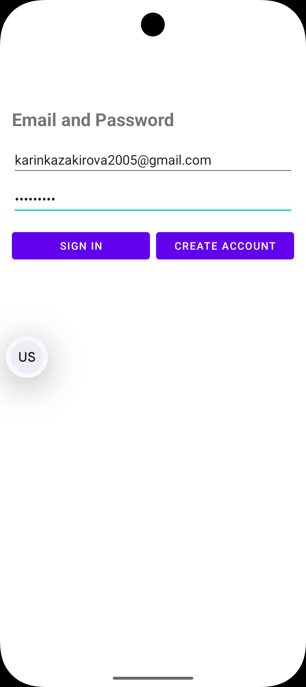

​	Зарегистрированные пользователи отображаются в Firebase

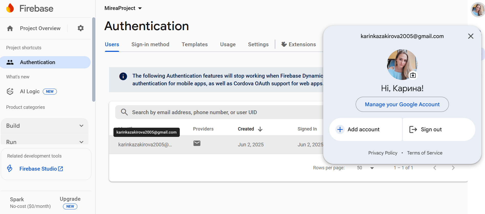

​	При успешном входе открывается домашняя страница. Далее открываем меню чтобы перейти в раздел Network

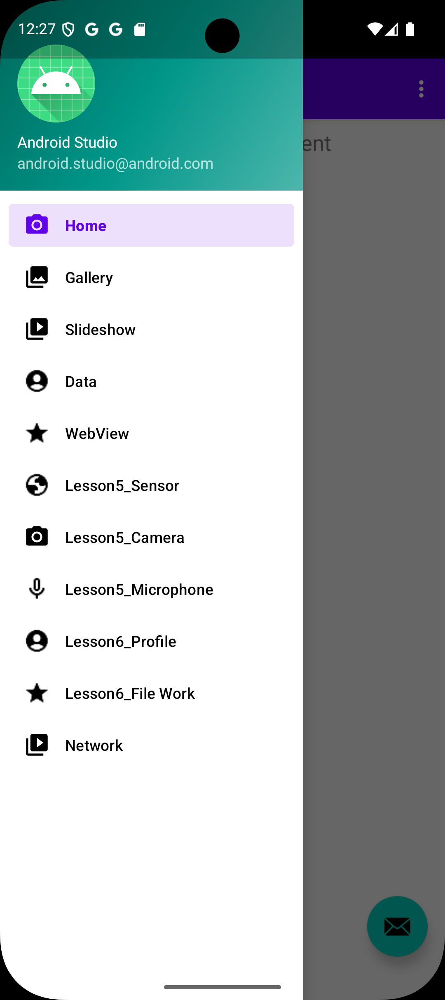

​	При нажатии на кнопку Network открывается страница с постами

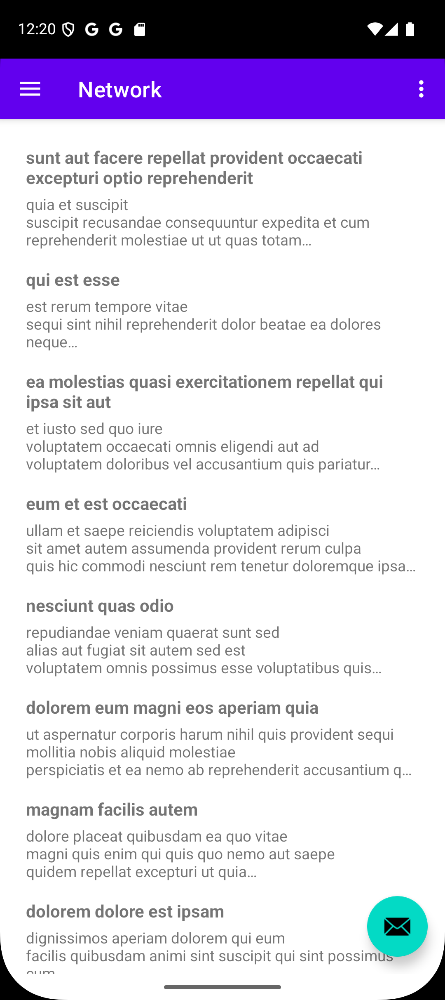


